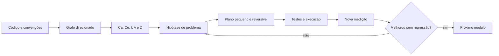

# Acoplamento e saúde da aplicação

Este módulo estuda dependências entre módulos, estabilidade, abstração e o uso dessas medidas
para orientar refatorações. As quatro primeiras aulas possuem registros visuais completos e notas
detalhadas. As aulas 05–18 preservam título e duração, mas ainda não possuem imagens, código ou
outro material original local; suas notas devem ser lidas como roteiro de estudo, não como
transcrição da aula.

## Trilha de estudo

| Aula | Tema | Evidência local |
|---|---|---|
| [01](01-introduction/README.md) | Vocabulário, tipos e mapa geral | 11 imagens |
| [02](02-types-coupling/README.md) | `CA`, `CE`, direção e instabilidade | 10 imagens |
| [03](03-when-coupling-becomes-an-arc-pain-point/README.md) | Rigidez, ciclos e abstrações úteis | 8 imagens |
| [04](04-main-sequence-and-coupling-zones/README.md) | Main sequence, `A`, `I` e `D` | 8 imagens |
| [05](05-goals-and-example-project/README.md) | Objetivos e projeto de exemplo | Título e duração |
| [06](06-coupling-calculation-script/README.md) | Script de cálculo | Título e duração |
| [07](07-tracking-chart-generation/README.md) | Gráfico de acompanhamento | Título e duração |
| [08](08-diving-into-details/README.md) | Investigação detalhada | Título e duração |
| [09](09-planning-refactoring/README.md) | Planejamento da refatoração | Título e duração |
| [10](10-rewriting-the-plan/README.md) | Revisão do plano | Título e duração |
| [11](11-starting-plan-execution/README.md) | Início da execução | Título e duração |
| [12](12-agent-handoff-and-refactor-start/README.md) | Handoff e começo da refatoração | Título e duração |
| [13](13-refactoring-and-verifying-chart/README.md) | Refatoração e nova medição | Título e duração |
| [14](14-testing-until-chart-clears/README.md) | Testes e acompanhamento | Título e duração |
| [15](15-finishing-pilot-refactor/README.md) | Encerramento do piloto | Título e duração |
| [16](16-confirming-exit-from-zone-of-pain/README.md) | Saída da zona de dor | Título e duração |
| [17](17-refactoring-after-danger-zone/README.md) | Próxima refatoração | Título e duração |
| [18](18-abstractions-and-composition/README.md) | Abstrações e composition root | Título e duração |

## Convenções das métricas

Considere uma unidade de análise explícita, como pacote ou módulo, e conte dependências entre
essas unidades sempre com a mesma regra:

```text
Ca = dependências que entram: outros módulos dependem deste
Ce = dependências que saem: este módulo depende de outros
I  = Ce / (Ca + Ce)
A  = tipos abstratos / total de tipos
D  = |A + I - 1|
```

Para `Ca + Ce = 0`, a fórmula de `I` exige uma convenção da ferramenta. Registre-a; atribuir zero
silenciosamente pode fazer um módulo isolado parecer uma base estável. `D` mede distância da main
sequence, mas não certifica qualidade. Coesão, ciclos, volatilidade, responsabilidade e contexto
de negócio continuam necessários para interpretar o ponto.



## Como usar as medidas

- Leia `Ca` e `Ce` pela direção real das dependências; uma seta mal interpretada inverte o
  diagnóstico.
- `I` alto indica que o módulo depende mais do que é dependido. Isso é esperado em adapters e
  pontos de entrada; não significa automaticamente código ruim.
- `I` baixo torna mudanças mais caras porque muitos módulos dependem daquele contrato. Quanto
  mais estável o módulo, mais importante é expor abstrações úteis e pequenas.
- Zona de dor corresponde ao canto concreto e estável (`A ≈ 0`, `I ≈ 0`). Zona de inutilidade
  corresponde ao canto abstrato e instável (`A ≈ 1`, `I ≈ 1`).
- Compare tendências com a mesma versão da ferramenta e a mesma unidade de contagem. Um número
  antes/depois perde sentido se arquivos gerados, testes ou imports de tipo mudarem de regra.

Uma refatoração deve preservar comportamento verificável. Primeiro registre testes, build e uma
linha de base das métricas. Faça um corte pequeno, execute as verificações e recalcule o grafo.
Mover arquivos ou criar interfaces sem mudar as dependências não reduz acoplamento por si só.

## Lacuna do acervo

O repositório não contém o projeto prático, scripts, gráficos ou imagens das aulas 05–18. Essa
ausência impede reconstruir fielmente comandos, linguagem, estrutura de arquivos e resultados.
Quando o material for adicionado, cada aula deve receber apenas o snapshot correspondente àquele
momento, seguindo o mesmo princípio usado nos projetos práticos do [módulo de cache](../05-cache/README.md).
