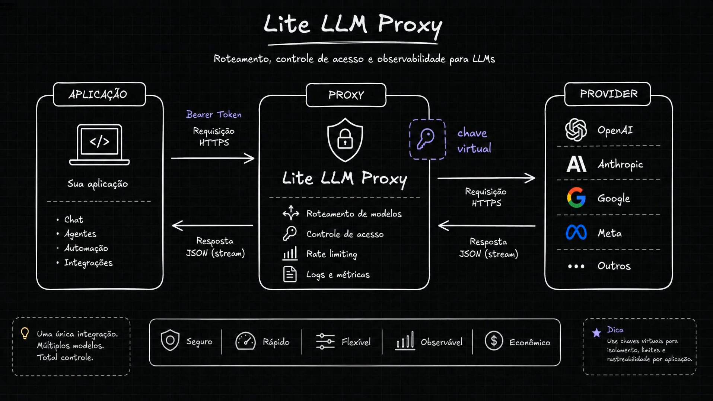
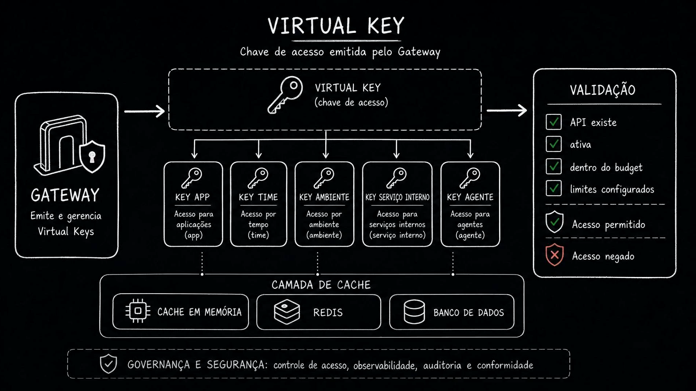
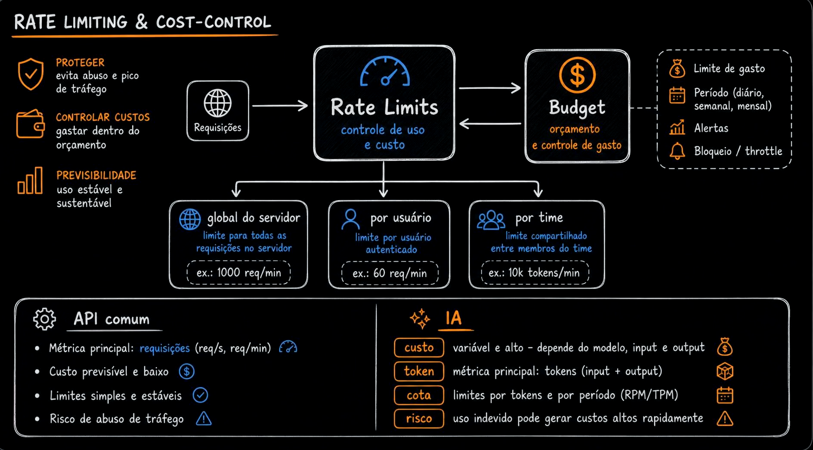
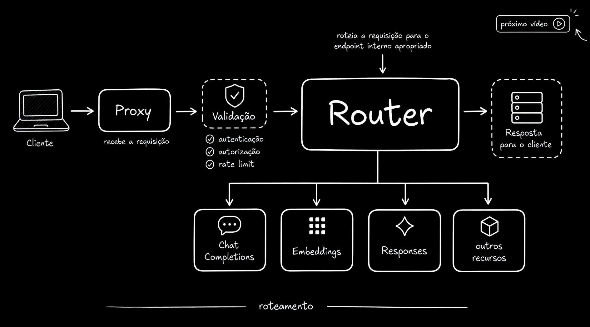

# Aula 09 — LiteLLM Proxy - Fluxo da requisição

[Índice do módulo](../README.md)

> Curso: **AI Gateways** · Duração: `03:27`

## Resumo

A aula detalha o caminho de uma requisição passando pelo LiteLLM Proxy. O proxy não é só um repassador de HTTP: ele valida acesso, aplica rate limit, controla custo, registra métricas e decide para onde a chamada deve ir.

O fluxo fica mais parecido com uma API interna de IA do que com uma chamada direta para um provider.

## 1. Uma integração, vários providers



A aplicação chama o proxy usando um token interno. O proxy recebe a requisição, valida, registra e encaminha para o provider físico configurado.

Responsabilidades destacadas:

- roteamento de modelo;
- controle de acesso;
- rate limiting;
- logs e métricas;
- isolamento por chave virtual.

A aplicação passa a integrar com uma interface única, enquanto o proxy mantém a flexibilidade de falar com OpenAI, Anthropic, Google, Meta ou outros providers.

## 2. Virtual keys



As chaves virtuais representam identidades internas: aplicação, time, ambiente, serviço interno ou agente.

Antes de liberar uma chamada, o gateway pode verificar:

- se a chave existe;
- se está ativa;
- se ainda tem orçamento;
- se respeita os limites configurados;
- se possui permissão para aquela capacidade.

Essa camada permite isolar consumo, auditar uso e aplicar governança sem expor chaves reais dos providers.

## 3. Rate limit e controle de custo



Em APIs comuns, o custo por requisição tende a ser mais previsível. Em IA, o custo varia por modelo, tamanho de entrada, tamanho da resposta e frequência de uso.

Por isso, o gateway precisa lidar com métricas específicas:

- requisições por minuto;
- tokens por minuto;
- orçamento por chave, time ou aplicação;
- proteção contra picos e abuso.

O objetivo não é apenas proteger infraestrutura. É proteger orçamento.

## 4. Fluxo interno da requisição



O fluxo apresentado é:

```text
Client -> Proxy -> Validation -> Router -> Endpoint -> Provider -> Response
```

Primeiro a requisição é autenticada e validada. Depois passa por rate limit e autorização. O caminho HTTP identifica o recurso solicitado, como chat completions, embeddings ou responses. O router resolve o nome lógico de modelo para um deployment elegível; selecionar esse deployment é diferente de escolher o endpoint da API.

## Ideia-chave

Um AI Gateway precisa tratar requisições de IA como tráfego governado: com identidade, limite, custo, permissão, observabilidade e roteamento.

## Complemento — Identidade e rastreabilidade da requisição

A virtual key é uma credencial de acesso ao gateway, não a chave do provider. Use uma identidade por consumidor e atribua permissões e orçamento a ela. O laboratório posterior usa uma master key compartilhada e não demonstra esse isolamento.

Ao acompanhar uma requisição, diferencie o recurso HTTP solicitado, a capacidade lógica, o deployment efetivo e o provider. Esses identificadores respondem perguntas diferentes: qual API foi usada, qual intenção foi solicitada e qual implementação respondeu.

Uma boa investigação liga request ID da aplicação, tentativa no gateway e request ID do provider. Registre também falhas, retries e cache hits; observar somente respostas bem-sucedidas subestima gasto e incidentes.
