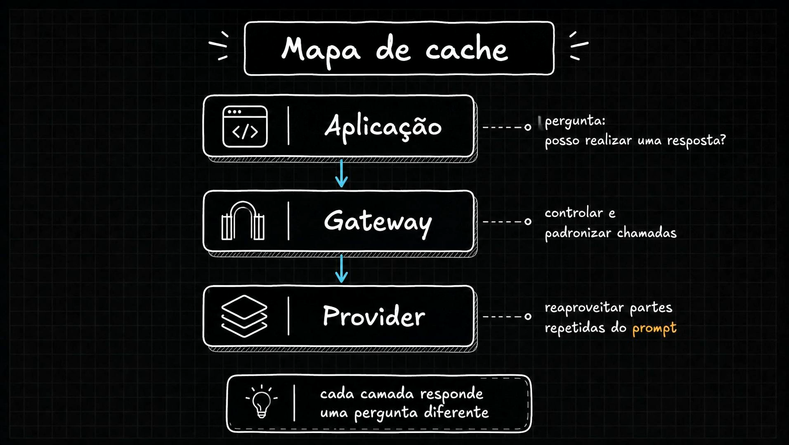

# Aula 20 — Camadas de cache em aplicações com IA

> Curso: **Cache** · Duração: `05:55`

## Observação sobre o material

Esta pasta contém seis prints conceituais. O texto organiza suas ideias e acrescenta critérios
de projeto; o [analisador de tickets](../mba-ia-cache/README.md) permite conferir o fluxo implementado.

## Resumo

Com cache exato, cache semântico e suas variações já implementados (aulas 01 a 19), esta aula dá
um passo atrás e organiza tudo em um panorama: uma aplicação com IA pode ter várias camadas de
cache atuando em pontos diferentes do fluxo, não apenas uma.

## Responsabilidade de cada camada

| Camada | Pergunta que responde | Quem define a validade |
|---|---|---|
| Aplicação: exato | Já processei esta entrada sob o mesmo contrato e contexto? | Aplicação, via chave e política de validade |
| Aplicação: semântico | Posso reutilizar esta análise para outra entrada? | Aplicação, via escopo, similaridade e validação |
| Gateway/proxy | Como controlar e encaminhar chamadas de vários clientes? | Políticas transversais; o domínio deve fornecer contexto para cache de respostas |
| Provider: prompt caching | Posso reaproveitar processamento de um prefixo desta chamada? | API/modelo do provider |

Um gateway pode oferecer cache de respostas, mas precisa receber as dimensões que tornam a
resposta reutilizável. Ocultar versão do prompt, tenant ou contrato atrás de um alias de modelo
não torna duas chamadas equivalentes. Veja [AI Gateway](../../03-ai-gateway/README.md).

## Ordem de execução

```text
requisição -> verifica elegibilidade e contexto
           -> cache exato -> hit válido: retorna
           -> cache semântico -> candidato reutilizável: retorna
           -> gateway -> provider, com possível prompt caching -> nova resposta
           -> valida resultado -> grava nas camadas permitidas -> retorna
```

Prompt caching acontece **dentro da chamada ao provider**. Não é uma busca por resposta pronta
depois da geração. No exemplo, um hit exato evita embedding, banco e modelo de chat; um hit
semântico evita o modelo de chat, mas já pagou embedding e consulta ao pgvector.



## Complemento: nem toda camada se paga

Considere uma aplicação sem repetição suficiente: acrescentar busca vetorial a toda entrada
pode aumentar a latência e o custo. Compare a economia de chamadas evitadas com custo de
embedding, busca, armazenamento e erros de reutilização. Meça separadamente p50/p95 dos
caminhos exato, semântico e modelo; a média global pode esconder misses mais lentos.

Também é necessário decidir como cada camada reage a falhas. Se cache for uma otimização
dispensável, um erro de leitura pode seguir para o modelo sob limites de custo e carga. Isso
precisa ser implementado: no projeto atual, falhas de embedding/busca interrompem o caminho
de miss exato, enquanto a falha de gravação semântica preserva a resposta do modelo.

## Correções na leitura dos slides

Os desenhos simplificam o fluxo. Um hit exato retorna diretamente; não precisa atravessar
cache semântico. Expressões como “token caching” ou “conteúdo” não significam que qualquer
provider devolve tokens de saída previamente gerados. Para as APIs comparadas aqui, confirme
os recursos documentados na [aula 22](../22-how-openai-anthropic-and-gemini-handle-prompt-caching/README.md).

## Ideia-chave

As camadas se complementam quando preservam a validade da resposta e sua economia compensa
o trabalho adicional. A aplicação decide sobre reutilização; o gateway controla acesso; o
provider pode reaproveitar o processamento das chamadas que chegam até ele.
