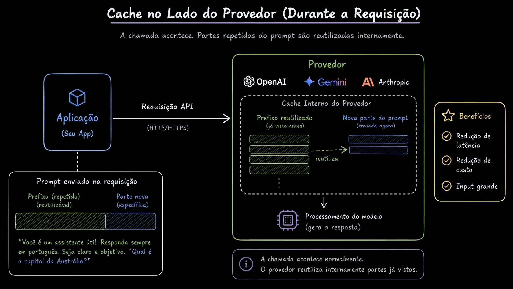

# Aula 21 — Cache da aplicação não é cache do provider

> Curso: **Cache** · Duração: `06:11`

## Observação sobre o material

Esta pasta contém seis prints. As notas distinguem os mecanismos discutidos e corrigem
simplificações dos diagramas. “Cache do provider”, neste módulo, refere-se a prompt/context
caching documentado, sem presumir outras otimizações internas.

## Resumo

Depois de mapear as camadas de cache (aula 20), esta aula separa claramente dois níveis que
costumam ser confundidos: o cache que a própria aplicação implementa (exato ou semântico) e o
cache que o provider de IA oferece nativamente dentro da chamada ao modelo (prompt caching).

## A diferença

- **Cache da aplicação**: decide se chama o modelo ou não. Vive fora da chamada — antes dela. É o
  que foi construído nas aulas 01 a 20 (fingerprint, pgvector, embeddings, threshold).
- **Cache do provider (prompt caching)**: o modelo é sempre chamado, mas o provider reaproveita
  processamento de um prefixo compatível do prompt (ex.: instruções longas e repetidas). Ainda
  processa o conteúdo novo e gera uma nova saída. A economia depende da API, modelo e ocorrência
  de hit, como detalhado na [comparação de providers](../22-how-openai-anthropic-and-gemini-handle-prompt-caching/README.md).

```text
Cache da aplicação:  decide SE chama o modelo
Cache do provider:   otimiza COMO o modelo processa a chamada, quando ela acontece
```

| Aspecto | Cache de respostas da aplicação | Prompt caching do provider |
|---|---|---|
| Objeto reutilizado | Resultado de uma análise anterior | Processamento de contexto de entrada |
| Modelo de chat chamado no hit? | Não, quando a resposta é servida localmente | Sim, para gerar a resposta atual |
| Entrada distinta pode aproveitar? | Semântico: se a análise for reutilizável | Sim, se houver prefixo compatível |
| Saída precisa ser idêntica? | É a saída armazenada, salvo transformações locais | Não há essa garantia |
| Validade de negócio | Deve estar na política da aplicação | Continua sendo responsabilidade da aplicação |

## Exemplo concreto

“Tenho dúvida sobre a fatura” e “Não consigo acessar minha conta” têm classificações diferentes.
O cache de respostas não deve misturá-las. Ambas podem aproveitar as mesmas instruções estáticas
do classificador no provider e receber saídas diferentes. A [aula prática](../23-prompt-caching-in-practice/README.md)
mostra exatamente essa distinção nos campos de uso e no contador de chamadas.

## Complemento: o que medir

Para cache de respostas, registre `source`, motivo de miss/rejeição, versões, idade da entrada
e latência. Para prompt caching, registre tokens de entrada reaproveitados, tokens novos,
saída e eventuais custos de escrita/armazenamento. Uma resposta rápida, sozinha, não prova hit.

Evite um único `cache_hit` para os dois níveis. Em um hit semântico, `cache.hit` do projeto
continua `false`, porque esse campo mede apenas o cache exato; `source` e
`semantic_cache.hit` explicam de onde veio o resultado.

## Correções na leitura dos slides

O slide 01 sugere que cache local não reduz carga no provider: isso não vale para um hit de
resposta que evita a chamada. O slide 02 liga hit exato ao semântico; no fluxo correto, hit
exato retorna imediatamente. O slide 04 menciona cache de resultados no provider, mas prompt
caching não oferece por si só reutilização de uma resposta completa. “Menos tokens enviados”
também não é regra geral: em cache implícito o cliente pode reenviar o prompt completo.



## Ideia-chave

Os dois níveis resolvem problemas diferentes e não competem entre si: uma aplicação bem otimizada
usa cache próprio para evitar chamadas desnecessárias, e ainda se beneficia do prompt caching do
provider nas chamadas que de fato precisam acontecer. As próximas duas aulas aprofundam o prompt
caching dos providers.
