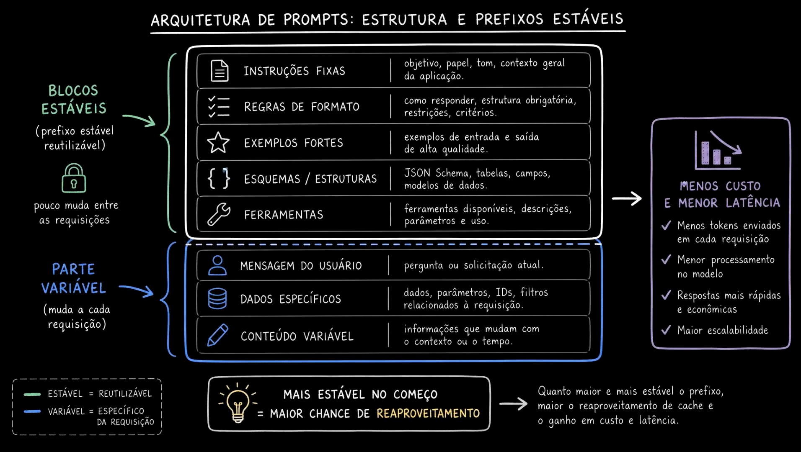

# Aula 22 — Como OpenAI, Anthropic e Gemini tratam prompt caching

> Curso: **Cache** · Duração: `07:33`

## Observação sobre o material

Esta pasta contém sete prints conceituais. Eles registram a explicação da aula, mas incluem
simplificações que não devem virar um contrato de implementação. A comparação abaixo foi
conferida nas documentações oficiais em **1 de outubro de 2026**; requisitos variam por modelo,
API e plataforma. Preços devem ser consultados para o modelo efetivamente usado.

## Resumo

Depois de diferenciar cache da aplicação de cache do provider (aula 21), esta aula compara como
os principais providers implementam prompt caching nativamente: o que é cacheado, por quanto
tempo e como isso afeta custo e latência.

## Comparação operacional

| Provider/API | Ativação e unidade reutilizada | Expiração | Como observar |
|---|---|---|---|
| OpenAI | Prefixos compatíveis; modos e controles dependem da geração do modelo | Controles variam por modelo | Responses: `usage.input_tokens_details.cached_tokens`; Chat Completions: `usage.prompt_tokens_details.cached_tokens` |
| Anthropic Messages | `cache_control` no nível da requisição para colocação automática, ou em blocos explícitos | TTL de 5 minutos ou 1 hora | `usage.cache_read_input_tokens` e `usage.cache_creation_input_tokens` |
| Gemini Interactions | Cache implícito; reutilização depende do contexto compatível | Gerenciada pelo serviço | `usage.total_cached_tokens` |
| Gemini GenerateContent | Implícito ou objeto explícito `cachedContents` referenciado na geração | No explícito, TTL configurável; padrão de 1 hora | `usageMetadata.cachedContentTokenCount` no REST |

Fontes: [OpenAI — prompt caching](https://developers.openai.com/api/docs/guides/prompt-caching),
[Anthropic — prompt caching](https://platform.claude.com/docs/en/build-with-claude/prompt-caching),
[Gemini — Interactions](https://ai.google.dev/gemini-api/docs/caching) e
[Gemini — GenerateContent](https://ai.google.dev/gemini-api/docs/generate-content/caching).

### OpenAI: preserve o contexto da aula e confira a geração do modelo

Os prints mostram caching implícito e a regra de 1.024 tokens usada no exemplo histórico.
A documentação atual diferencia modelos anteriores de GPT-5.6 e modelos a partir dessa geração.
Nos anteriores, `prompt_cache_key` auxilia o roteamento; nos mais novos há breakpoints explícitos,
`prompt_cache_options` e regras próprias de escrita/TTL. Não copie opções entre gerações sem
confirmar suporte. A chave não torna prompts diferentes iguais nem garante hit.
[Fonte oficial](https://developers.openai.com/api/docs/guides/prompt-caching).

### Anthropic: “automático” também tem configuração

Colocação automática de breakpoint usa `cache_control` no corpo da requisição. Para controlar
o fim do prefixo estável, marque um bloco explicitamente. Há cobrança de escrita distinta da
leitura; mínimos de tokens dependem do modelo. Ao combinar TTLs, blocos de duração maior devem
preceder os de duração menor. [Fonte oficial](https://platform.claude.com/docs/en/build-with-claude/prompt-caching).

### Gemini: separe implícito, explícito e API

Interactions oferece cache implícito, sem objetos de cache explícito. GenerateContent permite
criar e referenciar esses objetos; nesse modo há custo de armazenamento conforme volume e TTL.
O TTL padrão de uma hora pertence ao **objeto explícito**, não é uma promessa para o cache
implícito. Os mínimos de tokens devem ser verificados por modelo.
[Interactions](https://ai.google.dev/gemini-api/docs/caching),
[GenerateContent](https://ai.google.dev/gemini-api/docs/generate-content/caching).

## Correções na leitura dos prints

- O print 03 mistura cache implícito Gemini com `Cached Contents` e TTL de uma hora: são mecanismos
  diferentes, como explicado acima.
- O print 06 sugere “apenas referência” em todas as chamadas: isso descreve o explícito do Gemini;
  cache implícito normalmente recebe o conteúdo completo novamente.
- “90% de desconto” não significa 90% de economia na requisição inteira. Conte tokens novos,
  saída, escrita e armazenamento quando aplicáveis.
- “Menos tokens gerados” não decorre de cache de entrada. Uma saída continua sendo gerada e
  contabilizada. As respostas também não ficam garantidamente iguais.
- O print 05 coloca cache semântico antes do exato; no projeto didático a ordem é exato → semântico.



## Complemento: organização de prompts

```text
prefixo estável: instruções + regras + exemplos + contrato de saída + ferramentas
sufixo variável: mensagem atual + contexto específico necessário
```

Preserve conteúdo, ordem e configuração dos blocos compartilhados. Inserir timestamp ou ID
aleatório antes das instruções reduz a parte comum. Ferramentas e schemas também podem fazer
parte do contexto processado; mudar sua definição pode alterar o prefixo elegível.

Nem um prompt longo, nem uma segunda requisição garantem reaproveitamento. Verifique o campo
de uso correto para API/SDK. Campos ausentes devem ser tratados como falta de observação,
e não automaticamente como evidência de miss.

## Complemento: economia real

Use uma conta por requisição, adaptada à política de cobrança:

```text
custo = entrada nova × tarifa de entrada
      + entrada reutilizada × tarifa de leitura
      + escrita de cache × tarifa de escrita, quando separada
      + saída × tarifa de saída
      + armazenamento, quando aplicável
```

Conte cada token na categoria que a API informa, evitando cobrar novamente a escrita como
entrada nova quando as categorias forem exclusivas. Um desconto alto sobre o prefixo pode
representar pequena economia total se a saída dominar o custo. Compare também o trabalho
inicial de preparação, o número de reutilizações e os misses.

## Ideia-chave

Prompt caching exige preservar contexto reutilizável e observar o uso real. A aplicação
organiza o prompt e configura os controles disponíveis; o provider executa a reutilização.
Na [aula 23](../23-prompt-caching-in-practice/README.md), os prints mostram hits e misses na prática.
