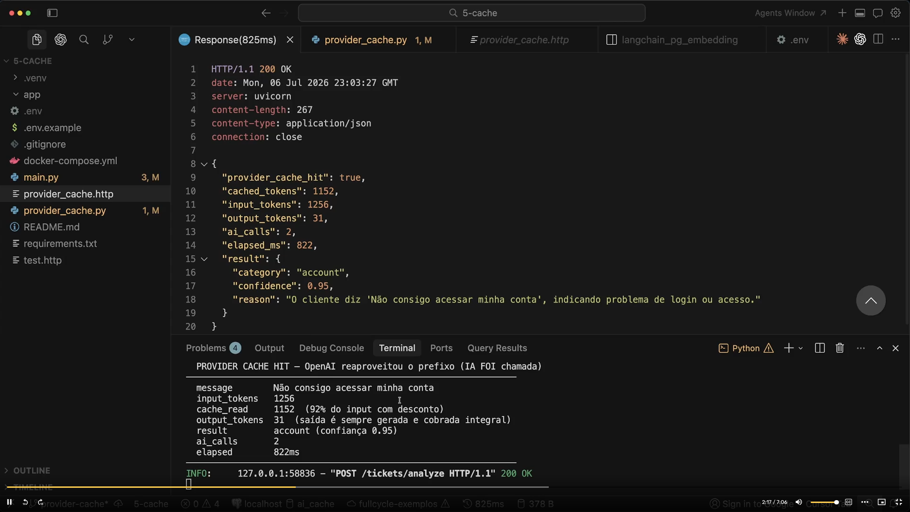

# Aula 23 — Prompt Caching na prática

> Curso: **Cache** · Duração: `07:06`

## Projeto prático da aula

O exemplo foi reconstruído em
[`provider-cache/`](provider-cache/README.md) a partir dos **31 prints**, de `01.png` a
`31.png`. Ele é um snapshot independente, focado apenas em prompt caching da OpenAI:

- [`provider_cache.py`](provider-cache/provider_cache.py): API, prompt longo, chamada estruturada,
  contador `ai_calls` e telemetria de tokens;
- [`provider_cache.http`](provider-cache/provider_cache.http): sequência de requests usada para
  observar miss, hits com mensagens diferentes e nova chamada com mensagem repetida;
- [`.env.example`](provider-cache/.env.example) e
  [`requirements.txt`](provider-cache/requirements.txt): preparação para execução futura.

As capturas mostram o comportamento, o prompt e a parte principal dos dois arquivos de código.
O início do Python, com imports, schemas e constantes, não aparece; essa parte foi reconstituída
pelo contrato das respostas e pelo padrão dos exemplos anteriores. Os arquivos de ambiente,
dependências e documentação são apoio mínimo inferido e estão identificados no
[README do projeto](provider-cache/README.md#o-que-veio-das-capturas).

## Resumo

Fechando o módulo "Cache", esta aula coloca em prática o prompt caching nativo de um provider
(apresentado conceitualmente na aula 22): estruturar uma chamada para que a parte fixa e repetida
do prompt seja reaproveitada pelo provider entre requisições.

## O que os prints mostram

1. `01.png`–`07.png`: um `SYSTEM_PROMPT` extenso, com cinco categorias, exemplos, regras de
   desempate e orientação sobre confiança. A mensagem do ticket entra depois desse prefixo.
2. `08.png`–`09.png`: `ChatOpenAI`, uma `prompt_cache_key` estável e
   `with_structured_output(TicketAnalysis, include_raw=True)` para preservar uso e saída analisada.
3. `11.png`–`15.png`: aplicação FastAPI e `/tickets/analyze`; cada requisição chama o modelo,
   incrementa `ai_calls` e lê `usage_metadata` da resposta bruta.
4. `16.png`–`20.png`: chamadas com mensagens distintas reutilizam o prefixo e geram classificações
   distintas; repetir mensagem continua aumentando o contador de chamadas.
5. `22.png`–`31.png`: alterações/reinício do processo local e novas chamadas. Há misses novamente;
   os prints não isolam uma causa única nem demonstram que reiniciar a aplicação apaga cache remoto.

## Evidência de hit: tokens, não identidade da resposta

| Print | Entrada | `cached_tokens` | `ai_calls` | Categoria retornada |
|---|---|---|---|---|
| [17](17.png) | Dúvidas sobre cobrança na fatura | 0 | 1 | `billing` |
| [18](18.png) | Não consigo acessar minha conta | 1.152 | 2 | `account` |
| [20](20.png) | Repete a pergunta sobre cobrança | 1.152 | 3 | `billing` |

O segundo ticket compartilha as instruções com o primeiro, mas precisa de outra resposta.
O terceiro ticket também chama o modelo. Portanto, `provider_cache_hit: true` significa que
houve reaproveitamento de **entrada**, não que a aplicação devolveu uma resposta armazenada.
Os números são observações dessa execução da aula, sem garantia de repetição em outro ambiente.



## Leitura dos metadados no LangChain

Fragmento de estudo inspirado nos prints, para integrar a uma chamada já configurada. `llm`,
`TicketAnalysis`, `system_prompt` e `message` representam o modelo, schema e entradas desse exemplo;
este trecho não é um novo programa completo incluído na pasta:

```python
analyzer = llm.with_structured_output(TicketAnalysis, include_raw=True)
out = analyzer.invoke([("system", system_prompt), ("human", message)])

if out["parsing_error"] is not None:
    raise out["parsing_error"]

usage = out["raw"].usage_metadata
details = (usage or {}).get("input_token_details", {})
cached_tokens = details.get("cache_read")
# None: metadado não observado; 0: nenhuma leitura de cache informada.
provider_cache_hit = None if cached_tokens is None else cached_tokens > 0
result = out["parsed"]
```

`include_raw=True` retorna `raw`, `parsed` e `parsing_error`.
[Referência de structured output](https://reference.langchain.com/python/langchain-openai/chat_models/base/BaseChatOpenAI/with_structured_output).
`input_token_details.cache_read` é a representação padronizada no LangChain, diferente do nome
no payload nativo da API. Não confunda `input_token_details` com `input_tokens_details` da Responses
API. [Referência de UsageMetadata](https://reference.langchain.com/python/langchain-core/messages/ai/UsageMetadata).

O demo usa zero como valor padrão quando o campo falta; isso facilita o log, mas mistura “miss
observado” com “telemetria indisponível”. Para diagnóstico, preserve essa diferença. Também
valide erro de parsing antes de confiar na saída analisada.

## Complemento: protocolo de reprodução e comparação

1. Fixe modelo/API, prompt, schema, ferramentas e configurações. Confira os requisitos da
   [aula 22](../22-how-openai-anthropic-and-gemini-handle-prompt-caching/README.md).
2. Use instruções estáveis que sejam úteis e suficientemente grandes para o modelo escolhido;
   coloque a mensagem variável no fim. Não acrescente texto inútil só para forçar um mínimo.
3. Execute uma chamada de referência e outras com o mesmo prefixo. Na demonstração isolada de
   provider, cada uma deve atingir o modelo; cache local de respostas mascararia esse experimento.
4. Registre input/output, leitura e escrita de cache quando disponíveis, modelo e latência.
   Agrupe várias observações; duas chamadas não formam um benchmark confiável.
5. Mude uma dimensão por vez — conteúdo inicial, chave ou modelo — e compare os metadados.
   Um miss admite várias explicações, como incompatibilidade, expiração e roteamento.
6. Calcule custo com as tarifas do modelo e compare a execução inteira, incluindo preparação.

Esse roteiro descreve como estudar os prints ou preparar uma reprodução. A pasta não fornece
o programa completo de provider; `python main.py` no projeto existente executa outra demonstração.

Na API OpenAI, opções de cache variam por geração do modelo. A `prompt_cache_key` mostrada no
exemplo não substitui identidade do prefixo nem funciona como chave do dicionário local.
[Documentação oficial OpenAI](https://developers.openai.com/api/docs/guides/prompt-caching).

## O que as latências permitem concluir

Há uma chamada com miss e outras com hit em que o tempo total diminui, mas tamanho da saída,
rede, carga e configuração também influenciam. Os prints comprovam tokens reutilizados, não
um percentual universal de aceleração. Para aplicações com streaming, acrescente tempo até
primeiro token e tempo total; veja [fluxos de chamada](../../04-call-flows/README.md).

## Ideia-chave

Esta aula fecha o módulo mostrando que cache em aplicações com IA acontece em várias camadas
complementares: cache exato e semântico controlados pela aplicação (aulas 01 a 19), e prompt
caching controlado pelo provider (aulas 21 a 23) — cada um reduzindo custo e latência em um ponto
diferente do fluxo.
