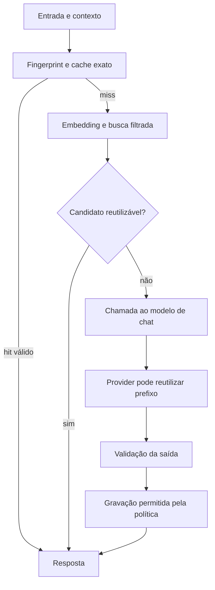

# Cache em aplicações com IA

Este módulo reúne 23 aulas sobre reutilização de respostas, embeddings/pgvector e prompt
caching. O objetivo é decidir **quando uma resposta continua válida**, medir o benefício de
reutilizá-la e separar esse mecanismo das otimizações realizadas pelo provider.

O [analisador de tickets](mba-ia-cache/README.md) é o exemplo executável. As aulas 01–17 e 20–23
têm prints; 18–19 não têm registros visuais próprios. Os complementos técnicos nas notas não
devem ser lidos como transcrição de aulas sem material. A aula 23 tem código visível em prints,
mas os fontes daquele demo de provider não estão presentes.

## Trilha de estudo

| Aula | Tema | Resultado esperado do estudo |
|---|---|---|
| [01](01-cache-in-ai-applications-is-not-just-performance/README.md) | Cache e validade | Explicar custo, consistência e risco de reutilização |
| [02](02-hit-miss-and-cache-aside/README.md) | Hit, miss e cache-aside | Desenhar consulta, geração e gravação |
| [03](03-ttl-stale-response-and-invalidation/README.md) | TTL e invalidação | Separar expiração por tempo de mudança de contexto |
| [04](04-analyzer-without-cache/README.md) | Baseline sem cache | Entender a análise e suas chamadas |
| [05](05-caching-responses-in-ai-calls/README.md) | O que armazenar | Identificar resultado, entrada e metadados de validade |
| [06](06-exact-cache-with-cache-aside/README.md) | Cache exato | Reconhecer limites de normalização e memória local |
| [07](07-prompt-and-context-fingerprint/README.md) | Fingerprint | Incluir dimensões que alteram a resposta |
| [08](08-cache-with-fingerprint/README.md) | Fingerprint na prática | Verificar misses após mudança de versões |
| [09](09-what-is-an-embedding-model/README.md) | Modelo de embedding | Entender representação, espaço vetorial e limites |
| [10](10-generating-text-embeddings/README.md) | Geração de embeddings | Conferir modelo, dimensão e custo de entrada |
| [11](11-similarity-distance-and-threshold/README.md) | Métrica e threshold | Distinguir distância, similaridade e probabilidade |
| [12](12-semantic-cache-is-not-rag/README.md) | Cache semântico e RAG | Separar resposta pronta de evidência para geração |
| [13](13-preparing-pgvector-and-storing-embeddings/README.md) | Persistência | Conferir schema e compatibilidade dos vetores |
| [14](14-searching-similar-answers-with-pgvector/README.md) | Busca vetorial | Aplicar filtros e ordenar candidatos |
| [15](15-threshold-and-false-positives-in-semantic-cache/README.md) | Falsos positivos | Calibrar reutilização com casos difíceis |
| [16](16-understanding-semantic-cache-integration-in-main-flow/README.md) | Integração conceitual | Organizar decisões antes da chamada ao chat |
| [17](17-integrating-semantic-cache-into-tickets-endpoint/README.md) | Endpoint de tickets | Interpretar a origem da resposta |
| [18](18-semantic-miss-and-automatic-write-to-pgvector/README.md) | Gravação após miss | Reaproveitar embedding e validar o que entra no cache |
| [19](19-rewriting-the-example-with-langchain/README.md) | LangChain | Identificar o que o framework abstrai e o SQL que permanece |
| [20](20-cache-layers-in-ai-applications/README.md) | Camadas | Separar aplicação, gateway e provider |
| [21](21-application-cache-is-not-provider-cache/README.md) | Cache local e remoto | Distinguir chamada evitada de processamento reutilizado |
| [22](22-how-openai-anthropic-and-gemini-handle-prompt-caching/README.md) | Comparação de providers | Conferir controles por API/modelo e medir economia |
| [23](23-prompt-caching-in-practice/README.md) | Evidências práticas | Interpretar uso de tokens e contador de chamadas |

## Modelo mental do fluxo



Este é um fluxo de estudo; no projeto atual a elegibilidade é simples, a busca depende de
serviços externos e não há TTL. Confira comportamento e limitações no README do projeto.

## Complemento: uma política de cache completa

Uma entrada deve responder a cinco perguntas antes do reaproveitamento:

1. **Escopo:** a resposta vale para este tenant, usuário, autorização, idioma e tarefa?
2. **Contrato:** prompt, regras, schema e política de modelo continuam compatíveis?
3. **Dados:** documentos, catálogo ou estado consultado ainda têm a mesma versão relevante?
4. **Tempo:** idade e política de expiração permitem reutilização?
5. **Conteúdo:** saída é válida e, no caso semântico, responde corretamente à entrada atual?

Uma chave pode ser um hash de uma serialização canônica dessas dimensões. O hash compacta a
identidade definida; não descobre um campo que foi esquecido. Se a resposta depende de saldo,
permissão ou plano atual, essas dependências precisam estar no escopo de validade ou impedir
reutilização. A normalização também deve preservar diferenças relevantes: caixa pode ser
irrelevante em um ticket comum e essencial em um identificador ou código.

No cache semântico, aplique restrições de tenant/contrato/contexto **antes** de comparar
candidatos. Similaridade alta entre perguntas de clientes distintos não autoriza compartilhar
a resposta. Depois da busca, valide schema e equivalência de tarefa, entidades e condições.

## Complemento: TTL, invalidação e crescimento

TTL limita idade; não garante que dados permaneçam corretos durante esse intervalo. Mudanças
de versão podem tornar entradas inacessíveis pela chave/filtro, mas não removem seus registros
fisicamente. Defina também limpeza, tamanho máximo, exclusão e política de retenção.

Se várias requisições iguais derem miss ao mesmo tempo, todas podem chamar o modelo e gravar.
Coalescer esse trabalho por chave (*single-flight*) pode reduzir o desperdício. Operações com
efeito externo precisam de idempotência própria: reutilizar texto não prova que uma operação
foi executada apenas uma vez. Veja [fluxos de chamada](../04-call-flows/README.md).

## Complemento: qualidade antes de taxa de hit

Um conjunto de calibração deve conter paráfrases reutilizáveis e pares próximos com respostas
incompatíveis: cancelar plano × reunião, pagar × estornar, problema resolvido × não resolvido,
entidades e valores diferentes. Separe calibração e avaliação final; reavalie após trocar
modelo de embedding, normalização ou regras.

Meça `hits corretos / hits auditados` para estimar precisão de reutilização em uma amostra
representativa, além de chamadas evitadas, rejeições e latência por caminho. Similaridade de
0,90 não corresponde a 90% de chance de acerto. Para classificação, compartilhar categoria
não garante que a justificativa de um ticket sirva para outro.

## Complemento: custo esperado da cascata

Defina `h_e` como taxa de hit exato e `h_s` como taxa de hit semântico **entre os misses exatos**.
Com custos médios constantes por etapa, uma aproximação por requisição é:

```text
E[custo] = C_exato
         + (1 - h_e) × (C_embedding + C_busca)
         + (1 - h_e) × (1 - h_s) × (C_chat + C_gravação)
```

Inclua armazenamento e operação para comparar custo total. `C_chat` pode refletir a combinação
observada de hits/misses do prompt caching, incluindo escrita quando cobrada. A equação não
incorpora o prejuízo de uma resposta incorreta: um cache com economia aparente pode piorar o
resultado do produto. Para latência, meça distribuição por caminho e orçamento de timeout;
não use essa média de custo como estimativa automática de p95.

## Perguntas para verificar entendimento

- O que muda na chave quando o prompt muda? E se só o alias apontar para outro modelo?
- Um hit semântico ainda pode fazer uma chamada paga? Qual modelo é chamado?
- Como uma falha de pgvector afeta um miss exato no código atual?
- Reiniciar o servidor limpa qual cache? O que continua no PostgreSQL?
- Por que `created_at` não implementa TTL sozinho?
- Como provar hit do provider sem depender de uma resposta rápida?

Para revisar a relação desses mecanismos com acoplamento, gateways e execução, comece no
[índice de arquitetura](../README.md).
