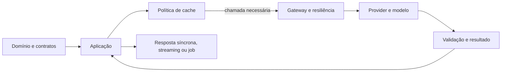

# Arquitetura de aplicações com IA

Material de estudo sobre dependências de código, acesso a modelos, execução de chamadas,
reutilização de resultados e recuperação de documentos. As cinco trilhas se conectam: organizar
módulos facilita trocar providers; um gateway centraliza políticas de acesso; o fluxo define
como o usuário acompanha o trabalho; cache decide quais resultados podem ser reutilizados;
RAG organiza a recuperação de documentos para compor o contexto da resposta.

## Módulos e ordem sugerida

| Módulo | Aulas | Questão central |
|---|---|---|
| [02 — Acoplamento e saúde da aplicação](02-coupling-and-application-health/README.md) | 18 | Quais dependências tornam uma mudança difícil e como investigar isso? |
| [03 — AI Gateway](03-ai-gateway/README.md) | 18 | Como padronizar acesso, roteamento e políticas sem esconder requisitos da aplicação? |
| [04 — Fluxos de chamada](04-call-flows/README.md) | 7 | A resposta precisa terminar nesta requisição, chegar em partes ou virar um job? |
| [05 — Cache](05-cache/README.md) | 23 | Quando uma análise anterior ou parte do processamento pode ser reaproveitada? |
| [06 — RAG](06-RAG/README.md) | 34 | Como recuperar documentos e compor o contexto de uma resposta? |

A numeração acompanha as pastas existentes; não há módulo `01` neste diretório. Cada índice
leva às aulas e exemplos. As durações e os prints registram a sequência do curso, enquanto
seções de complemento trazem interpretação e aprofundamento técnico.

## Como usar o material

Leia primeiro o índice e os fundamentos do módulo. Nas aulas práticas, compare a explicação
com o README e o código do projeto associado. Prints mostram um instante do desenvolvimento;
o código disponível pode refletir uma etapa posterior. Uma observação de execução não constitui
garantia de latência, custo ou qualidade em outro ambiente.

As aulas 05–18 de acoplamento ainda não têm material original local. No módulo de cache,
18–19 não têm prints próprios, mas o projeto final ajuda a estudar os conceitos relacionados.
O demo de provider da aula 23 aparece em imagens; seus fontes não foram adicionados ao projeto.
Essas lacunas estão identificadas nas notas, com complementos separados de evidências da aula.

## Como as decisões se conectam

As setas mostram responsabilidades no fluxo, não uma contagem de imports para calcular
acoplamento. O domínio deve definir o contrato da análise; adapters e gateway atendem a esse
contrato. Um cliente HTTP com formato comum simplifica transporte, mas não iguala comportamento,
qualidade, ferramentas ou custo de modelos distintos.

## Guia de decisão

| Situação | Decisão a investigar | Evidência necessária |
|---|---|---|
| Alterar provider exige mudar regras de negócio | Separar dependência externa do caso de uso | Imports, testes e locais realmente afetados |
| Várias aplicações repetem políticas de acesso | Usar gateway/proxy com responsabilidades explícitas | Auth, limites, logs e roteamento configurados |
| Chamada curta cujo resultado determina a operação atual | Fluxo síncrono com orçamento de timeout | Latência observada e contrato de erro |
| Usuário se beneficia de texto progressivo | Streaming com transporte/contrato definidos | Primeiro chunk, encerramento, erro e cancelamento |
| Trabalho deve continuar após encerrar a requisição | Job com estado, execução e recuperação | Persistência, idempotência, retries e acompanhamento |
| Mesma entrada/contexto se repete | Cache exato com validade explícita | Chave, versões, TTL/invalidação e memória |
| Há paráfrases de tarefas equivalentes | Cache semântico após calibração | Filtros, precisão de reutilização e falsos positivos |
| Chamadas necessárias compartilham contexto estável | Prompt caching do provider | Tokens reutilizados e custo líquido por API/modelo |

Essas alternativas podem coexistir. Um job pode chamar um gateway, usar cache e produzir eventos
de progresso; continuar o trabalho em outro momento não remove a necessidade de validar a saída.

## Distinções que evitam erros

- **Instabilidade de dependências × falha em runtime:** `I = Ce / (Ca + Ce)` descreve um grafo
  estático e sua unidade de contagem. Não mede disponibilidade de serviços.
- **Compatibilidade × equivalência:** aceitar um payload comum não garante capacidades ou
  respostas intercambiáveis. Teste o contrato de cada capability.
- **Retry × fallback:** retry repete uma tentativa; fallback muda a alternativa. Ambos podem
  aumentar custo e devem respeitar o prazo total e a idempotência.
- **`async def` × job:** esperar I/O sem bloquear o event loop não persiste trabalho para
  sobrevivência a reinícios. Tarefa em memória e fila durável oferecem garantias diferentes.
- **Streaming × SSE:** streaming é entrega incremental; SSE é um protocolo específico de eventos.
  Um `StreamingResponse` de `text/plain` não implementa automaticamente SSE.
- **Similaridade × reutilização correta:** proximidade vetorial gera candidatos, não prova
  equivalência da resposta, autorização ou atualização dos dados.
- **Cache da aplicação × prompt caching:** o primeiro pode evitar o chat; o segundo reaproveita
  entrada na chamada que ainda gera uma nova saída.

## Exercício de integração

Projete um classificador de tickets e explique as escolhas antes de implementar:

1. Defina categorias, schema, critérios de erro e quais dados do cliente influenciam o resultado.
2. Posicione o contrato do classificador e o adapter do provider nas dependências do código.
3. Escolha chamada direta ou gateway; estabeleça prazo total, limites, retries e fallback aceitável.
4. Escolha fluxo síncrono ou job conforme a experiência exigida, e transporte de progresso quando útil.
5. Defina escopo e validade do cache; calibre semanticamente com pares que têm respostas incompatíveis.
6. Faça o resultado passar pela mesma validação de negócio, venha ele de cache ou de nova inferência.
7. Meça qualidade, custo e latência por caminho, usando origem da resposta e metadados das chamadas.

Os exemplos são independentes: não compartilham automaticamente gateway, cache ou banco. Cada
projeto declara dependências, portas e comandos em seu README. Os limites observados e as
correções desta revisão estão no [registro de revisão](REVISAO.md).
