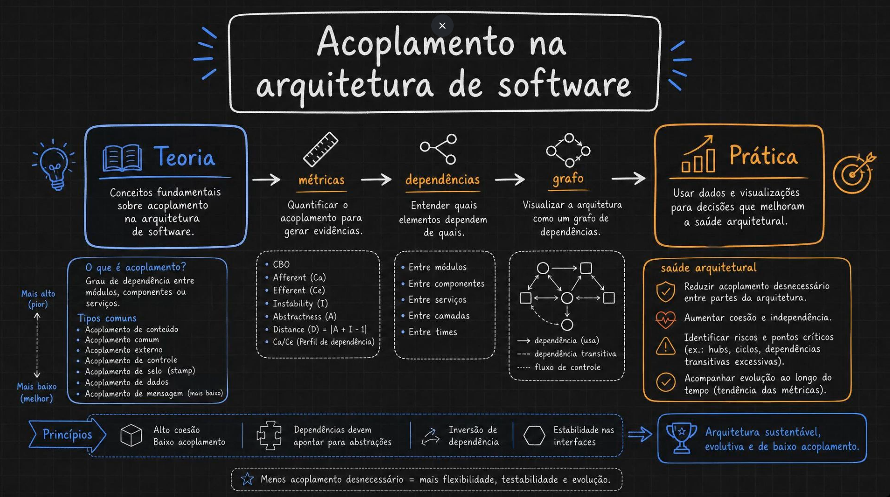
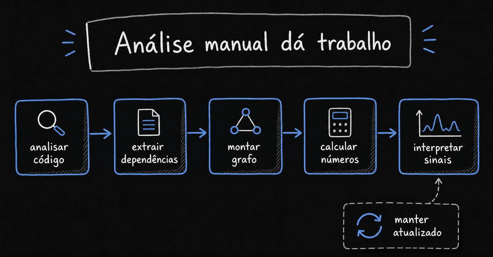
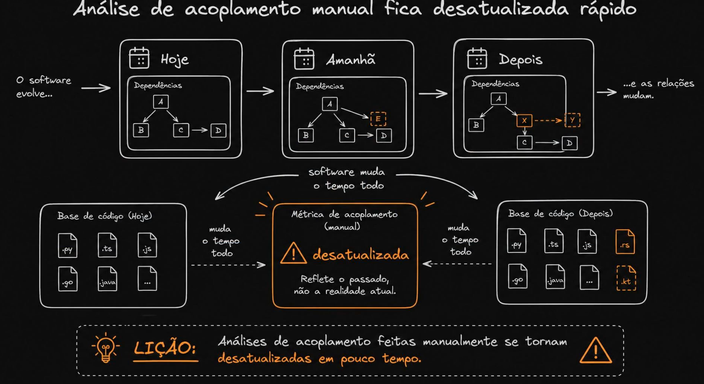
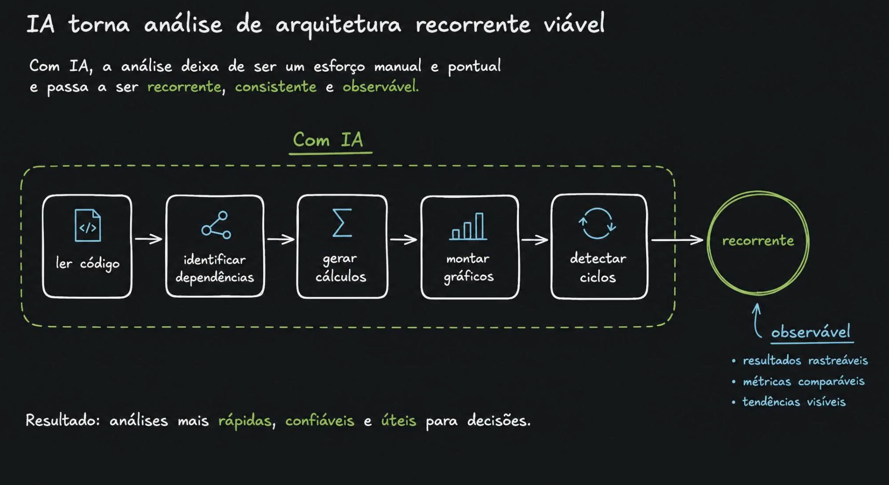
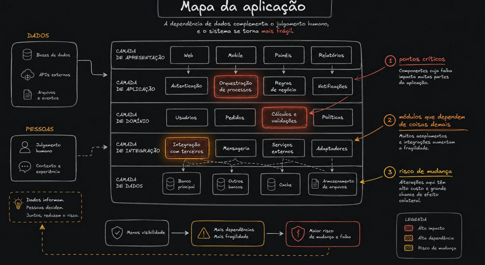
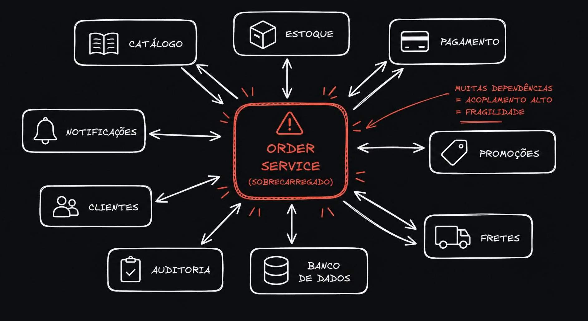
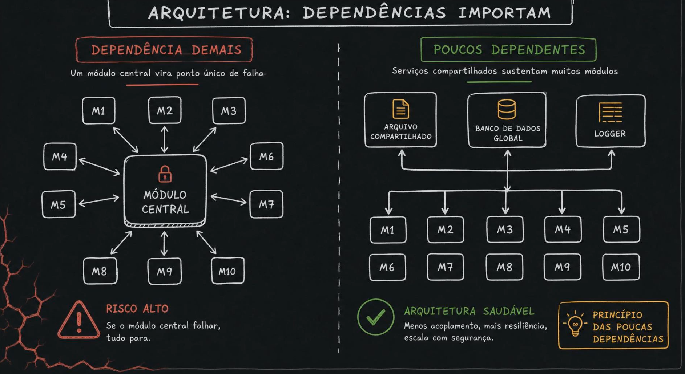
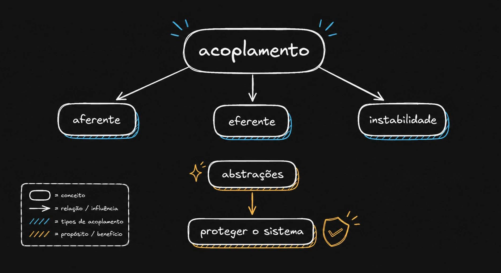
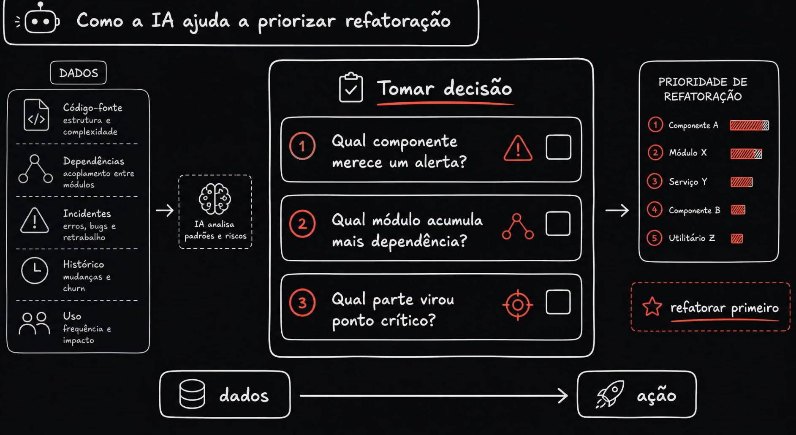
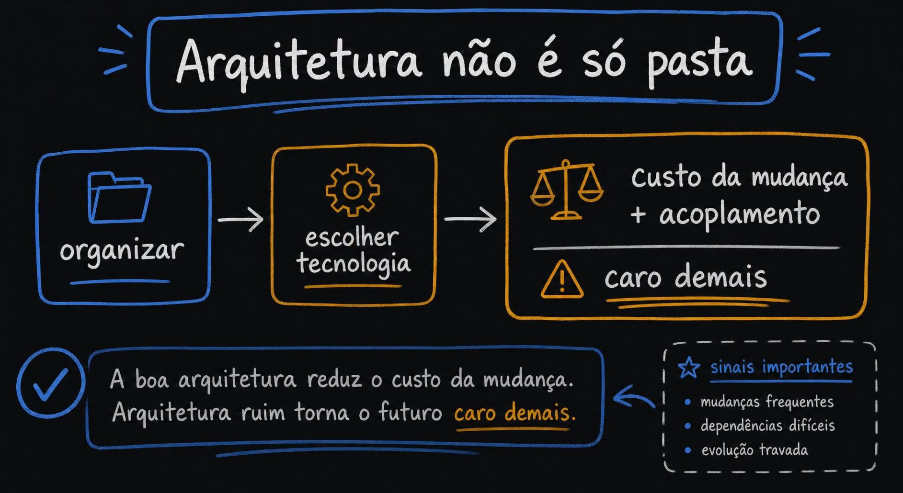

# Acoplamento e saúde da aplicação — Introdução

Este documento explica, imagem por imagem, o material visual desta pasta.

A linha de raciocínio do conjunto é:

> **Acoplamento é o que define o custo de mudar um software.**
> Ele pode ser medido, mas medir na mão fica caro e desatualiza rápido.
> IA resolve o custo de *medir*; a decisão continua sendo humana.

---

## Índice

| # | Imagem | Assunto |
|---|--------|---------|
| 01 | [Mapa geral](#01--mapa-geral-da-teoria-à-prática) | Teoria → métricas → dependências → grafo → prática |
| 02 | [Análise manual dá trabalho](#02--análise-manual-dá-trabalho) | O esforço do processo manual |
| 03 | [Análise manual desatualiza](#03--análise-manual-fica-desatualizada-rápido) | Por que a foto manual apodrece |
| 04 | [IA torna recorrente](#04--ia-torna-a-análise-recorrente-viável) | De esforço pontual a processo contínuo |
| 05 | [Mapa da aplicação](#05--mapa-da-aplicação) | Camadas, pontos críticos e risco de mudança |
| 06 | [Serviço sobrecarregado](#06--o-serviço-sobrecarregado-god-service) | O anti-padrão do hub |
| 07 | [Dependências importam](#07--dependências-importam-hub-frágil-vs-base-estável) | Hub frágil × base compartilhada saudável |
| 08 | [IA facilita](#08--ia-facilita-mas-não-decide) | Papel da IA na decisão arquitetural |
| 09 | [Mapa conceitual](#09--mapa-conceitual-do-acoplamento) | Aferente, eferente, instabilidade, abstrações |
| 10 | [Priorizar refatoração](#10--como-a-ia-ajuda-a-priorizar-refatoração) | Da evidência para a fila de trabalho |
| 11 | [Arquitetura não é só pasta](#11--arquitetura-não-é-só-pasta) | O que arquitetura realmente decide |

---

## 01 — Mapa geral: da teoria à prática



O quadro-síntese do tema. Ele percorre cinco estações:

**Teoria → métricas → dependências → grafo → prática**

### O que é acoplamento

Grau de dependência entre módulos, componentes ou serviços. Quanto maior o acoplamento, maior a chance de que mexer em **A** obrigue a mexer em **B**.

### Tipos comuns, do pior para o melhor

A imagem lista a escala clássica (Stevens, Myers e Constantine). Ler de cima para baixo é ler de **pior** para **melhor**:

| Tipo | O que acontece | Por que é ruim (ou aceitável) |
|------|----------------|-------------------------------|
| **Conteúdo** | Um módulo mexe nos dados/internos de outro | Pior de todos: viola o encapsulamento por completo |
| **Comum** | Vários módulos compartilham estado global | Mudar o global quebra todos de uma vez |
| **Externo** | Módulos amarrados a um formato/protocolo/ferramenta externa | O de fora dita o ritmo do de dentro |
| **De controle** | Um módulo passa uma flag que decide o comportamento do outro | O chamador precisa conhecer a lógica interna do chamado |
| **De selo (stamp)** | Passa uma estrutura inteira quando só precisa de um campo | Acopla ao formato do dado, não ao dado |
| **De dados** | Passa apenas os parâmetros necessários | Saudável — é o padrão desejável |
| **De mensagem** | Comunicação por mensagem/evento, sem estrutura compartilhada | O mais baixo: independência máxima |

> A escala não é "elimine todo acoplamento". Acoplamento zero é sistema sem funcionalidade. A meta é **eliminar o acoplamento desnecessário** e empurrar o necessário para os níveis de baixo da tabela.

### Métricas citadas

| Métrica | Significado | Leitura |
|---------|-------------|---------|
| **CBO** (*Coupling Between Objects*) | Quantas outras classes uma classe referencia | Alto = classe difícil de testar e reusar |
| **Ca** (*Afferent coupling*) | Quantos dependem **de mim** | Alto = sou muito usado; mudar em mim é caro |
| **Ce** (*Efferent coupling*) | De quantos **eu dependo** | Alto = sou frágil; qualquer um deles me quebra |
| **I** (*Instability*) | `I = Ce / (Ca + Ce)` — varia de 0 a 1 | `0` = totalmente estável (muitos dependem de mim); `1` = totalmente instável (só eu dependo dos outros) |
| **A** (*Abstractness*) | Proporção de tipos abstratos no pacote | `0` = tudo concreto; `1` = tudo abstração |
| **D** (*Distance*) | `D = \|A + I − 1\|` | Distância da "sequência principal". Perto de `0` = equilibrado; perto de `1` = zona de dor |
| **Ca/Ce** | Perfil de dependência | Mostra se o componente é mais consumido ou mais consumidor |

**Como interpretar `D` na prática:** o ideal é que componentes muito dependidos (`I` baixo) sejam abstratos (`A` alto), e componentes que dependem de tudo (`I` alto) sejam concretos e descartáveis (`A` baixo). Quando isso se inverte, você tem ou uma **zona de dor** (concreto e estável — difícil de mudar, todo mundo usa) ou uma **zona de inutilidade** (abstrato e instável — abstração que ninguém usa).

### Onde o acoplamento aparece

Entre módulos, componentes, serviços, camadas — e **entre times**. O último é o mais subestimado: a Lei de Conway garante que o desenho da organização acaba refletido no desenho do sistema.

### Princípios de fechamento

- Alta coesão, baixo acoplamento
- Dependências devem apontar para abstrações (*Dependency Inversion*)
- Estabilidade nas interfaces

---

## 02 — Análise manual dá trabalho



O pipeline que alguém precisa executar para responder "como está o acoplamento aqui?":

```
analisar código → extrair dependências → montar grafo → calcular números → interpretar sinais
                                                                                    ↑
                                                                          manter atualizado
```

Os quatro primeiros passos são trabalhosos, mas **mecânicos**. O quinto — interpretar sinais — é onde está o valor. A ironia: quase todo o tempo é gasto nos quatro primeiros, e a energia acaba antes de chegar no quinto.

A seta tracejada de "manter atualizado" é o detalhe importante. Não é um pipeline que se roda uma vez; é um ciclo.

---

## 03 — Análise manual fica desatualizada rápido



A consequência direta da imagem anterior.

**Hoje / Amanhã / Depois** — o mesmo grafo em três momentos. Entre um e outro, um `E` aparece, um `X` vira intermediário, um `Y` surge, arestas mudam de direção. Embaixo, a base de código ganha `.rs` e `.kt` que não existiam.

No centro: a métrica de acoplamento feita manualmente, marcada como **desatualizada** — *"reflete o passado, não a realidade atual"*.

> **Lição:** análises de acoplamento feitas manualmente se tornam desatualizadas em pouco tempo.

O problema não é a análise estar errada quando foi feita. É que ela **é uma foto de um sistema que continua se mexendo**. Uma decisão de refatoração tomada com base num grafo de três meses atrás pode atacar um problema que já não existe — ou ignorar um que nasceu depois.

---

## 04 — IA torna a análise recorrente viável



Aqui está a virada de chave do material.

```
ler código → identificar dependências → gerar cálculos → montar gráficos → detectar ciclos → recorrente
```

O pipeline é essencialmente o mesmo da imagem 02. O que muda é **quem executa e a que custo**. Quando o custo marginal de rodar a análise cai perto de zero, três propriedades aparecem:

| Propriedade | O que significa na prática |
|-------------|----------------------------|
| **Recorrente** | Roda a cada commit / a cada sprint, não uma vez por ano |
| **Consistente** | Mesmo critério sempre — dá para comparar hoje com o mês passado |
| **Observável** | Resultados rastreáveis, métricas comparáveis, tendências visíveis |

**Observabilidade é o ganho real.** Um número isolado de acoplamento diz pouco. `CBO = 14` é bom ou ruim? Depende. Mas `CBO` que era 6 e virou 14 em dois meses é um sinal inequívoco — e você só enxerga isso se a medição for recorrente e consistente.

---

## 05 — Mapa da aplicação



Uma aplicação em cinco camadas — apresentação, aplicação, domínio, integração, dados — com dois insumos entrando pela esquerda: **dados** (bases, APIs externas, arquivos e eventos) e **pessoas** (julgamento humano, contexto e experiência).

Três sinais destacados no diagrama:

1. **Pontos críticos** — componentes cuja falha impacta muitas partes da aplicação. No exemplo: *Orquestração de processos* e *Cálculos e validações*.
2. **Módulos que dependem de coisas demais** — muitos acoplamentos e integrações aumentam a fragilidade. No exemplo: *Integração com terceiros*.
3. **Risco de mudança** — alterações ali têm alto custo e grande chance de efeito colateral. No exemplo: a camada de dados.

E a cadeia causal no rodapé:

```
Menos visibilidade → Mais dependências, mais fragilidade → Maior risco de mudança e falha
```

Note que as setas tracejadas da *Integração com terceiros* atravessam a camada inteira até os dados — é o desenho de um acesso que fura camadas. Esse tipo de aresta é justamente o que um grafo automático revela e uma leitura de pastas esconde.

> **Dados informam. Pessoas decidem. Juntos, reduzem o risco.**

---

## 06 — O serviço sobrecarregado (*god service*)



O anti-padrão em sua forma mais reconhecível. O **Order Service** conversa com catálogo, estoque, pagamento, promoções, fretes, banco de dados, auditoria, clientes e notificações — **e quase todas as setas são bidirecionais**.

```
MUITAS DEPENDÊNCIAS = ACOPLAMENTO ALTO = FRAGILIDADE
```

Traduzindo em métricas: esse componente tem **Ce alto** (depende de todo mundo) **e Ca alto** (todo mundo depende dele) ao mesmo tempo. É a pior combinação possível:

- Como `Ce` é alto, qualquer um dos nove vizinhos pode quebrá-lo.
- Como `Ca` é alto, quando ele quebra, quebra tudo junto.
- Como as setas são bidirecionais, há **ciclos** — não dá para implantar, testar ou raciocinar sobre uma ponta sem a outra.

O nome do serviço entrega o diagnóstico. "Order" virou o lugar onde a regra de negócio de todo mundo foi parar, porque toda funcionalidade nova passa por pedido em algum momento. O caminho de saída raramente é "quebrar o Order Service em dez"; é **inverter as dependências** — trocar chamadas síncronas bidirecionais por eventos, e mover regra que não é de pedido para fora.

---

## 07 — Dependências importam: hub frágil × base estável



A imagem mais sutil do conjunto, e a que mais gente lê errado.

**Lado esquerdo — "dependência demais":** um módulo central com dez módulos ao redor, **setas bidirecionais**, cadeado no meio. *Se o módulo central falhar, tudo para.* Risco alto.

**Lado direito — "poucos dependentes":** arquivo compartilhado, banco de dados global e logger sustentando dez módulos, com **fluxo unidirecional**. Arquitetura saudável.

### Por que os dois não são a mesma coisa

Nos dois lados há muitos módulos apontando para poucos elementos. A diferença é qual **tipo** de dependência:

| | Esquerda (frágil) | Direita (saudável) |
|---|---|---|
| Direção | Bidirecional — há ciclos | Unidirecional |
| Natureza do centro | Regra de negócio concreta | Infraestrutura estável e genérica |
| Volatilidade | Muda a cada feature | Quase não muda |
| Efeito de mudar o centro | Propaga por todo o sistema | Contido, porque a interface é estável |

Ou seja: **`Ca` alto não é defeito por si só.** Um logger com `Ca` altíssimo está cumprindo seu papel. O que é defeito é `Ca` alto num componente **volátil, concreto e que também tem `Ce` alto** — que é exatamente o caso da imagem 06.

> **Princípio das poucas dependências:** menos acoplamento, mais resiliência, escala com segurança.

---

## 08 — IA facilita, mas não decide


O contrapeso necessário depois de duas imagens celebrando automação.

**O que a IA faz:** processa dados, identifica padrões, simula cenários, organiza informações. Ela torna visíveis três sinais que costumam ficar implícitos:

| Sinal | O que revela |
|-------|--------------|
| **Fragilidade** | Pontos críticos, vulnerabilidades, sensibilidades |
| **Rigidez** | Baixa adaptabilidade, acoplamentos, dependências |
| **Custo de mudança** | Esforço, tempo, recursos e impacto de alterações |

**O que a IA não faz:** substituir o julgamento arquitetural — que depende de **contexto, valores, intenções e experiência**.

> **IA não decide. Ela ilumina o caminho para melhores decisões.**

Isso não é ressalva de cortesia; é limitação técnica real. As métricas dizem que o módulo `X` tem acoplamento alto. Elas não sabem que `X` vai ser substituído no trimestre que vem, que o time que o mantém está sendo desmontado, ou que aquele acoplamento "feio" é uma exigência de auditoria regulatória. **Números são entrada da decisão, não a decisão.**

---

## 09 — Mapa conceitual do acoplamento



O resumo mínimo do vocabulário. Do conceito de acoplamento saem três medidas:

- **Aferente (`Ca`)** — quem depende de mim
- **Eferente (`Ce`)** — de quem eu dependo
- **Instabilidade (`I`)** — `Ce / (Ca + Ce)`

E, embaixo, o mecanismo de defesa:

```
abstrações → proteger o sistema
```

**Por que abstrações protegem.** Uma dependência para uma classe concreta amarra você à implementação dela — muda a implementação, você muda junto. Uma dependência para uma interface amarra você apenas ao contrato. O contrato muda menos que a implementação; logo a dependência custa menos. É por isso que a métrica `D = |A + I − 1|` faz sentido: ela cobra que **o que é muito dependido seja abstrato**.

### Como ler `Ca` e `Ce` juntos

| `Ca` | `Ce` | Perfil | Diagnóstico |
|------|------|--------|-------------|
| Alto | Baixo | Estável / base | Saudável se for abstrato. É o logger da imagem 07 |
| Baixo | Alto | Instável / borda | Saudável. É o controller, o adapter, o descartável |
| Alto | Alto | **Hub** | **Problema.** É o Order Service da imagem 06 |
| Baixo | Baixo | Isolado | Investigar — pode ser código morto |

---

## 10 — Como a IA ajuda a priorizar refatoração



Onde a análise vira trabalho concreto. Quatro fontes de dados alimentam a decisão:

| Fonte | O que traz |
|-------|-----------|
| **Código-fonte** | Estrutura e complexidade |
| **Dependências** | Acoplamento entre módulos |
| **Incidentes** | Erros, bugs e retrabalho |
| **Histórico** | Mudanças e *churn* |
| **Uso** | Frequência e impacto |

E três perguntas de decisão:

1. Qual componente merece um alerta?
2. Qual módulo acumula mais dependência?
3. Qual parte virou ponto crítico?

O resultado é uma **fila priorizada** — Componente A, Módulo X, Serviço Y… — com um item marcado como *refatorar primeiro*.

```
dados → ação
```

**O ponto não óbvio aqui é o cruzamento de fontes.** Acoplamento sozinho não prioriza nada: existe módulo com acoplamento horrível que ninguém toca há três anos e nunca deu incidente — refatorar isso é desperdício. O que prioriza é a interseção:

> **acoplamento alto × churn alto × incidentes** = onde a dor é real e recorrente.

É exatamente o cruzamento que ninguém faz na mão, porque exige juntar grafo de dependências, histórico do Git e dados de incidente na mesma tabela.

---

## 11 — Arquitetura não é só pasta



O fechamento — e a tese do material inteiro.

```
organizar → escolher tecnologia → custo da mudança + acoplamento → caro demais
```

Organizar pastas e escolher tecnologia são as decisões visíveis, e são as que consomem a maior parte das discussões de arquitetura. Mas nenhuma delas é o produto final. O que a arquitetura realmente determina é o **custo de mudar o sistema depois** — e esse custo é função direta do acoplamento.

> **A boa arquitetura reduz o custo da mudança. Arquitetura ruim torna o futuro caro demais.**

**Sinais importantes** de que o custo está subindo:

- mudanças frequentes
- dependências difíceis
- evolução travada

---

## Fechando o ciclo

Juntando as onze imagens:

| Etapa | Imagens | Resumo |
|-------|---------|--------|
| **O conceito** | 01, 09, 11 | Acoplamento é o preço da mudança futura; medível por `Ca`, `Ce`, `I`, `A`, `D` |
| **O problema** | 02, 03 | Medir na mão é caro e a foto apodrece antes de virar decisão |
| **A solução** | 04, 08, 10 | IA torna a medição recorrente e observável; a decisão continua humana |
| **Os sintomas** | 05, 06, 07 | Hub sobrecarregado, ponto único de falha, acesso que fura camadas |

### Perguntas para levar ao seu próprio repositório

1. Existe algum componente com `Ca` **e** `Ce` altos ao mesmo tempo? Esse é seu Order Service.
2. Existem ciclos no grafo de dependências? Ciclo impede testar, implantar e raciocinar em separado.
3. O que muda mais (`churn` alto) é também o que tem acoplamento alto? Essa interseção é a fila de refatoração.
4. As dependências mais concentradas apontam para abstrações estáveis ou para regra de negócio volátil?
5. Você consegue comparar a métrica de hoje com a de três meses atrás? Se não, você tem um número, não uma tendência.

---

### Glossário rápido

| Termo | Definição |
|-------|-----------|
| **Acoplamento** | Grau de dependência entre duas unidades de software |
| **Coesão** | Grau em que os elementos de uma unidade pertencem juntos. Meta: alta |
| **`Ca` / Aferente** | Número de unidades externas que dependem desta |
| **`Ce` / Eferente** | Número de unidades externas das quais esta depende |
| **`I` / Instabilidade** | `Ce / (Ca + Ce)`. `0` = estável, `1` = instável |
| **`A` / Abstratividade** | Proporção de tipos abstratos na unidade |
| **`D` / Distância** | `\|A + I − 1\|`. Distância da sequência principal |
| **CBO** | *Coupling Between Objects* — quantidade de classes acopladas a uma classe |
| **Dependência transitiva** | `A → B → C`: `A` depende de `C` sem saber |
| **Hub** | Componente com `Ca` e `Ce` altos; concentra risco |
| **Ciclo** | `A → B → A`. Impede evolução e implantação independentes |
| **Churn** | Frequência de alteração de um arquivo ao longo do tempo |
| **Zona de dor** | Concreto e estável: caro de mudar, todo mundo usa |
| **Zona de inutilidade** | Abstrato e instável: abstração que ninguém consome |
