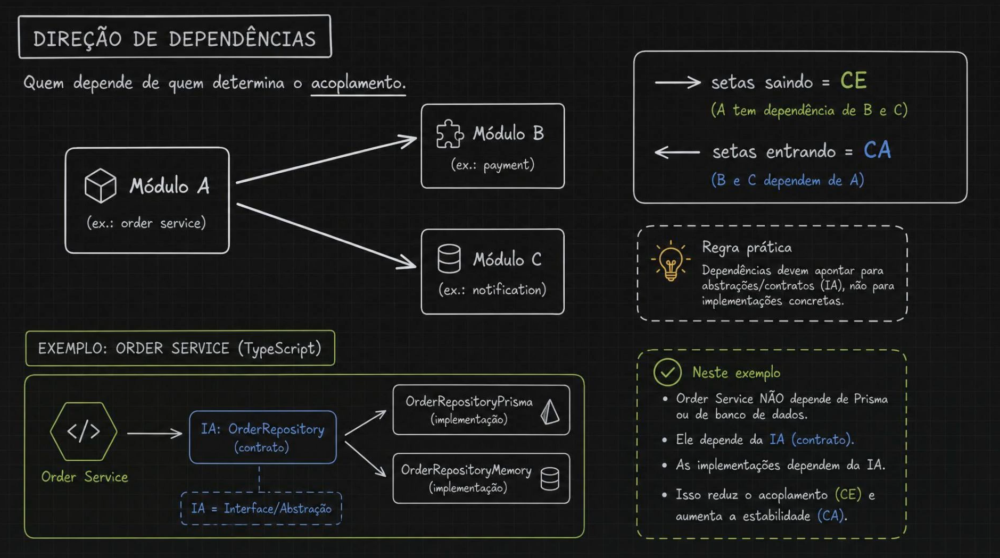
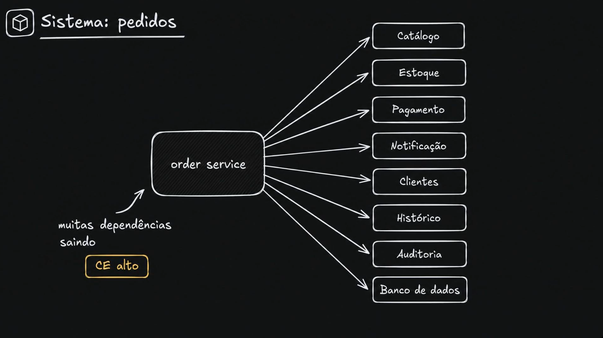
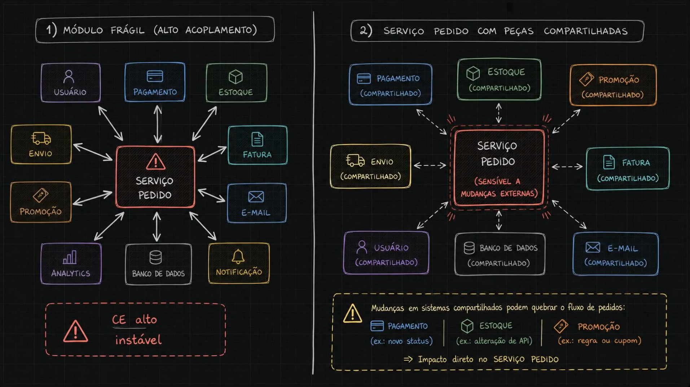
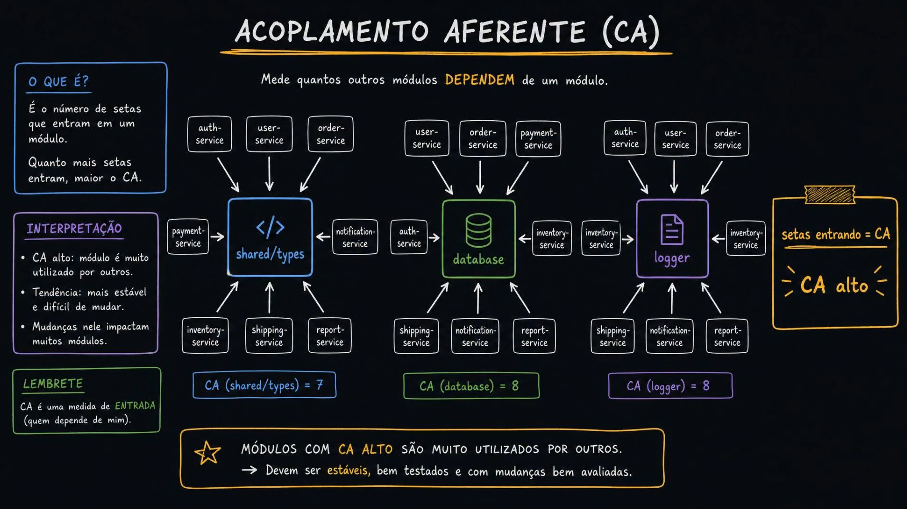
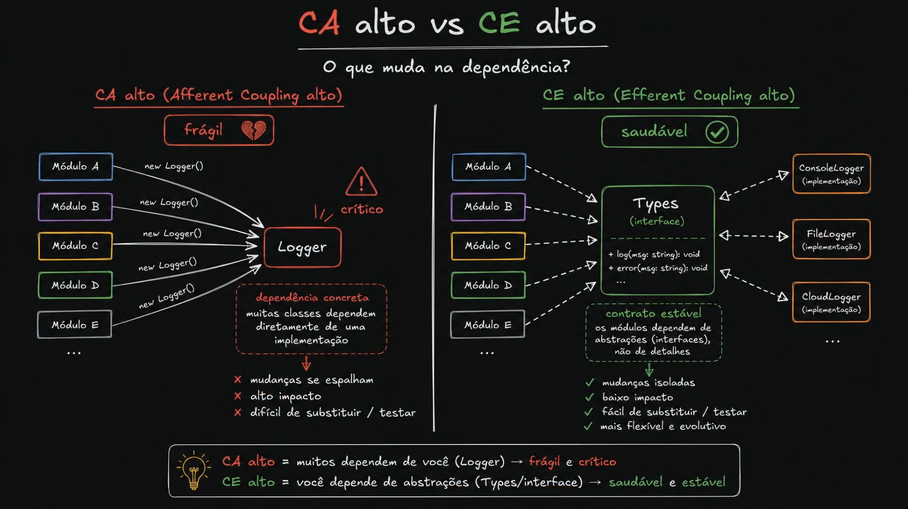
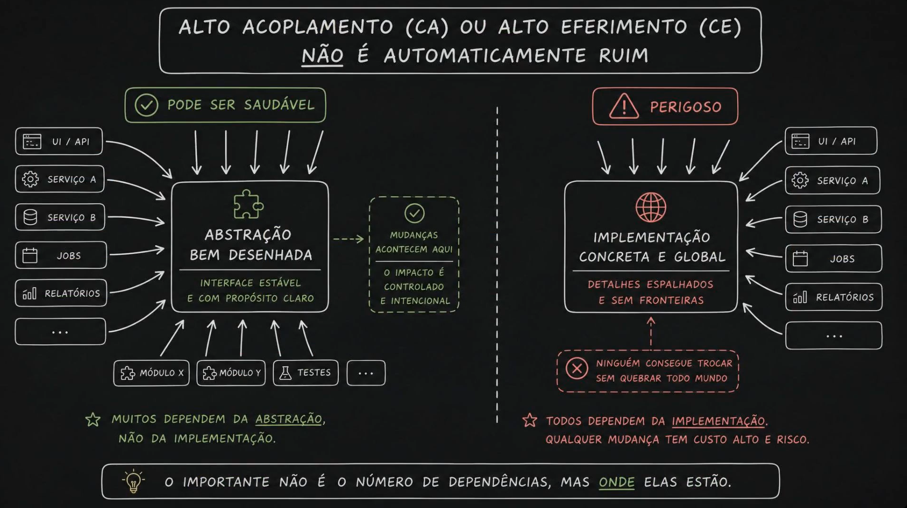
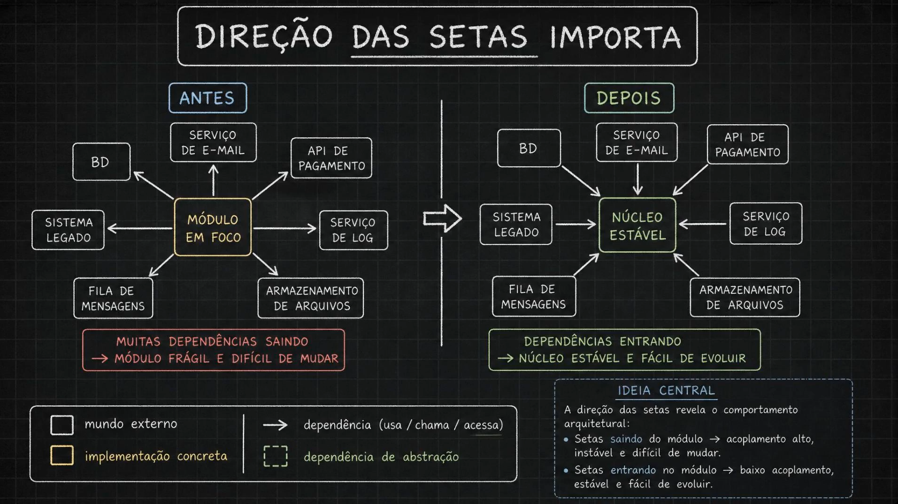
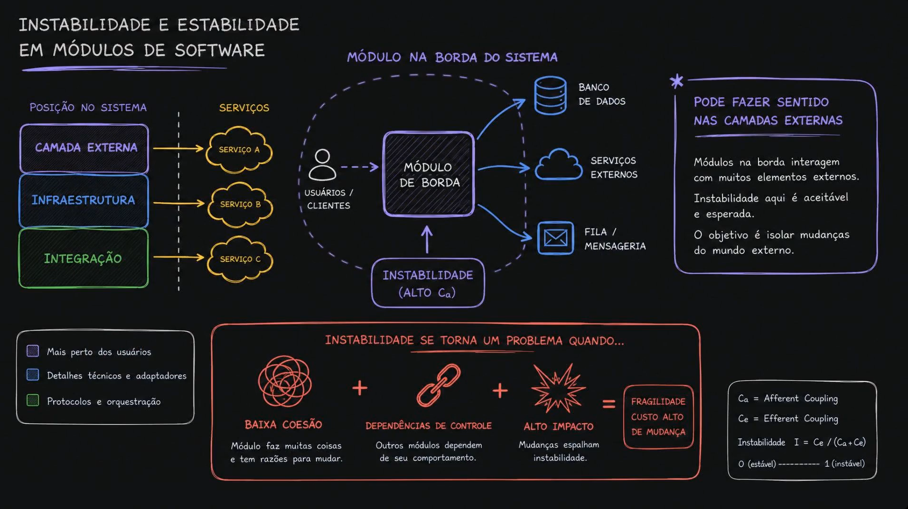
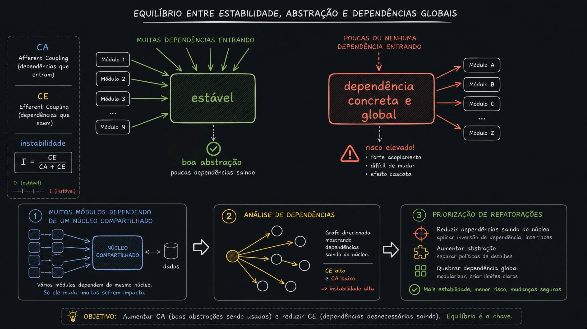
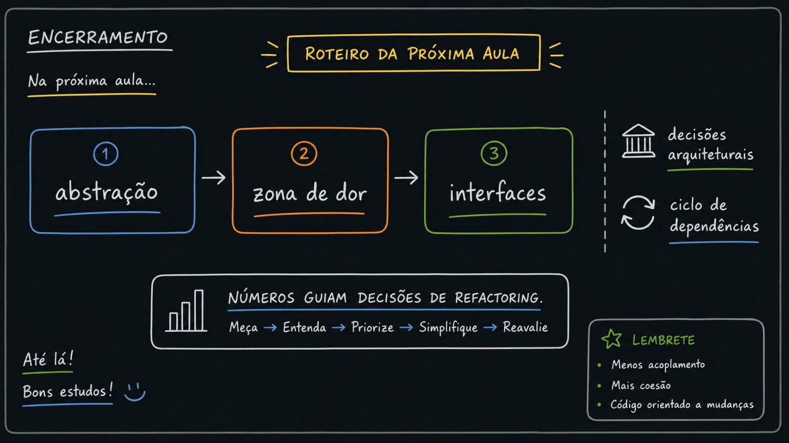

# Aula 02 — Tipos de Acoplamento

> Curso: **Acoplamento e saúde da aplicação ao longo do tempo** · Duração: `08:10`
> Aula anterior: [01 — Introdução a Acoplamento](../01-introduction/README.md)

A aula 01 apresentou o vocabulário. Esta aula aprofunda **as duas medidas que sustentam todo o resto do curso** — `CA` e `CE` — e chega numa conclusão que parece contraintuitiva:

> **O que importa não é *quantas* dependências um módulo tem, mas *para onde* elas apontam.**

---

## Índice

| # | Imagem | Assunto |
|---|--------|---------|
| 01 | [Direção de dependências](#01--direção-de-dependências) | `CE` = setas saindo, `CA` = setas entrando |
| 02 | [Order service com `CE` alto](#02--order-service-com-ce-alto) | Como se parece um módulo com CE alto |
| 03 | [Módulo frágil × peças compartilhadas](#03--módulo-frágil--peças-compartilhadas) | O custo real do `CE` alto |
| 04 | [Acoplamento aferente (`CA`)](#04--acoplamento-aferente-ca) | Definição e contagem prática |
| 05 | [`CA` alto vs `CE` alto](#05--ca-alto-vs-ce-alto) | Concreto × abstrato *(atenção aos rótulos)* |
| 06 | [Não é automaticamente ruim](#06--acoplamento-alto-não-é-automaticamente-ruim) | A frase que resolve a aula |
| 07 | [Direção das setas importa](#07--direção-das-setas-importa) | Antes e depois da inversão |
| 08 | [Instabilidade e estabilidade](#08--instabilidade-e-estabilidade) | `I = CE / (CA + CE)` e módulos de borda |
| 09 | [Equilíbrio](#09--equilíbrio-entre-estabilidade-abstração-e-dependências-globais) | O objetivo prático e como priorizar |
| 10 | [Encerramento](#10--encerramento) | Roteiro da próxima aula |

---

## 01 — Direção de dependências



**Quem depende de quem determina o acoplamento.** As duas medidas são simplesmente a contagem de setas, e o que muda é a direção:

| Setas | Métrica | Significado |
|-------|---------|-------------|
| **Saindo** do módulo | **`CE`** (*Efferent Coupling*) | Eu dependo de outros — *A depende de B e C* |
| **Entrando** no módulo | **`CA`** (*Afferent Coupling*) | Outros dependem de mim — *B e C dependem de A* |

> **Regra prática da imagem:** dependências devem apontar para **abstrações/contratos**, não para implementações concretas.

### O exemplo em TypeScript

```
Order Service ──▶ OrderRepository (interface/contrato)
                        ▲              ▲
                        │              │
             OrderRepositoryPrisma   OrderRepositoryMemory
                 (implementação)        (implementação)
```

Repare na direção das setas de baixo: **as implementações apontam para a interface**, não o contrário. Isso é o *Dependency Inversion Principle* em ação, e é o que produz os três fatos listados na imagem:

- O Order Service **não** depende de Prisma nem de banco de dados
- Ele depende apenas do **contrato**
- Trocar Prisma por outra coisa não toca no Order Service

### O detalhe que decide se a inversão é real

A interface `OrderRepository` precisa **pertencer ao domínio**, não à camada de infraestrutura. Se ela mora junto do Prisma e o domínio a importa de lá, a seta continua saindo do domínio para a infra — você ganhou uma interface, mas não inverteu nada. É a diferença entre *ter uma interface* e *fazer inversão de dependência*.

---

## 02 — Order service com `CE` alto



O mesmo `order service` da aula 01, agora medido. Oito setas saindo:

`Catálogo · Estoque · Pagamento · Notificação · Clientes · Histórico · Auditoria · Banco de dados`

**`CE` = 8.** Traduzindo: existem **oito motivos externos** para esse módulo quebrar ou precisar mudar. Ele não controla nenhum deles.

Aplicando a fórmula da instabilidade — se esse módulo tem `CA` baixo (ninguém depende dele além do controller):

```
I = CE / (CA + CE) = 8 / (0 + 8) = 1.0   →  instabilidade máxima
```

Um `I` de `1.0` não é automaticamente errado. É errado **quando o módulo carrega regra de negócio importante**, porque significa que a regra mais valiosa do sistema está no lugar mais volátil dele.

---

## 03 — Módulo frágil × peças compartilhadas



Dois painéis mostrando o mesmo problema por ângulos diferentes.

**Painel 1 — Módulo frágil (alto acoplamento).** Serviço Pedido no centro, dez vizinhos, **setas bidirecionais**. Diagnóstico: `CE` alto, instável.

**Painel 2 — As mesmas peças, agora marcadas como *compartilhadas*.** O Serviço Pedido aparece como *"sensível a mudanças externas"*, e a imagem dá três exemplos concretos de como ele quebra sem ninguém tocar nele:

| Mudança em… | Exemplo | Efeito |
|-------------|---------|--------|
| **Pagamento** | Novo status | Impacto direto no fluxo de pedidos |
| **Estoque** | Alteração de API | Impacto direto no fluxo de pedidos |
| **Promoção** | Nova regra ou cupom | Impacto direto no fluxo de pedidos |

### O ponto que esse par de painéis ensina

O custo do `CE` alto **não é principalmente falha em runtime**. É o custo de **mudar junto**: toda vez que um vizinho evolui, você entra na fila para acompanhar. Isso não aparece em nenhum incidente — aparece como time lento, sprint que estoura, mudança pequena que vira épico.

---

## 04 — Acoplamento aferente (`CA`)



> **`CA` mede quantos outros módulos DEPENDEM de um módulo.** É o número de setas que *entram*.

A imagem conta três casos reais:

| Módulo | `CA` | Natureza |
|--------|------|----------|
| `shared/types` | 7 | Contratos e tipos |
| `database` | 8 | Infraestrutura |
| `logger` | 8 | Infraestrutura |

### Interpretação

- **`CA` alto** = o módulo é muito utilizado por outros
- **Tendência:** mais estável e mais difícil de mudar
- Mudanças nele **impactam muitos módulos**

> Módulos com `CA` alto devem ser **estáveis, bem testados e com mudanças bem avaliadas**.

**Note o que a imagem *não* diz:** ela não diz que `CA` alto é um defeito. `CA` alto é o comportamento *esperado* de tipos compartilhados, banco e logger — é literalmente para isso que eles existem. `CA` alto vira alarme quando aparece em algo **volátil**, que muda toda semana. Aí você tem um módulo que muda muito e que todo mundo usa: a combinação mais cara que existe.

---

## 05 — `CA` alto vs `CE` alto



Dois cenários de dependência sobre logging.

**Esquerda — rotulada `CA` alto, "frágil":** cinco módulos fazem `new Logger()` direto. Dependência **concreta**: muitas classes dependem diretamente de uma implementação.
`✗` mudanças se espalham · `✗` alto impacto · `✗` difícil de substituir/testar

**Direita — rotulada `CE` alto, "saudável":** os módulos dependem de `Types (interface)`, e `ConsoleLogger`, `FileLogger` e `CloudLogger` implementam esse contrato.
`✓` mudanças isoladas · `✓` baixo impacto · `✓` fácil de substituir/testar · `✓` mais flexível

### ⚠️ Ponto de atenção sobre os rótulos

Lido literalmente, o resumo desta imagem (`CA` alto = frágil, `CE` alto = saudável) **entra em conflito com as imagens 04 e 09 desta mesma aula** — a 04 diz que `CA` alto é característica de módulos bem usados, e a 09 define como objetivo explícito *aumentar `CA`*.

O conflito é de rótulo, não de conteúdo. Os dois painéis usam **pontos de vista diferentes**:

- A esquerda mede do ponto de vista do **`Logger`** (quantos dependem dele → `CA`)
- A direita mede do ponto de vista dos **módulos A–E** (eles dependem da interface → `CE`)

E, na prática, `Types` no painel da direita **também tem `CA` alto** — cinco módulos e três implementações apontam para ele. Se `CA` alto fosse o problema, a direita seria tão ruim quanto a esquerda.

**O que realmente distingue os dois painéis é para onde a seta aponta:**

| | Esquerda | Direita |
|---|---|---|
| Alvo da dependência | Implementação concreta (`Logger`) | Contrato (`Types`) |
| Frequência de mudança do alvo | Alta | Baixa |
| Para trocar a implementação | Toca nos 5 módulos | Toca em nenhum |

A própria aula confirma essa leitura na imagem seguinte.

---

## 06 — Acoplamento alto não é automaticamente ruim



A imagem que resolve a ambiguidade anterior. Os dois lados têm **exatamente o mesmo número de setas entrando** — UI/API, Serviço A, Serviço B, Jobs, Relatórios, Módulo X, Módulo Y, Testes. A única diferença é o que está no meio:

| | **Pode ser saudável** | **Perigoso** |
|---|---|---|
| Centro | Abstração bem desenhada | Implementação concreta e global |
| Característica | Interface estável, propósito claro | Detalhes espalhados, sem fronteiras |
| Efeito de mudar | Impacto controlado e intencional | Ninguém troca sem quebrar todo mundo |
| Quem depende de quê | Muitos dependem da **abstração** | Todos dependem da **implementação** |

> **O importante não é o número de dependências, mas ONDE elas estão.**

Essa é a tese da aula inteira. Toda métrica de acoplamento é secundária a essa pergunta.

---

## 07 — Direção das setas importa



O mesmo módulo, antes e depois de uma inversão de dependência.

**Antes:** *Módulo em foco* (marcado como implementação concreta) com setas **saindo** para BD, serviço de e-mail, API de pagamento, serviço de log, fila de mensagens, armazenamento de arquivos e sistema legado.
→ *Muitas dependências saindo → módulo frágil e difícil de mudar.*

**Depois:** *Núcleo estável* com as mesmas sete caixas, mas agora as setas **entram** nele.
→ *Dependências entrando → núcleo estável e fácil de evoluir.*

> **Ideia central:** a direção das setas revela o comportamento arquitetural.
> Setas **saindo** → acoplamento alto, instável, difícil de mudar.
> Setas **entrando** → baixo acoplamento, estável, fácil de evoluir.

### Como essa inversão acontece de verdade

Virar a seta não é um exercício de desenho. O mecanismo é:

1. O **núcleo declara a interface** de que precisa (`EmailSender`, `OrderRepository`, `PaymentGateway`)
2. O **adaptador de infraestrutura implementa** essa interface
3. A montagem (composition root / DI) liga os dois na inicialização

O núcleo passa a nomear o contrato, e a infra passa a obedecê-lo. É o padrão *Ports & Adapters* — e é por isso que o "depois" tem setas entrando: quem aponta agora é a infra.

**Teste honesto para saber se você realmente inverteu:** se o núcleo ainda `import`a qualquer coisa vinda da infraestrutura — um tipo, um enum de erro, um cliente HTTP — a seta continua saindo. O diagrama muda, o acoplamento não.

---

## 08 — Instabilidade e estabilidade



### A fórmula

```
I = CE / (CA + CE)

0 ─────────────────────────── 1
estável                  instável
```

### Posição no sistema importa

A imagem separa três posições — **camada externa** (mais perto dos usuários), **infraestrutura** (detalhes técnicos e adaptadores) e **integração** (protocolos e orquestração) — e faz um ponto importante sobre **módulos de borda**:

> Módulos na borda interagem com muitos elementos externos.
> **Instabilidade aqui é aceitável e esperada.**
> O objetivo é isolar mudanças do mundo externo.

Ou seja: `I` alto num controller, num adaptador ou num consumer de fila **é o desenho funcionando**. A borda existe justamente para absorver a volatilidade externa e não deixá-la vazar para dentro.

### Quando instabilidade vira problema

A imagem dá a fórmula de três fatores:

```
BAIXA COESÃO          +  DEPENDÊNCIAS DE CONTROLE  +  ALTO IMPACTO       =  FRAGILIDADE
Módulo faz muitas        Outros módulos dependem      Mudanças espalham     CUSTO ALTO
coisas e tem muitas      do seu comportamento         instabilidade         DE MUDANÇA
razões para mudar
```

Note que o segundo fator é `CA` disfarçado: *outros módulos dependem do seu comportamento*. **Instabilidade só é perigosa quando alguém depende do instável.** Borda instável que ninguém consome = tudo bem. Borda instável que virou passagem obrigatória = problema.

### ⚠️ Ponto de atenção

O balão do diagrama diz `INSTABILIDADE (ALTO Ca)`. Pela fórmula que a própria imagem traz — `I = Ce / (Ca + Ce)` — e pelas setas desenhadas (o módulo de borda **aponta para** banco de dados, serviços externos e fila, ou seja, setas *saindo*), o correto é **`CE` alto**. `CA` alto puxa a instabilidade para **baixo**, não para cima. Trate como erro de digitação no slide.

---

## 09 — Equilíbrio entre estabilidade, abstração e dependências globais



Os dois extremos, lado a lado:

| | **Estável** (esquerda) | **Dependência concreta e global** (direita) |
|---|---|---|
| Entrando (`CA`) | Muitas | Poucas ou nenhuma |
| Saindo (`CE`) | Poucas | Muitas |
| `I` | → 0 | → 1 |
| Veredito | Boa abstração | **Risco elevado:** forte acoplamento, difícil de mudar, efeito cascata |

### O processo de três passos

1. **Muitos módulos dependendo de um núcleo compartilhado** — se ele muda, muitos sofrem impacto
2. **Análise de dependências** — grafo direcionado mostrando as dependências que *saem* do núcleo. `CE` alto + `CA` baixo ⇒ instabilidade alta
3. **Priorização de refatorações:**
   - **Reduzir dependências saindo do núcleo** — aplicar inversão de dependência, interfaces
   - **Aumentar abstração** — separar políticas de detalhes
   - **Quebrar dependência global** — modularizar, criar limites claros

> **Objetivo:** aumentar `CA` (boas abstrações sendo usadas) e reduzir `CE` (dependências desnecessárias saindo). **Equilíbrio é a chave.**

O parêntese dessa frase é o que a torna correta. Não é "aumentar `CA`" — é aumentar o `CA` **de boas abstrações**. Aumentar o `CA` de uma implementação concreta é exatamente o painel "perigoso" da imagem 06.

---

## 10 — Encerramento



**Próxima aula:** `abstração` → `zona de dor` → `interfaces`, mais **decisões arquiteturais** e **ciclo de dependências**.

**O ciclo de trabalho do curso:**

```
Meça → Entenda → Priorize → Simplifique → Reavalie
```

> **Números guiam decisões de refactoring.**

**Lembrete final:** menos acoplamento · mais coesão · código orientado a mudanças

---

## Resumo operacional

### A tabela de decisão

| `CA` | `CE` | `I` | Perfil | O que fazer |
|------|------|-----|--------|-------------|
| Alto | Baixo | →0 | **Estável** | Saudável **se for abstrato**. Proteja: teste bem, versione a interface, mude com cuidado |
| Baixo | Alto | →1 | **Instável / borda** | Saudável. É o adaptador, o controller, o descartável. Não coloque regra de negócio aqui |
| Alto | Alto | ~0.5 | **Hub** | **Problema.** Quebre: inverta dependências, separe responsabilidades |
| Baixo | Baixo | — | **Isolado** | Investigue: pode ser código morto |

### As três perguntas da aula

1. **Para onde a seta aponta?** Contrato ou implementação?
2. **Quem declara o contrato?** O núcleo (inversão real) ou a infra (inversão de fachada)?
3. **O que é instável carrega regra de negócio?** Se sim, a regra está no lugar errado.

### Erros de rótulo identificados nos slides

Anotados para não propagarem para as próximas aulas:

| Imagem | O slide diz | O correto |
|--------|-------------|-----------|
| 05 | `CA` alto = frágil, `CE` alto = saudável | O eixo é **concreto × abstrato**, não `CA` × `CE`. A imagem 06 corrige explicitamente |
| 08 | `INSTABILIDADE (ALTO Ca)` | `INSTABILIDADE (ALTO Ce)` — pela fórmula `I = Ce/(Ca+Ce)` |

---

## Conexão com o resto do curso

| Aula | Ligação |
|------|---------|
| [01 — Introdução](../01-introduction/README.md) | Definiu `CA`, `CE`, `I`, `A`, `D` e os 7 tipos de acoplamento |
| **02 — Tipos de Acoplamento** | Aprofunda `CA` e `CE`: direção, alvo e instabilidade |
| [03 — Quando Acoplamento Vira Dor Arquitetural](../03-when-coupling-becomes-an-arc-pain-point/README.md) | Quando os números viram custo real |
| [04 — Main Sequence e Zonas](../04-main-sequence-and-coupling-zones/README.md) | Onde `A` e `D` entram: zona de dor e zona de inutilidade |
