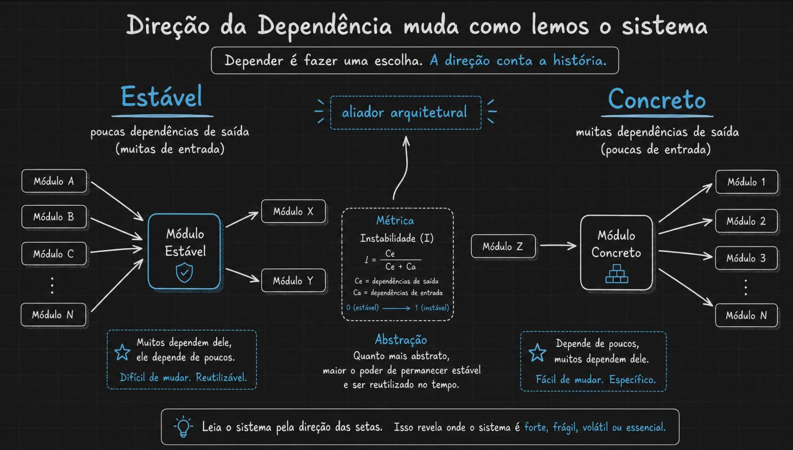
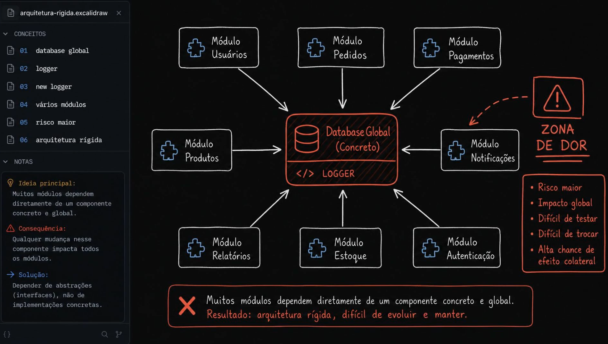
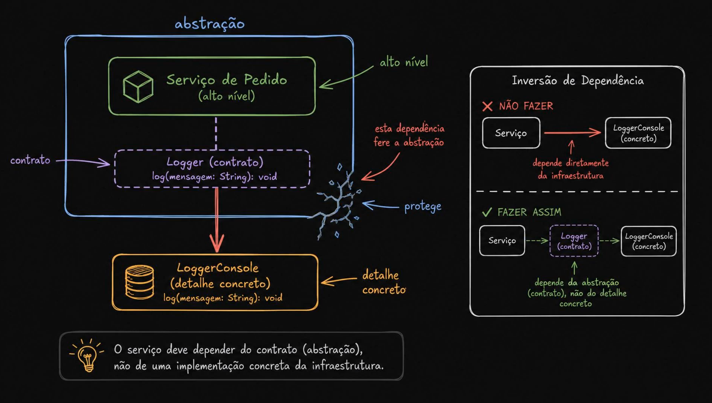
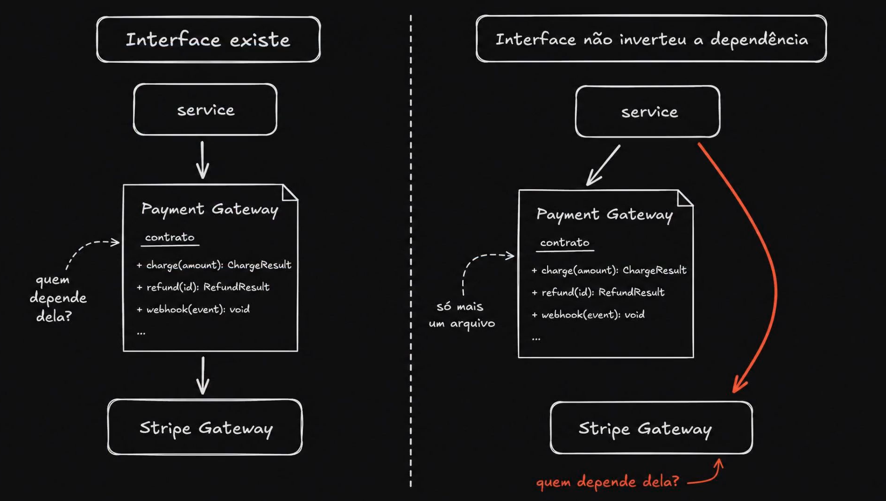
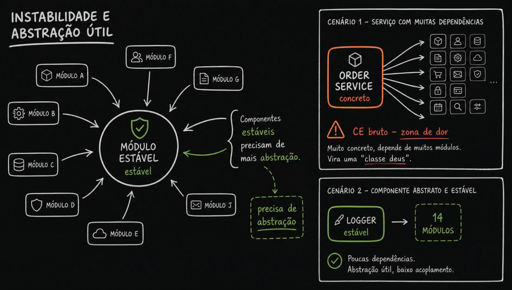
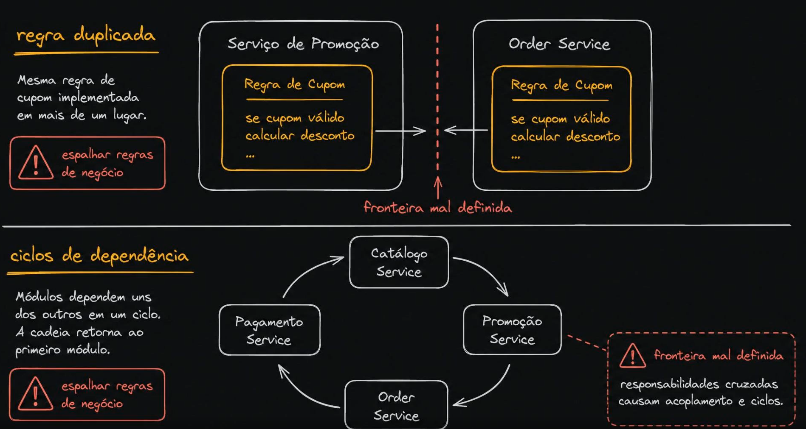
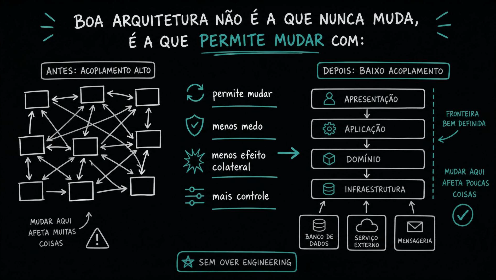
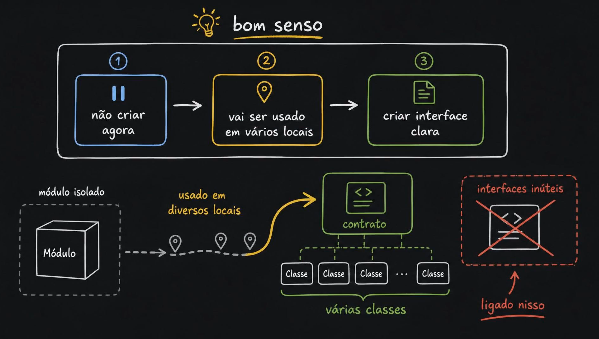

# Aula 03 — Quando Acoplamento Vira Dor Arquitetural

> Curso: **Acoplamento e saúde da aplicação ao longo do tempo** · Duração: `06:25`
> ← [02 — Tipos de Acoplamento](../02-types-coupling/README.md) · [04 — Main Sequence e As Zonas](../04-main-sequence-and-coupling-zones/README.md) →

A aula 02 mostrou **como medir** (`CA`, `CE`, `I`). Esta aula responde à pergunta seguinte: **a partir de quando o número vira dor?** E a resposta não é um limite numérico — é uma combinação de sintomas.

> **Depender é fazer uma escolha. A direção conta a história.**

---

## Índice

| # | Imagem | Assunto |
|---|--------|---------|
| 01 | [Direção da dependência](#01--direção-da-dependência-muda-como-lemos-o-sistema) | Estável × Concreto, e o papel da abstração |
| 02 | [Arquitetura rígida](#02--arquitetura-rígida-a-zona-de-dor-na-prática) | Database global + logger concreto |
| 03 | [Abstração protege](#03--a-abstração-protege-o-alto-nível) | Contrato entre serviço e detalhe |
| 04 | [Interface ≠ inversão](#04--ter-interface-não-é-ter-inversão) | O erro mais comum de todos |
| 05 | [Instabilidade e abstração útil](#05--instabilidade-e-abstração-útil) | "Classe deus" × componente estável |
| 06 | [Regra duplicada e ciclos](#06--regra-duplicada-e-ciclos-de-dependência) | Os dois sintomas de fronteira mal definida |
| 07 | [Permitir mudar](#07--boa-arquitetura-é-a-que-permite-mudar) | Antes e depois, sem over engineering |
| 08 | [Bom senso](#08--bom-senso-quando-criar-a-abstração) | Quando criar a interface |

---

## 01 — Direção da dependência muda como lemos o sistema



Dois perfis opostos, separados apenas pela direção das setas:

| | **Estável** | **Concreto** |
|---|---|---|
| Dependências de **saída** (`CE`) | Poucas | Muitas |
| Dependências de **entrada** (`CA`) | Muitas | Poucas |
| `I = CE / (CE + CA)` | → 0 | → 1 |
| Consequência | **Difícil de mudar. Reutilizável.** | **Fácil de mudar. Específico.** |

No centro, a métrica que separa os dois:

```
      CE
I = ───────        CE = dependências de saída
    CE + CA        CA = dependências de entrada

0 (estável) ─────────────▶ 1 (instável)
```

### O papel da abstração

A imagem chama a abstração de **aliador arquitetural**:

> Quanto mais abstrato, maior o poder de permanecer estável e ser reutilizado no tempo.

O raciocínio: um contrato tem menos motivos para mudar do que uma implementação. Se o que é muito dependido também é abstrato, o `CA` alto para de ser um risco e vira uma fundação.

> **Leia o sistema pela direção das setas.** Isso revela onde o sistema é *forte, frágil, volátil ou essencial*.

### ⚠️ Ponto de atenção

A caixa de estrela do lado **Concreto** diz *"Depende de poucos, muitos dependem dele"* — que é exatamente a descrição do lado **Estável**, repetida. Pelo diagrama (`Módulo Z → Módulo Concreto → Módulos 1..N`) e pelo próprio cabeçalho da coluna (*"muitas dependências de saída, poucas de entrada"*), o texto correto seria:

> **Depende de muitos, poucos dependem dele.**

O resto do quadro (*"Fácil de mudar. Específico."*) já está coerente com essa leitura.

---

## 02 — Arquitetura rígida: a zona de dor na prática



Sete módulos — Usuários, Pedidos, Pagamentos, Produtos, Notificações, Relatórios, Estoque, Autenticação — todos apontando para o mesmo bloco: **`Database Global (Concreto)` + `LOGGER`**.

O bloco é marcado como **ZONA DE DOR**, com cinco consequências:

- Risco maior
- Impacto global
- Difícil de testar
- Difícil de trocar
- Alta chance de efeito colateral

**Ideia principal:** muitos módulos dependem diretamente de um componente **concreto e global**.
**Consequência:** qualquer mudança nesse componente impacta todos os módulos.
**Solução:** depender de **abstrações (interfaces)**, não de implementações concretas.

> Resultado: arquitetura rígida, difícil de evoluir e manter.

### Por que "rígida" e não só "acoplada"

Compare com o `order service` da aula 02: lá o problema era **fragilidade** (`CE` alto — muitos podem me quebrar). Aqui é o oposto: `CA` altíssimo em algo **concreto**. Ninguém quebra o database global; o problema é que **ninguém consegue mudá-lo**. São duas dores diferentes:

| | Fragilidade (`CE` alto) | Rigidez (`CA` alto + concreto) |
|---|---|---|
| Sintoma | "Quebra sozinho toda semana" | "Não dá para encostar nisso" |
| Quem sofre | O módulo | Todo mundo que depende dele |
| Custo | Retrabalho constante | Mudança que nunca acontece |

---

## 03 — A abstração protege o alto nível



O mecanismo concreto da solução proposta na imagem anterior.

```
┌─ abstração ────────────────────────┐
│  Serviço de Pedido  (alto nível)   │
│           ┆                        │
│  Logger (contrato)                 │   ← protege a fronteira
│  log(mensagem: String): void       │
└────────────┬───────────────────────┘
             │
             ▼
   LoggerConsole (detalhe concreto)
   log(mensagem: String): void
```

A borda azul é a **fronteira de proteção**. A seta vermelha que a atravessa é marcada como *"esta dependência fere a abstração"* — é o que acontece quando o alto nível referencia o detalhe direto.

### O contraste explícito

| ✗ **NÃO FAZER** | ✓ **FAZER ASSIM** |
|---|---|
| `Serviço ──▶ LoggerConsole (concreto)` | `Serviço ⇢ Logger (contrato) ⇠ LoggerConsole` |
| Depende diretamente da infraestrutura | Depende da abstração, não do detalhe concreto |

> O serviço deve depender do **contrato** (abstração), não de uma implementação concreta da infraestrutura.

Repare na direção no caso correto: **o `LoggerConsole` aponta *para* o contrato**. A seta da infraestrutura sobe. É isso que caracteriza inversão de dependência — e é exatamente o que a imagem seguinte mostra que quase todo mundo erra.

---

## 04 — Ter interface não é ter inversão



**A imagem mais valiosa da aula.** Os dois lados têm a **mesma interface**, com os mesmos métodos:

```
PaymentGateway (contrato)
  + charge(amount): ChargeResult
  + refund(id): RefundResult
  + webhook(event): void
```

| **Interface existe** (esquerda) | **Interface não inverteu a dependência** (direita) |
|---|---|
| `service ──▶ PaymentGateway ──▶ StripeGateway` | `service ──▶ PaymentGateway` **e** `service ──▶ StripeGateway` |
| *"quem depende dela?"* → o service | *"só mais um arquivo"* |
| A interface está no caminho | A interface está **ao lado** do caminho |

A seta vermelha do painel direito é o diagnóstico: o `service` continua chamando o `StripeGateway` **direto**, contornando o contrato. A interface existe, está bonita, tem os três métodos — e não protege nada.

### Como detectar isso no seu código

A pergunta da imagem — **"quem depende dela?"** — é o teste:

1. Procure quem `import`a a interface. Se o número de consumidores for zero ou um, ela é decorativa.
2. Procure quem `import`a a implementação concreta. Se for mais do que a montagem (DI / composition root), a inversão não aconteceu.
3. Tente apagar a interface. Se o código compila, ela nunca esteve no caminho.

> Interface é infraestrutura de desacoplamento **só quando é a única rota**. Se existe um atalho, o tráfego usa o atalho.

---

## 05 — Instabilidade e abstração útil



**Painel esquerdo:** um `MÓDULO ESTÁVEL` com sete módulos (A–G, J) apontando para ele.

> Componentes **estáveis** precisam de mais **abstração**.

Essa é a regra que vira, na aula 04, a métrica `A` e a *main sequence*. A lógica é direta: se muitos dependem de você, você não pode mudar; se você não pode mudar, é melhor que aquilo que você expõe seja um contrato, não um detalhe.

**Os dois cenários da direita:**

| | **Cenário 1** | **Cenário 2** |
|---|---|---|
| Componente | `ORDER SERVICE` — **concreto** | `LOGGER` — **estável** |
| Perfil | Depende de ~12 módulos | Usado por **14 módulos** |
| Veredito | `CE` bruto — **zona de dor**. Vira uma **"classe deus"** | Poucas dependências. **Abstração útil, baixo acoplamento** |

O contraste é o argumento central: **o mesmo "número grande" significa coisas opostas**. Doze setas *saindo* de um serviço concreto é doença. Catorze setas *entrando* num logger enxuto é o desenho funcionando.

### ⚠️ Nota técnica

A imagem atribui a "zona de dor" ao **`CE` bruto**. Vale precisar, porque a aula 04 formaliza esse termo: o que coloca um módulo na zona de dor é ser **concreto e muito dependido**, não ter `CE` alto. `CE` alto sozinho descreve um módulo de *borda* — e a aula 02 já estabeleceu que instabilidade na borda é aceitável e esperada.

O `order service` do Cenário 1 é doloroso porque acumula **as duas coisas**: depende de todo mundo (`CE` alto) *e* todo mundo passa por ele (`CA` alto), sendo concreto. É o quadrante **hub** da tabela da aula 02.

---

## 06 — Regra duplicada e ciclos de dependência



Os dois sintomas que denunciam **fronteira mal definida**.

### Regra duplicada

A mesma `Regra de Cupom` — *"se cupom válido, calcular desconto"* — implementada em **dois lugares**: no `Serviço de Promoção` e no `Order Service`.

> Espalhar regras de negócio.

O custo real não é a linha de código repetida. É que **as duas cópias divergem**: alguém corrige um caso de borda em um lado, esquece o outro, e o sistema passa a calcular descontos diferentes dependendo do caminho. Bug que não aparece em teste unitário nenhum, porque cada cópia passa nos seus próprios testes.

### Ciclos de dependência

```
Catálogo Service ──▶ Promoção Service
      ▲                     │
      │                     ▼
Pagamento Service ◀── Order Service
```

> Módulos dependem uns dos outros em um ciclo. A cadeia retorna ao primeiro módulo.
> **Responsabilidades cruzadas causam acoplamento e ciclos.**

### Por que ciclo é pior que acoplamento alto

Acoplamento alto é caro. Ciclo é **estrutural**:

- Não dá para **testar** um módulo isolado — para instanciar um, você precisa dos quatro
- Não dá para **implantar** separado — as versões precisam subir juntas
- Não dá para **raciocinar** sobre um sozinho — a resposta de qualquer pergunta volta para o começo
- Não dá para **extrair** um serviço — o ciclo vem junto

E os dois sintomas têm a **mesma causa raiz**: ninguém decidiu de quem é a regra de cupom. Sem esse dono definido, a lógica vaza para os dois lados e as chamadas passam a ir e voltar.

---

## 07 — Boa arquitetura é a que permite mudar



> **Boa arquitetura não é a que nunca muda, é a que PERMITE MUDAR com:**
> `permite mudar` · `menos medo` · `menos efeito colateral` · `mais controle`

**Antes — acoplamento alto:** nove caixas ligadas por setas em todas as direções, sem hierarquia.
→ *Mudar aqui afeta muitas coisas.*

**Depois — baixo acoplamento:** quatro camadas empilhadas com fluxo em uma direção só:

```
APRESENTAÇÃO
     ▼
  APLICAÇÃO
     ▼
   DOMÍNIO
     ▼
INFRAESTRUTURA
     ▲    ▲    ▲
   BD  Serviço  Mensageria
       externo
```

→ *Fronteira bem definida. Mudar aqui afeta poucas coisas.*

Repare que as três caixas de baixo (banco, serviço externo, mensageria) **apontam para cima**, para a infraestrutura — a mesma inversão da imagem 03, agora em escala de arquitetura.

> ⭐ **SEM OVER ENGINEERING**

Esse selo no rodapé não é decorativo: ele antecipa a **zona de inutilidade** da aula 04. A resposta ao acoplamento não é empilhar camadas — é definir fronteiras. A imagem seguinte diz quando parar.

---

## 08 — Bom senso: quando criar a abstração



O contrapeso da aula. Três passos, em ordem:

| | Passo | Significado |
|---|-------|-------------|
| **1** | **não criar agora** | Módulo isolado, um consumidor só → deixe concreto |
| **2** | **vai ser usado em vários locais** | O sinal chegou — o uso apareceu em diversos pontos |
| **3** | **criar interface clara** | Agora sim: um contrato, várias classes o implementando |

E o que evitar, marcado com um X vermelho: **interfaces inúteis** — abstrações criadas por precaução, que ninguém consome.

### A regra operacional

A abstração é criada **depois** que o segundo e o terceiro consumidor aparecem, não antes. Motivo prático: uma interface desenhada com um caso de uso só codifica os detalhes desse caso. Ela costuma estar errada, e uma interface errada é pior que nenhuma — porque agora existem dois lugares para mudar e ninguém quer mexer no contrato.

> Interface criada por antecipação vira **peso**, não proteção. O gatilho é o uso real, não a previsão de uso.

Isso fecha o par com a imagem 04: **interface criada cedo demais** vira o arquivo decorativo que ninguém usa.

---

## Resumo: os sinais de dor arquitetural

| Sintoma observável | O que está por trás | Onde apareceu |
|---|---|---|
| "Não dá para encostar nisso" | `CA` alto em componente **concreto** | Imagem 02 |
| "A interface existe mas não resolveu" | Inversão de fachada — há atalho | Imagem 04 |
| "Esse serviço faz tudo" | `CE` + `CA` altos, concreto — *classe deus* | Imagem 05 |
| "O desconto sai diferente dependendo do fluxo" | Regra duplicada, fronteira indefinida | Imagem 06 |
| "Não consigo testar/subir um módulo sozinho" | Ciclo de dependência | Imagem 06 |
| "Temos camada demais e nada ficou mais fácil" | Abstração sem consumidor | Imagem 08 |

### As duas perguntas que a aula deixa

1. **Quem depende dessa interface?** Se ninguém, ela é decoração. *(imagem 04)*
2. **Esse uso já apareceu em vários locais?** Se não, ainda não é hora de abstrair. *(imagem 08)*

---

## Pontos de atenção nos slides

| Imagem | O slide diz | Leitura correta |
|--------|-------------|-----------------|
| 01 | Lado **Concreto**: *"Depende de poucos, muitos dependem dele"* | *"Depende de muitos, poucos dependem dele"* — o texto atual repete a descrição do lado Estável, e contradiz o próprio diagrama e o cabeçalho da coluna |
| 05 | *"`CE` bruto — zona de dor"* | Zona de dor = **concreto + muito dependido**. `CE` alto sozinho é perfil de **borda**, aceitável. O caso do slide dói por acumular `CE` e `CA` altos sendo concreto |
