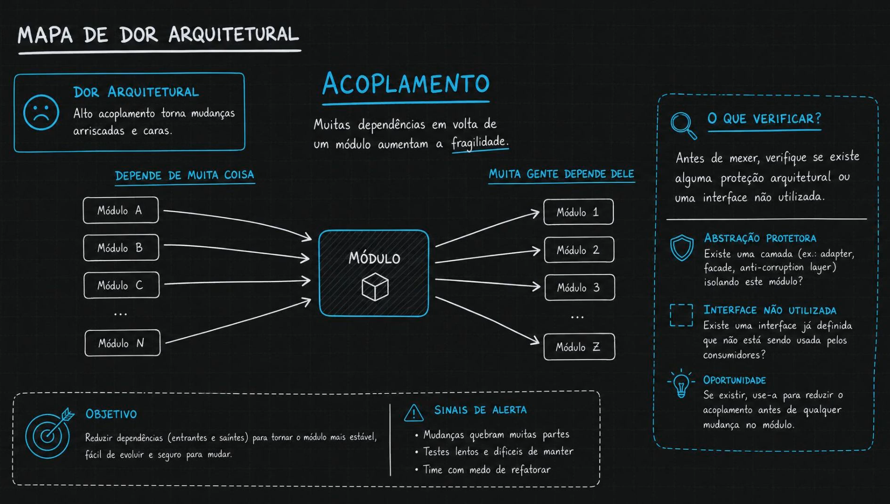
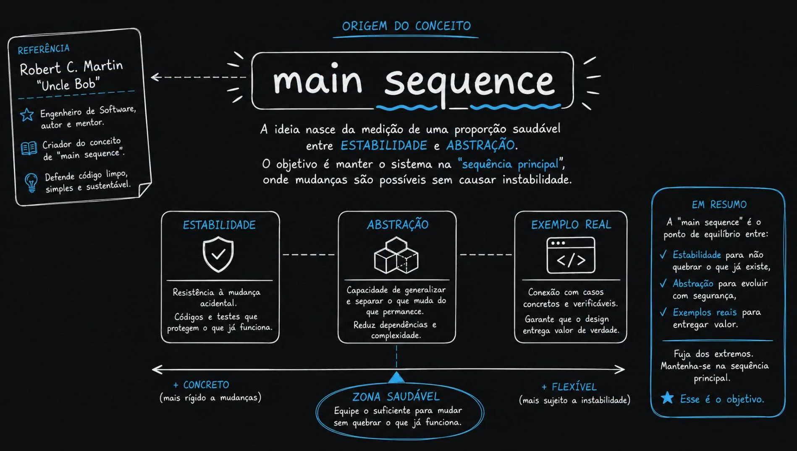
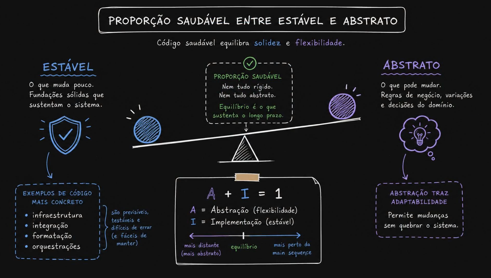
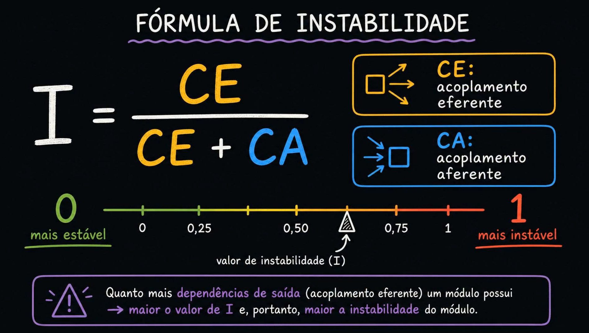
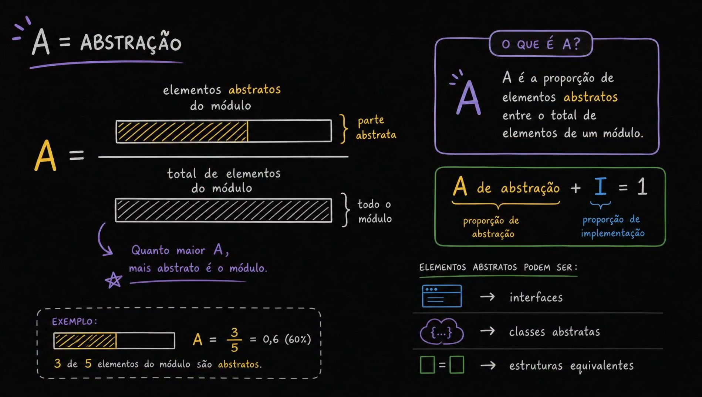
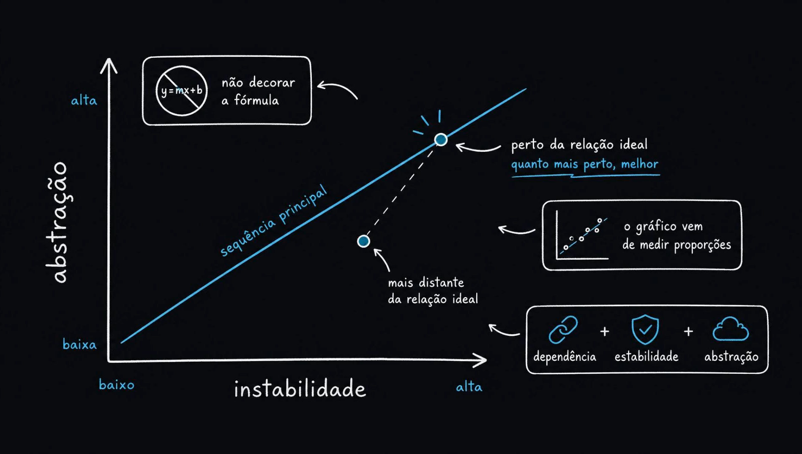
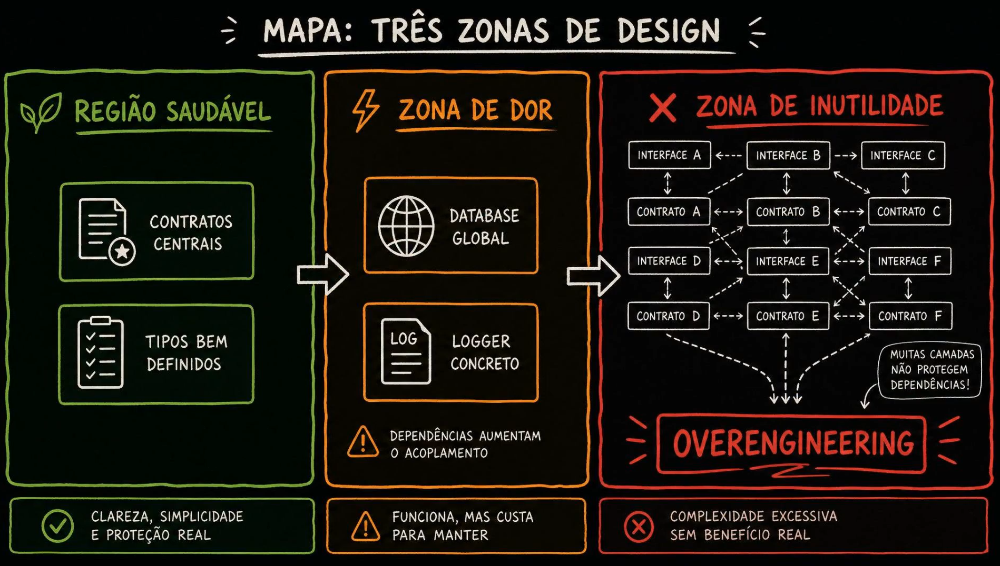
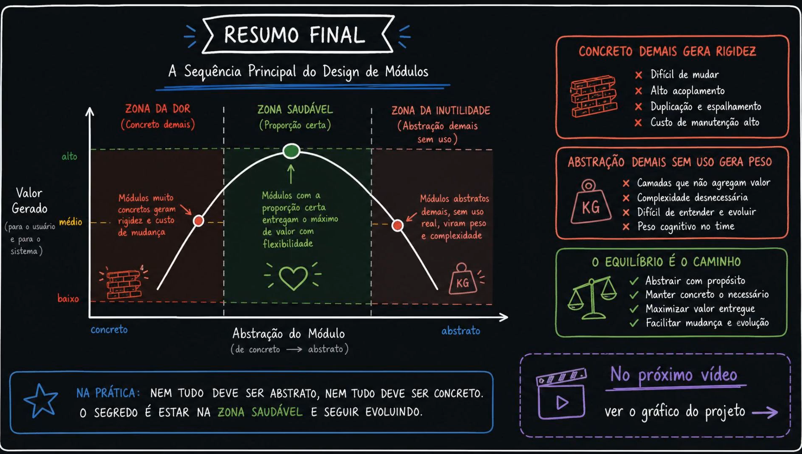

# Aula 04 — Main Sequence e As Zonas de Acoplamento

> Curso: **Acoplamento e saúde da aplicação ao longo do tempo** · Duração: `06:25`
> ← [03 — Quando Acoplamento Vira Dor Arquitetural](../03-when-coupling-becomes-an-arc-pain-point/README.md) · [05 — Objetivos e Projeto Exemplo](../05-goals-and-example-project/README.md) →

As aulas 01–03 construíram o vocabulário e os sintomas. Esta aula fecha a parte teórica com o **modelo que transforma tudo em coordenada**: dois números por módulo, um gráfico, três regiões.

> A ideia nasce da medição de uma **proporção saudável entre estabilidade e abstração**.

---

## Índice

| # | Imagem | Assunto |
|---|--------|---------|
| 01 | [Mapa de dor arquitetural](#01--mapa-de-dor-arquitetural) | O checklist antes de mexer |
| 02 | [Main sequence: origem](#02--main-sequence-a-origem-do-conceito) | Robert C. Martin e a ideia de equilíbrio |
| 03 | [Proporção saudável](#03--proporção-saudável-entre-estável-e-abstrato) | Solidez × flexibilidade |
| 04 | [Fórmula de instabilidade](#04--fórmula-de-instabilidade) | `I = CE / (CE + CA)` |
| 05 | [Fórmula de abstração](#05--fórmula-de-abstração) | `A = abstratos / total` |
| 06 | [O gráfico](#06--o-gráfico-abstração--instabilidade) | A sequência principal e a distância |
| 07 | [Três zonas de design](#07--as-três-zonas-de-design) | Saudável, dor, inutilidade |
| 08 | [Resumo final](#08--resumo-final) | A curva de valor |

---

## 01 — Mapa de dor arquitetural



> **Dor arquitetural:** alto acoplamento torna mudanças **arriscadas e caras**.
> Muitas dependências em volta de um módulo aumentam a **fragilidade**.

O diagrama mostra o caso completo: um módulo que ao mesmo tempo **depende de muita coisa** (A, B, C… N entrando) e do qual **muita gente depende** (1, 2, 3… Z saindo).

### Sinais de alerta

- Mudanças quebram muitas partes
- Testes lentos e difíceis de manter
- **Time com medo de refatorar**

O terceiro é o mais importante e o menos mensurável. Medo de refatorar é o sintoma humano do acoplamento alto — e costuma aparecer antes de qualquer métrica piorar.

### O checklist antes de mexer

A imagem propõe uma verificação que economiza trabalho:

| Verificar | Pergunta |
|-----------|----------|
| **Abstração protetora** | Existe uma camada (*adapter*, *facade*, *anti-corruption layer*) isolando este módulo? |
| **Interface não utilizada** | Existe uma interface já definida que **não está sendo usada** pelos consumidores? |
| **Oportunidade** | Se existir, use-a para reduzir o acoplamento **antes** de qualquer mudança no módulo |

O segundo item é a continuação direta da aula 03, imagem 04: aquela interface decorativa que ninguém consome já está escrita. Antes de projetar uma abstração nova, verifique se o trabalho já foi feito e só falta **plugar**.

> **Objetivo:** reduzir dependências (entrantes e saintes) para tornar o módulo mais estável, fácil de evoluir e seguro para mudar.

---

## 02 — Main sequence: a origem do conceito



Conceito criado por **Robert C. Martin ("Uncle Bob")**.

> O objetivo é manter o sistema na **"sequência principal"**, onde mudanças são possíveis sem causar instabilidade.

Três pilares:

| Pilar | Definição |
|-------|-----------|
| **Estabilidade** | Resistência à mudança acidental. Códigos e testes que protegem o que já funciona |
| **Abstração** | Capacidade de generalizar e separar o que muda do que permanece. Reduz dependências e complexidade |
| **Exemplo real** | Conexão com casos concretos e verificáveis. Garante que o design entrega valor de verdade |

E o eixo do rodapé:

```
◀─────────────────────────────────────────────▶
+ CONCRETO          ZONA SAUDÁVEL        + FLEXÍVEL
(mais rígido      "Equipe o suficiente   (mais sujeito
 a mudanças)       para mudar sem         a instabilidade)
                   quebrar o que
                   já funciona"
```

> **Fuja dos extremos. Mantenha-se na sequência principal.**

---

## 03 — Proporção saudável entre estável e abstrato



> Código saudável equilibra **solidez** e **flexibilidade**.

| **Estável** | **Abstrato** |
|---|---|
| O que muda pouco. Fundações sólidas que sustentam o sistema | O que pode mudar. Regras de negócio, variações e decisões do domínio |
| Exemplos de código mais concreto: **infraestrutura, integração, formatação, orquestrações** | **Abstração traz adaptabilidade** — permite mudanças sem quebrar o sistema |
| São previsíveis, testáveis, difíceis de errar (e fáceis de manter) | |

> **Proporção saudável:** nem tudo rígido, nem tudo abstrato. Equilíbrio é o que sustenta o longo prazo.

A imagem apresenta a equação central da aula:

```
A + I = 1
```

⚠️ **O significado de `I` aqui exige cuidado** — veja [Pontos de atenção](#pontos-de-atenção-nos-slides) no final.

---

## 04 — Fórmula de instabilidade



```
        CE
I = ─────────
     CE + CA

CE = acoplamento eferente  (setas saindo  □→)
CA = acoplamento aferente  (setas entrando →□)

0 ──── 0,25 ──── 0,50 ──── 0,75 ──── 1
mais estável              mais instável
```

> Quanto mais **dependências de saída** um módulo possui → maior o valor de `I` e, portanto, maior a instabilidade do módulo.

Nada novo em relação à aula 02 — mas note a escala colorida: a imagem trata valores baixos como verde e altos como vermelho. **Isso vale para o módulo médio, não como regra universal.** Um adaptador com `I = 0.9` está correto; um núcleo de domínio com `I = 0.9` está errado. O que decide é o cruzamento com `A`, que vem a seguir.

### Contas rápidas

| `CE` | `CA` | `I` | Leitura |
|------|------|-----|---------|
| 0 | 12 | `0.00` | Fundação pura — ninguém mais estável |
| 2 | 8 | `0.20` | Núcleo estável |
| 5 | 5 | `0.50` | Meio-termo — investigar |
| 8 | 2 | `0.80` | Borda / adaptador |
| 9 | 0 | `1.00` | Folha instável — nada depende dele |

---

## 05 — Fórmula de abstração



```
    elementos abstratos do módulo
A = ──────────────────────────────
     total de elementos do módulo
```

> Quanto maior `A`, mais abstrato é o módulo.

**Exemplo da imagem:** 3 de 5 elementos são abstratos → `A = 3/5 = 0,6 (60%)`.

**Elementos abstratos podem ser:**
- interfaces
- classes abstratas
- estruturas equivalentes

O último item importa em linguagens sem `abstract class`: em TypeScript contam `interface` e `type`; em Go, `interface`; em Rust, `trait`. A ferramenta que você usar na aula 06 vai precisar dessa definição explícita para contar.

---

## 06 — O gráfico: abstração × instabilidade



O plano onde tudo se junta:

- **Eixo horizontal:** instabilidade (`I`), de baixa a alta
- **Eixo vertical:** abstração (`A`), de baixa a alta
- **A linha:** a *sequência principal*
- **A distância do ponto até a linha:** o quanto o módulo está fora do equilíbrio

> **Não decorar a fórmula.** O gráfico vem de medir proporções: `dependência + estabilidade + abstração`.

Cada módulo do sistema vira **um ponto**. Quanto mais perto da linha, melhor. Um ponto abaixo dela é marcado como *"mais distante da relação ideal"*.

⚠️ **A orientação da linha neste slide precisa de correção** — veja [Pontos de atenção](#pontos-de-atenção-nos-slides).

### A distância, formalizada

```
D = | A + I − 1 |

D = 0  → exatamente sobre a sequência principal
D = 1  → o mais longe possível (canto de dor ou de inutilidade)
```

É esse `D` que os scripts das aulas 06 e 07 vão calcular e plotar ao longo do tempo.

---

## 07 — As três zonas de design



| 🌿 **Região saudável** | ⚡ **Zona de dor** | ✖ **Zona de inutilidade** |
|---|---|---|
| Contratos centrais<br>Tipos bem definidos | Database global<br>Logger concreto | Interfaces A–F sobre contratos A–F,<br>ligados entre si em todas as direções |
| **Clareza, simplicidade e proteção real** | **Funciona, mas custa para manter**<br><sub>dependências aumentam o acoplamento</sub> | **Complexidade excessiva sem benefício real**<br><sub>**OVERENGINEERING**</sub> |

O painel da direita traz o aviso que fecha a aula 03:

> **Muitas camadas não protegem dependências!**

Empilhar interface sobre contrato sobre interface não reduz acoplamento — só distribui o mesmo acoplamento por mais arquivos, e adiciona custo de navegação. A zona de inutilidade não é um erro de iniciante; é o erro de quem aprendeu sobre acoplamento e aplicou sem medir.

### As duas zonas ruins são erros opostos

| | Zona de dor | Zona de inutilidade |
|---|---|---|
| Erro | Abstraiu **de menos** | Abstraiu **de mais** |
| `A` | Baixo | Alto |
| Sintoma | "Não dá para mudar isso" | "Por que existem 6 arquivos para isso?" |
| Custo | Rigidez | Peso cognitivo |
| Correção | Extrair contrato, inverter dependência | Deletar camada, colapsar indireção |

**Sair de uma pode empurrar para a outra.** É por isso que o curso mede em vez de opinar: sem o gráfico, "reduzir acoplamento" facilmente vira overengineering.

---

## 08 — Resumo final



A curva de **valor gerado** em função da abstração do módulo:

```
valor
  ▲
alto│         ╭───●───╮
    │       ╱           ╲
médio│    ●               ●
    │   ╱                   ╲
baixo│ ╱                       ╲
    └──────────────────────────────▶
    concreto                abstrato
   ZONA DA DOR  ZONA SAUDÁVEL  ZONA DA INUTILIDADE
```

| Zona | Diagnóstico |
|------|-------------|
| **Zona da dor** *(concreto demais)* | Difícil de mudar · Alto acoplamento · Duplicação e espalhamento · Custo de manutenção alto |
| **Zona saudável** *(proporção certa)* | Máximo de valor com flexibilidade |
| **Zona da inutilidade** *(abstração demais sem uso)* | Camadas que não agregam valor · Complexidade desnecessária · Difícil de entender e evoluir · **Peso cognitivo no time** |

### O equilíbrio é o caminho

- Abstrair **com propósito**
- Manter concreto **o necessário**
- Maximizar valor entregue
- Facilitar mudança e evolução

> **Na prática:** nem tudo deve ser abstrato, nem tudo deve ser concreto. O segredo é estar na **zona saudável** e seguir evoluindo.

**No próximo vídeo:** ver o gráfico do projeto.

---

## Como usar isto na prática

### O procedimento

1. Para cada módulo, conte `CA` e `CE` → calcule `I = CE/(CE+CA)`
2. Conte elementos abstratos e totais → calcule `A`
3. Plote `(I, A)` no gráfico
4. Calcule `D = |A + I − 1|`
5. Ordene por `D` decrescente — **os maiores `D` são a fila de refatoração**

### Onde cada perfil deveria cair

| Tipo de módulo | `I` esperado | `A` esperado | Comentário |
|---|---|---|---|
| Contratos / tipos do domínio | Baixo | Alto | Muitos dependem, quase tudo é interface |
| Regras de negócio | Médio-baixo | Médio | Estável, com pontos de extensão |
| Adaptadores, controllers, jobs | Alto | Baixo | Concretos e descartáveis — **correto assim** |
| Database global concreto | Baixo | Baixo | **Zona de dor** |
| Camada de interfaces sem consumidor | Alto | Alto | **Zona de inutilidade** |

---

## Pontos de atenção nos slides

Esta aula tem duas questões de notação que valem registro, porque as aulas 06, 07, 16 e 17 vão gerar e ler esse gráfico.

### 1. Existem dois `I` diferentes nos slides

| Onde | O slide define | Fórmula implícita |
|------|----------------|-------------------|
| Imagem 04 | `I` = **instabilidade** | `I = CE / (CE + CA)` |
| Imagens 03 e 05 | `I` = "proporção de **implementação**" | `I = 1 − A` |

São grandezas diferentes com a mesma letra. A equação da sequência principal de Martin é:

```
A + I = 1     com I = INSTABILIDADE (a da imagem 04)
```

Sob a segunda leitura (`I = 1 − A`), a equação `A + I = 1` seria verdadeira para **todo módulo, sempre** — uma tautologia sobre contagem de elementos, sem poder de diagnóstico. É a **instabilidade** que faz a equação dizer algo.

### 2. A linha da sequência principal está invertida na imagem 06

No slide, a linha sobe da esquerda para a direita — de `(I baixo, A baixo)` até `(I alto, A alto)`. A sequência principal de Martin **desce**: liga `(I=0, A=1)` a `(I=1, A=0)`.

Confira pela própria fórmula `D = |A + I − 1|`:

| Ponto | `A` | `I` | `D` | Significado |
|-------|-----|-----|-----|-------------|
| Abstrato e estável | 1 | 0 | `0` | **sobre** a linha |
| Concreto e instável | 0 | 1 | `0` | **sobre** a linha |
| Concreto e estável | 0 | 0 | `1` | **zona de dor** |
| Abstrato e instável | 1 | 1 | `1` | **zona de inutilidade** |

Com a linha desenhada subindo, os pontos `(0,0)` e `(1,1)` cairiam **sobre** ela — justamente as duas zonas que deveriam estar o mais longe possível. O gráfico correto:

```
A
1 ┤●╲                        ● (0,1) e (1,0) estão SOBRE a linha
  │   ╲  sequência
  │     ╲  principal         ZONA DE INUTILIDADE ▲ canto (1,1)
  │       ╲                  ZONA DE DOR         ▼ canto (0,0)
0 ┤· · · · ·╲●
  └───────────────▶ I
  0             1
```

Isso é coerente com a leitura de sempre: **o que é muito dependido (`I` baixo) precisa ser abstrato (`A` alto)**, e o que é volátil (`I` alto) pode e deve ser concreto (`A` baixo).

> A imagem 08 apresenta o mesmo conteúdo projetado num eixo só (abstração × valor). Como simplificação didática funciona — mas a zona de dor **não** é definida só por "ser concreto": é por ser concreto **e estável**. Um controller concreto e instável está na sequência principal, não na zona de dor.
