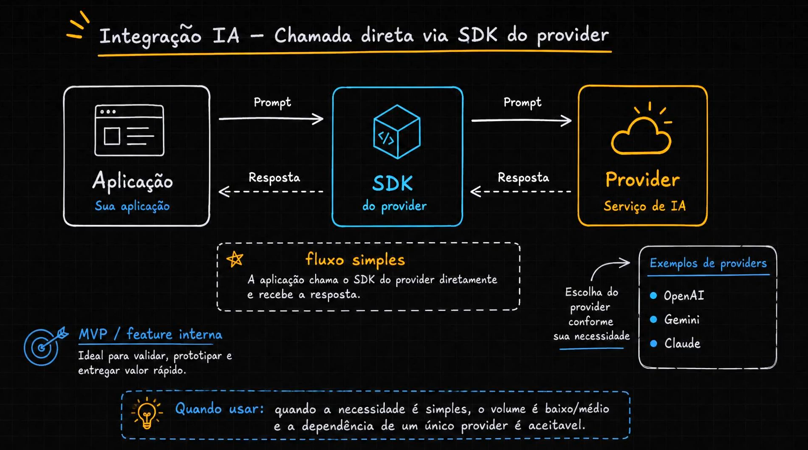
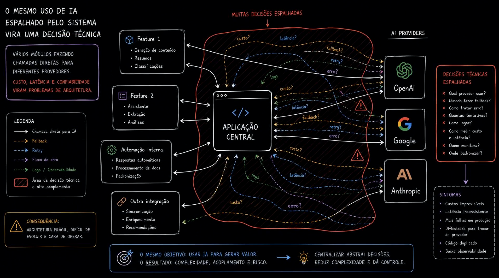
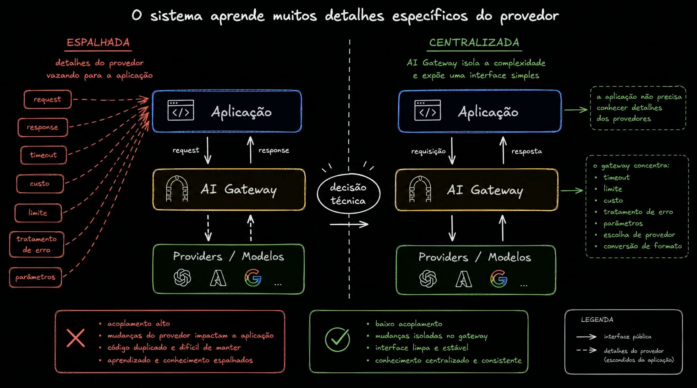
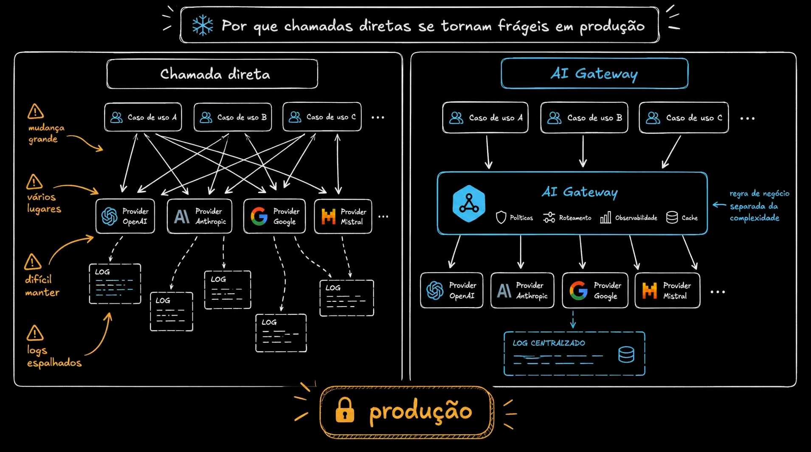
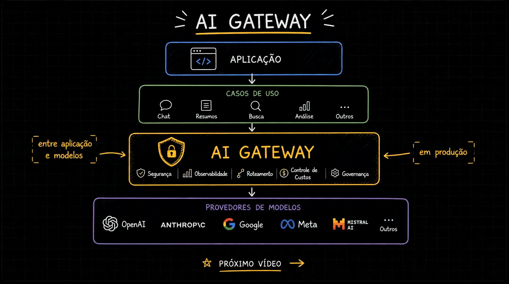

# Aula 01 — Introdução - Integrações com IA

> Curso: **AI Gateways** · Duração: `03:05`

Esta aula apresenta o problema arquitetural que aparece quando várias partes de uma aplicação passam a chamar modelos de IA diretamente. No começo, uma chamada direta via SDK é rápida e suficiente; com o tempo, decisões como provider, modelo, custo, latência, fallback, retry e logs começam a se espalhar pelo sistema.

## Resumo

Uma integração direta com IA é adequada para validar hipóteses, construir um MVP ou entregar uma feature interna. O problema começa quando o mesmo padrão se repete em muitos módulos e com vários providers. Nesse momento, o uso de IA deixa de ser apenas detalhe de implementação e vira uma decisão de arquitetura.

O AI Gateway aparece como uma camada intermediária entre a aplicação e os providers/modelos. Ele centraliza decisões operacionais e protege a aplicação de detalhes específicos de cada provider.

## Índice

| # | Imagem | Assunto |
|---|--------|---------|
| 01 | [Chamada direta via SDK](#01--chamada-direta-via-sdk-do-provider) | Fluxo simples entre aplicação, SDK e provider |
| 02 | [Decisões espalhadas](#02--decisões-técnicas-espalhadas-pelo-sistema) | Custo, latência, retry, fallback e logs em vários lugares |
| 03 | [Detalhes do provider](#03--detalhes-do-provider-vazando-para-a-aplicação) | Conhecimento espalhado versus centralizado |
| 04 | [Fragilidade em produção](#04--por-que-chamadas-diretas-se-tornam-frágeis-em-produção) | Muitos casos de uso, providers e logs duplicados |
| 05 | [AI Gateway](#05--ai-gateway-como-camada-entre-aplicação-e-modelos) | Segurança, observabilidade, roteamento, custos e governança |

## 01 — Chamada direta via SDK do provider



O primeiro desenho mostra o cenário mais simples:

```text
Aplicação -> SDK do provider -> Provider de IA
Aplicação <- SDK do provider <- Provider de IA
```

A aplicação envia um prompt, o SDK traduz a chamada para o formato esperado pelo provider, e a resposta volta pelo mesmo caminho. É um fluxo fácil de entender e rápido de implementar.

Esse desenho é bom quando:

- a necessidade é simples;
- o volume é baixo ou médio;
- depender de um único provider é aceitável;
- a prioridade é validar uma ideia, prototipar ou entregar valor rapidamente.

O limite desse modelo aparece quando a aplicação precisa trocar provider, comparar modelos, medir custo, padronizar logs ou tratar falhas de modo consistente.

## 02 — Decisões técnicas espalhadas pelo sistema



Aqui a aula mostra a virada do problema: vários módulos fazem chamadas diretas para diferentes providers. Features de geração de conteúdo, resumo, classificação, análise e automação passam a decidir por conta própria como chamar IA.

As perguntas que começam a se repetir são:

- qual provider usar?
- quando fazer fallback?
- como tratar erro?
- quantas tentativas fazer?
- como logar?
- como medir custo e latência?
- quem monitora?
- onde padronizar?

Quando cada módulo responde isso sozinho, o sistema ganha acoplamento acidental. O objetivo continua sendo usar IA para gerar valor, mas o resultado operacional vira complexidade, risco e custo de manutenção.

## 03 — Detalhes do provider vazando para a aplicação



O slide compara duas abordagens.

Na abordagem espalhada, detalhes como `request`, `response`, `timeout`, `custo`, `limite`, tratamento de erro e parâmetros entram na aplicação. Isso gera acoplamento alto, mudanças difíceis e conhecimento duplicado.

Na abordagem centralizada, o AI Gateway concentra esses detalhes e expõe uma interface mais estável. A aplicação não precisa conhecer cada diferença entre providers; ela chama uma fronteira interna controlada.

O ganho arquitetural não é "esconder tudo". É colocar a complexidade no lugar certo.

## 04 — Por que chamadas diretas se tornam frágeis em produção



Em produção, o problema se amplia porque há muitos casos de uso e muitos providers. Se cada caso de uso chama OpenAI, Anthropic, Google, Mistral ou outro provider diretamente, a malha de dependências cresce rápido.

Os sintomas do lado esquerdo são:

- mudança grande para trocar provider;
- decisões repetidas em vários lugares;
- manutenção difícil;
- logs espalhados.

O lado direito mostra a alternativa: casos de uso chamam o AI Gateway, e o gateway concentra políticas, roteamento, observabilidade e cache. A regra de negócio fica separada da complexidade operacional dos providers.

## 05 — AI Gateway como camada entre aplicação e modelos



O fechamento da aula define o AI Gateway como uma camada entre aplicação e modelos, especialmente relevante em produção.

Ele pode concentrar:

- segurança;
- observabilidade;
- roteamento;
- controle de custos;
- governança.

O ponto mais importante: o gateway não existe só para "chamar modelo". Ele existe para controlar como a aplicação usa IA ao longo do tempo.

## Ideia-chave

Chamada direta é uma boa porta de entrada. AI Gateway é a resposta quando as decisões sobre IA precisam deixar de estar espalhadas e passar a ser padronizadas, observáveis e governadas.
