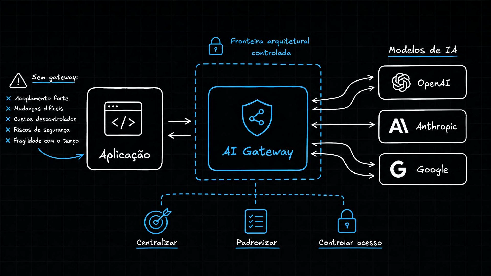
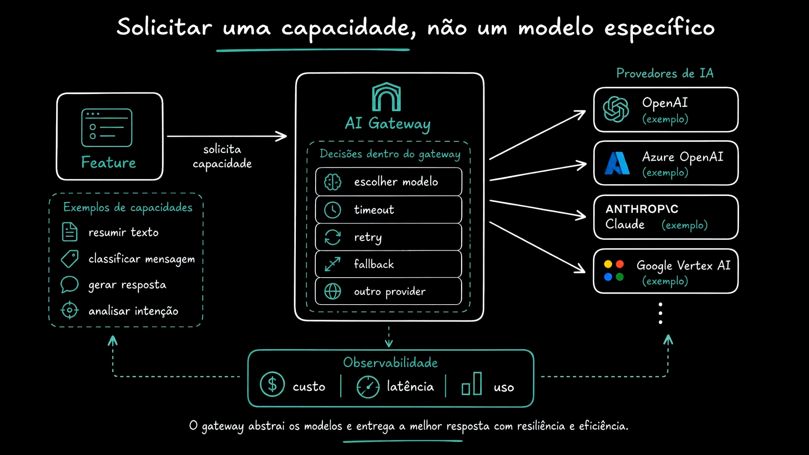
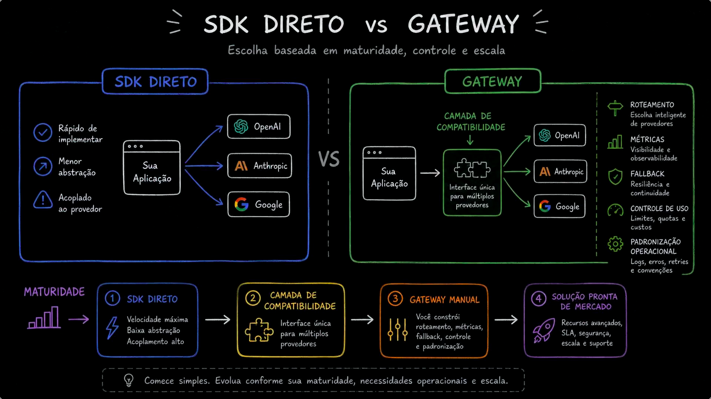
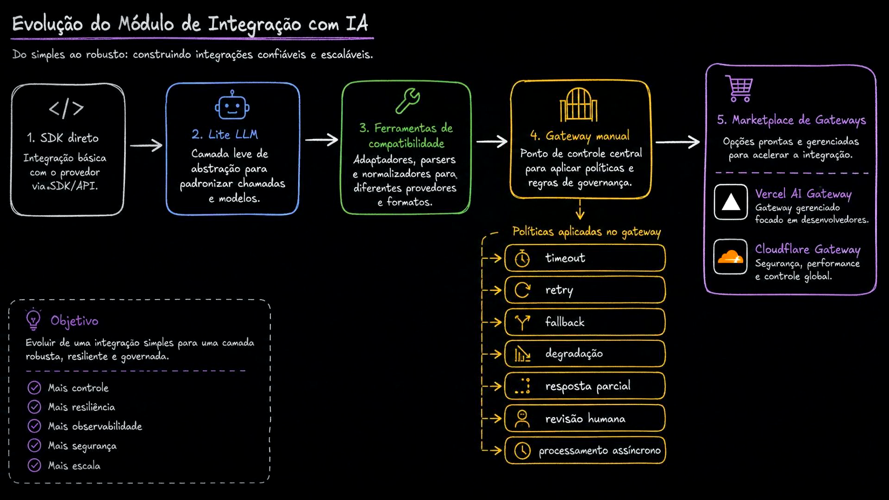
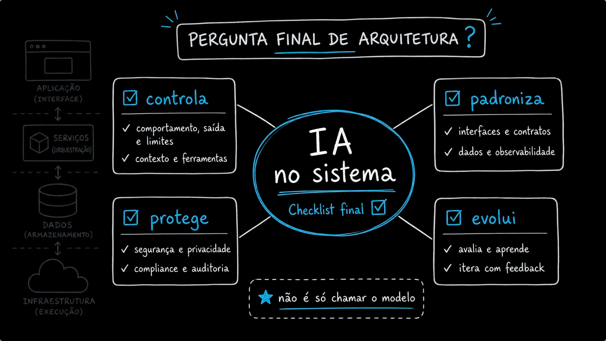

# Aula 04 — Entendendo AI Gateway

> Curso: **AI Gateways** · Duração: `03:29`

Esta aula define o AI Gateway como uma fronteira arquitetural controlada entre aplicação e modelos de IA. Depois de ver chamada direta e múltiplos SDKs, o foco passa a ser onde colocar controle, padronização e evolução.

## Resumo

Um AI Gateway é uma camada intermediária que conecta a aplicação a múltiplos providers de IA com mais controle. Ele não é apenas um proxy técnico. Ele concentra decisões que, sem essa camada, ficariam espalhadas pela aplicação: provider, modelo, timeout, retry, fallback, custo, observabilidade e políticas.

## Índice

| # | Imagem | Assunto |
|---|--------|---------|
| 01 | [Fronteira arquitetural](#01--fronteira-arquitetural-controlada) | Centralizar, padronizar e controlar acesso |
| 02 | [Capacidade, não modelo](#02--solicitar-uma-capacidade-não-um-modelo-específico) | Features pedem intenção; gateway decide execução |
| 03 | [SDK direto vs Gateway](#03--sdk-direto-vs-gateway) | Maturidade, controle e escala |
| 04 | [Evolução do módulo](#04--evolução-do-módulo-de-integração-com-ia) | Do SDK direto até soluções gerenciadas |
| 05 | [Checklist final](#05--checklist-final-de-arquitetura) | Controlar, proteger, padronizar e evoluir |

## 01 — Fronteira arquitetural controlada

Sem gateway, a aplicação sofre com acoplamento forte, mudanças difíceis, custos descontrolados, riscos de segurança e fragilidade com o tempo.

Com gateway, a aplicação fala com uma fronteira interna. Essa fronteira controla como os providers são usados e evita que cada feature implemente sua própria integração.

Os três verbos do slide são bons critérios de desenho:

- **centralizar** decisões comuns;
- **padronizar** contratos;
- **controlar acesso** aos providers e modelos.

## 02 — Solicitar uma capacidade, não um modelo específico

Uma aplicação madura não deveria necessariamente pedir "use o modelo X". Ela deveria pedir uma capacidade: resumir texto, classificar mensagem, gerar resposta ou analisar intenção.

O gateway pode traduzir essa capacidade em decisões técnicas:

- escolher modelo;
- aplicar timeout;
- executar retry;
- fazer fallback;
- trocar provider;
- registrar custo, latência e uso.

Essa separação reduz acoplamento porque a feature expressa o que precisa, e o gateway decide como executar.

## 03 — SDK direto vs Gateway

O SDK direto é rápido de implementar e tem pouca abstração. Em troca, fica acoplado ao provider.

O gateway adiciona uma camada de compatibilidade e abre espaço para:

- roteamento;
- métricas;
- fallback;
- controle de uso;
- padronização operacional.

O slide também propõe uma trilha de maturidade:

1. SDK direto: velocidade máxima, baixa abstração, acoplamento alto.
2. Camada de compatibilidade: interface única para múltiplos providers.
3. Gateway manual: você constrói roteamento, métricas, fallback, controle e padronização.
4. Solução pronta de mercado: recursos avançados, SLA, segurança, escala e suporte.

## 04 — Evolução do módulo de integração com IA

A evolução vai do simples ao robusto:

- SDK direto;
- LiteLLM como camada leve de abstração;
- ferramentas de compatibilidade;
- gateway manual;
- marketplace de gateways.

O objetivo não é pular direto para a solução mais sofisticada. O objetivo é evoluir conforme a necessidade de controle, resiliência, observabilidade, segurança e escala.

## 05 — Checklist final de arquitetura

O fechamento reforça que IA no sistema não é só chamar modelo.

Uma integração madura precisa:

- controlar comportamento, saída, limites, contexto e ferramentas;
- proteger segurança, privacidade, compliance e auditoria;
- padronizar interfaces, contratos, dados e observabilidade;
- evoluir com avaliação, aprendizado e feedback.

## Ideia-chave

AI Gateway é uma fronteira arquitetural. Ele concentra decisões operacionais e técnicas para que as features não precisem carregar detalhes de cada provider.
