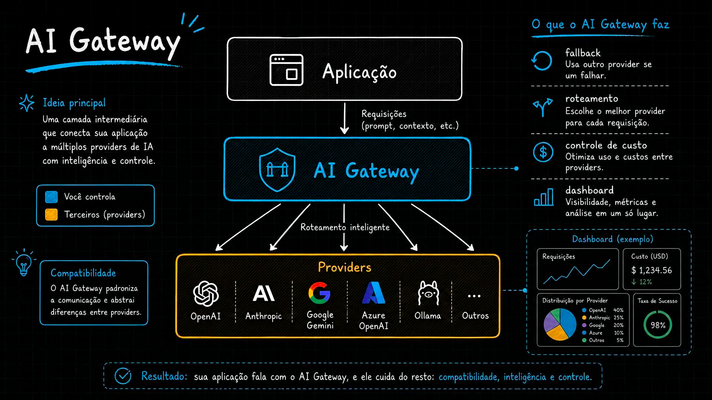
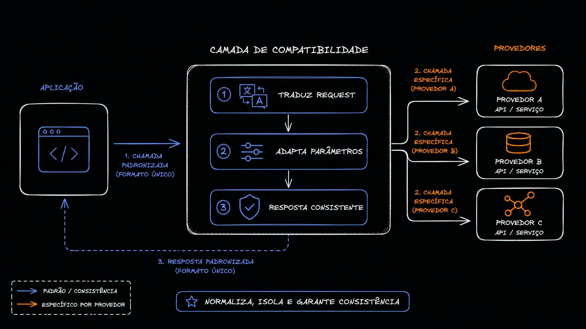
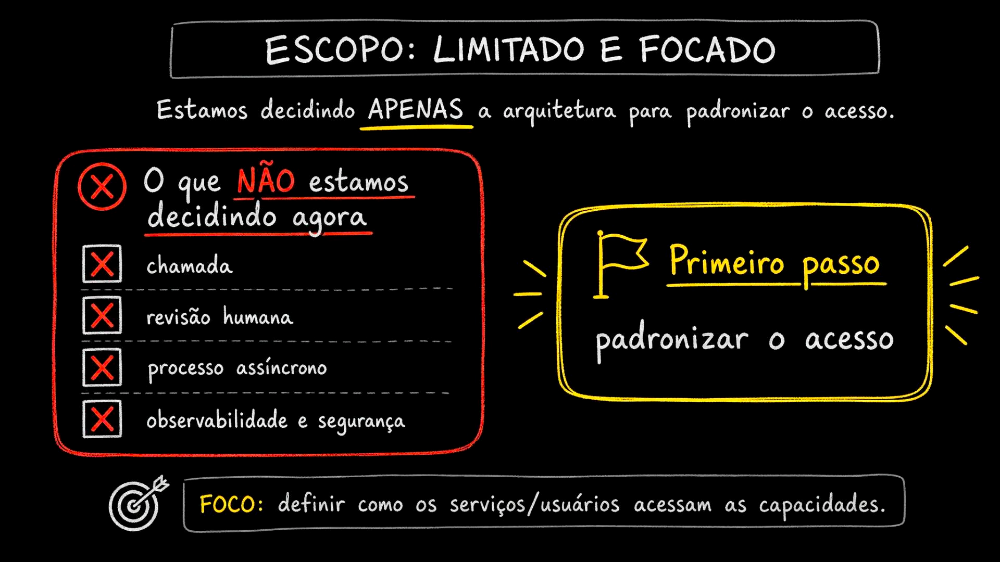
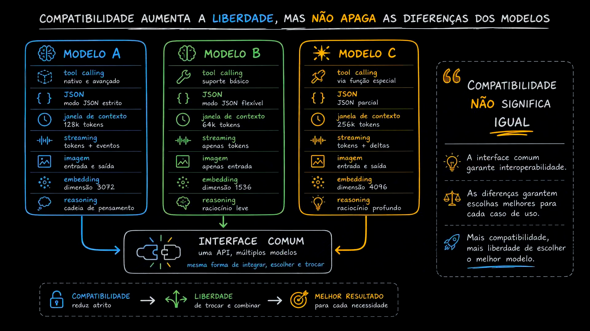
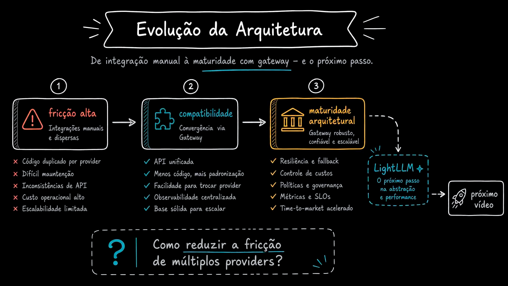

# Aula 05 — Compatibilidade - a primeira capacidade de uma AI Gateway

> Curso: **AI Gateways** · Duração: `03:38`

Esta aula aprofunda a primeira capacidade importante de um AI Gateway: compatibilidade. Antes de pensar em roteamento inteligente, fallback ou governança completa, o gateway precisa oferecer uma forma padronizada de acesso aos modelos.

## Resumo

Compatibilidade significa permitir que a aplicação fale com múltiplos providers usando uma interface comum. O gateway recebe uma chamada padronizada, traduz para o formato específico de cada provider, adapta parâmetros e devolve uma resposta consistente.

O objetivo não é fingir que todos os modelos são iguais. O objetivo é reduzir fricção para trocar, comparar e combinar modelos sem reescrever cada feature.

## Índice

| # | Imagem | Assunto |
|---|--------|---------|
| 01 | [O que o gateway faz](#01--o-que-o-ai-gateway-faz) | Fallback, roteamento, custos e dashboard |
| 02 | [Camada de compatibilidade](#02--camada-de-compatibilidade) | Traduz request, adapta parâmetros e normaliza resposta |
| 03 | [Escopo limitado](#03--escopo-limitado-e-focado) | Primeiro passo: padronizar acesso |
| 04 | [Compatibilidade não significa igual](#04--compatibilidade-não-significa-igual) | Diferenças entre modelos continuam existindo |
| 05 | [Evolução da arquitetura](#05--evolução-da-arquitetura) | Da fricção alta até maturidade com gateway |

## 01 — O que o AI Gateway faz

O gateway fica entre a aplicação e providers como OpenAI, Anthropic, Google Gemini, Azure OpenAI, Ollama e outros.

Ele pode fazer:

- fallback: usar outro provider se um falhar;
- roteamento: escolher o melhor provider para cada requisição;
- controle de custo: otimizar uso e custo entre providers;
- dashboard: centralizar visibilidade, métricas e análise.

Mas, antes desses recursos mais avançados, existe uma base necessária: compatibilidade.

## 02 — Camada de compatibilidade

A camada de compatibilidade atua em três movimentos:

1. recebe uma chamada padronizada da aplicação;
2. traduz e adapta a chamada para o provider escolhido;
3. devolve uma resposta padronizada para a aplicação.

Isso isola a aplicação das diferenças de API entre providers. A aplicação conhece um contrato interno; o gateway conhece os formatos externos.

Em termos arquiteturais, é uma aplicação direta do princípio de isolamento de dependência externa: detalhes instáveis ficam fora do núcleo da aplicação.

## 03 — Escopo limitado e focado

A aula delimita o escopo: neste momento, a decisão é apenas sobre padronizar o acesso.

Ainda não estamos decidindo:

- chamada humana;
- revisão humana;
- processo assíncrono;
- observabilidade completa;
- segurança completa.

O primeiro passo é responder: como serviços e usuários acessam capacidades de IA de forma consistente?

Esse recorte é importante porque evita tentar resolver todos os problemas de gateway de uma vez.

## 04 — Compatibilidade não significa igual

Uma interface comum aumenta liberdade, mas não apaga as diferenças dos modelos.

Modelos podem variar em:

- tool calling;
- modo JSON;
- janela de contexto;
- streaming;
- suporte a imagem;
- dimensão de embeddings;
- capacidade de reasoning.

Portanto, compatibilidade não significa nivelar tudo pelo menor denominador comum. Significa criar uma forma comum de integrar, escolher e trocar, preservando informação suficiente para tomar boas decisões por caso de uso.

## 05 — Evolução da arquitetura

O slide resume a jornada:

1. **Fricção alta:** integrações manuais e dispersas, código duplicado por provider, manutenção difícil, inconsistências de API e custo operacional alto.
2. **Compatibilidade:** convergência via gateway, API unificada, menos código, mais padronização, troca de provider mais simples e observabilidade centralizada.
3. **Maturidade arquitetural:** gateway robusto, confiável e escalável, com resiliência, fallback, controle de custos, políticas, governança, métricas e SLOs.

O próximo passo indicado é LiteLLM, usado como caminho prático para reduzir a fricção de múltiplos providers.

## Ideia-chave

A primeira entrega de valor de um AI Gateway é reduzir a fricção de integração. Compatibilidade cria uma interface comum, mas a arquitetura ainda precisa respeitar as diferenças reais entre modelos.
