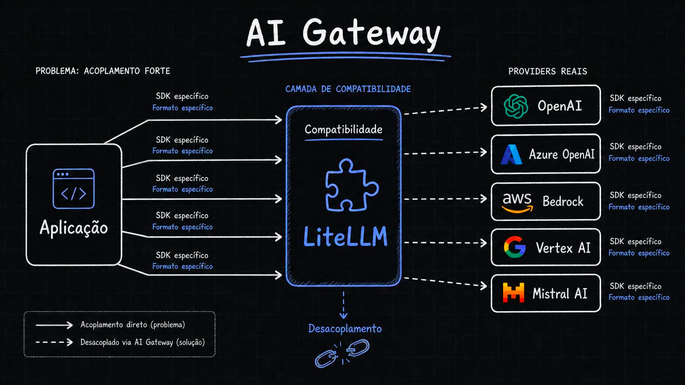
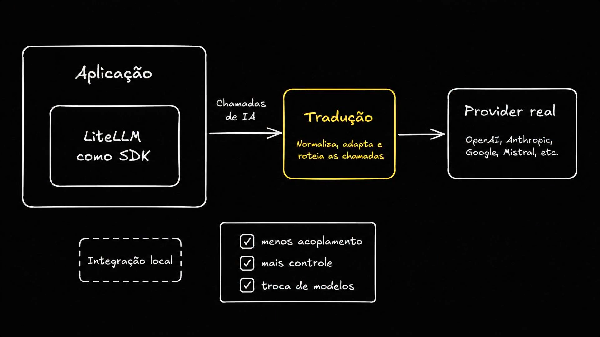
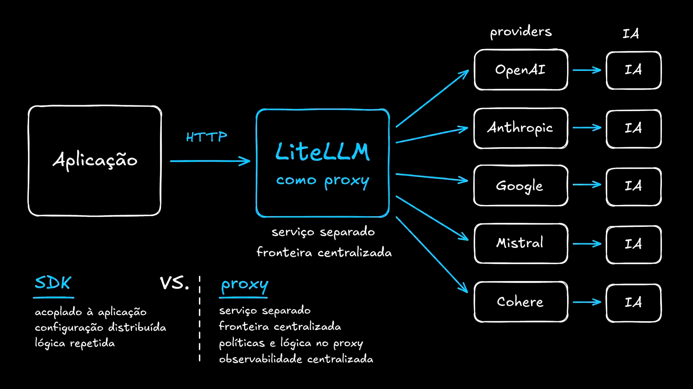
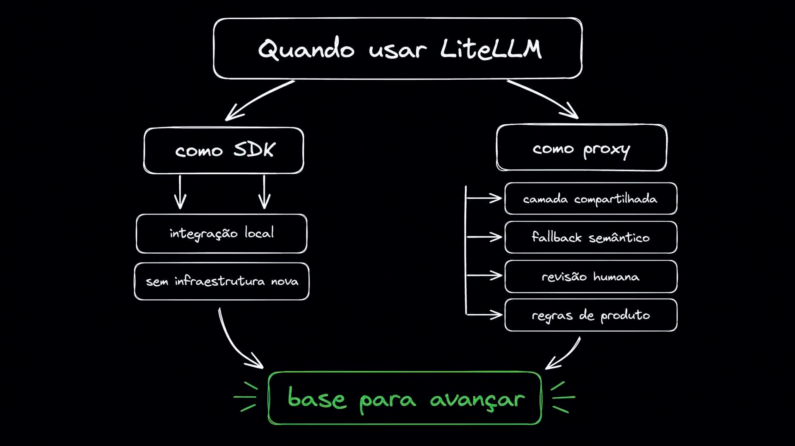

# Aula 06 — LiteLLM como primeira implementação da compatibilidade

> Curso: **AI Gateways** · Duração: `03:13`

Esta aula apresenta o LiteLLM como uma primeira implementação prática da camada de compatibilidade discutida na aula anterior. A ideia é reduzir o acoplamento direto com SDKs e formatos específicos de providers sem ainda construir um gateway completo.

## Resumo

LiteLLM entra como uma peça de compatibilidade: ele oferece uma interface comum para chamar diferentes providers e modelos. Em vez de a aplicação conhecer vários SDKs, clients e formatos de resposta, ela passa a falar com uma API unificada.

A aula também separa dois modos de uso:

- **LiteLLM como SDK:** biblioteca dentro da própria aplicação, boa para integração local e evolução incremental.
- **LiteLLM como proxy:** serviço separado, acessado via HTTP, melhor quando se quer uma fronteira centralizada para vários serviços.

## Índice

| # | Imagem | Assunto |
|---|--------|---------|
| 01 | [Compatibilidade com LiteLLM](#01--compatibilidade-com-litellm) | Desacoplar a aplicação dos SDKs específicos |
| 02 | [LiteLLM como SDK](#02--litellm-como-sdk) | Integração local, menos acoplamento e troca de modelos |
| 03 | [LiteLLM como proxy](#03--litellm-como-proxy) | Serviço separado e fronteira centralizada |
| 04 | [Quando usar cada modo](#04--quando-usar-litellm) | SDK para começar; proxy para centralizar políticas |

## 01 — Compatibilidade com LiteLLM



O slide retoma o problema: a aplicação se acopla a SDKs e formatos específicos de cada provider. OpenAI, Azure OpenAI, Bedrock, Vertex AI e Mistral podem exigir formas diferentes de autenticar, montar requisições e interpretar respostas.

LiteLLM aparece como a camada de compatibilidade que fica entre a aplicação e os providers reais. A aplicação deixa de apontar diretamente para cada SDK e passa a falar com uma abstração comum.

O ganho principal é o desacoplamento:

```text
Aplicação -> LiteLLM -> Provider real
```

Isso não elimina as diferenças entre modelos, mas reduz a fricção para trocar provider, testar alternativas e padronizar chamadas.

## 02 — LiteLLM como SDK



Nesse modo, LiteLLM é usado dentro da própria aplicação, como biblioteca local. A aplicação importa LiteLLM e faz uma chamada unificada, enquanto a biblioteca normaliza, adapta e roteia a chamada para o provider real.

Esse caminho é útil quando:

- você quer evoluir a integração sem criar infraestrutura nova;
- a aplicação ainda é pequena ou tem poucos serviços;
- o objetivo imediato é remover duplicação de SDKs;
- você quer trocar modelos/providers com menos mudança no código.

O slide resume os benefícios:

- menos acoplamento;
- mais controle;
- troca de modelos.

É exatamente a ponte para a aula 07, onde o projeto prático troca os SDKs nativos por `completion()` da LiteLLM.

## 03 — LiteLLM como proxy



O modo proxy muda a fronteira arquitetural. A aplicação não importa LiteLLM como biblioteca; ela chama um serviço separado via HTTP.

```text
Aplicação -> HTTP -> LiteLLM Proxy -> Providers -> IA
```

Comparação proposta no slide:

| Modo | Característica |
|------|----------------|
| SDK | Acoplado à aplicação, configuração distribuída, lógica repetida |
| Proxy | Serviço separado, fronteira centralizada, políticas e lógica no proxy, observabilidade centralizada |

O proxy se aproxima mais da ideia de gateway porque concentra a configuração e o controle fora das aplicações individuais.

## 04 — Quando usar LiteLLM



A aula fecha mostrando que LiteLLM pode ser usado em dois momentos da maturidade arquitetural.

Como SDK:

- integração local;
- sem infraestrutura nova;
- bom ponto de partida.

Como proxy:

- camada compartilhada;
- fallback semântico;
- revisão humana;
- regras de produto.

O ponto importante é que o SDK não é o fim da jornada; ele é uma base para avançar. Começar com LiteLLM como SDK reduz a fricção inicial. Evoluir para proxy permite centralizar políticas e observabilidade quando a operação crescer.

## Ideia-chave

LiteLLM é a primeira implementação concreta da compatibilidade: ele diminui a dependência direta dos SDKs dos providers e cria uma base para evoluir de integração local para uma fronteira centralizada de AI Gateway.
