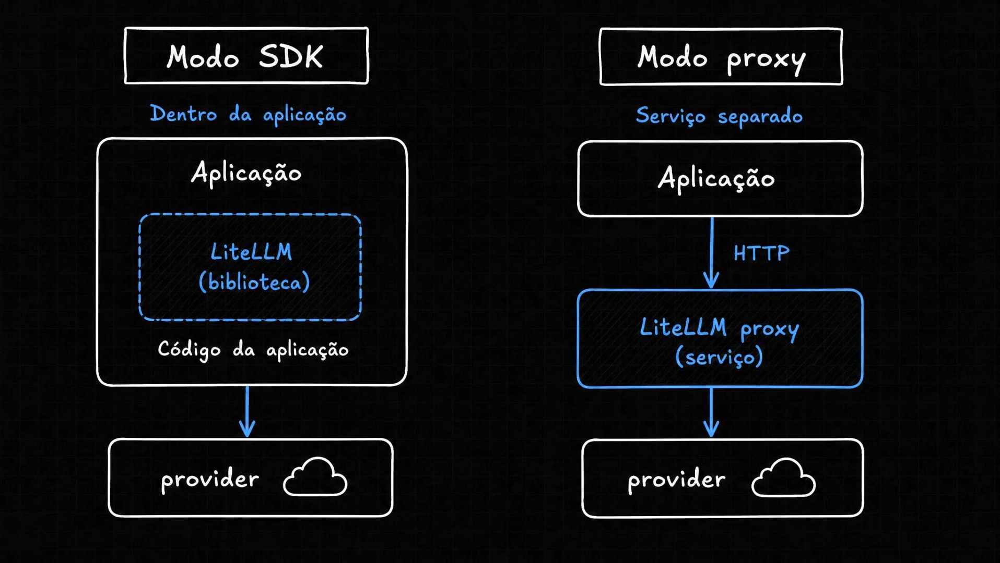
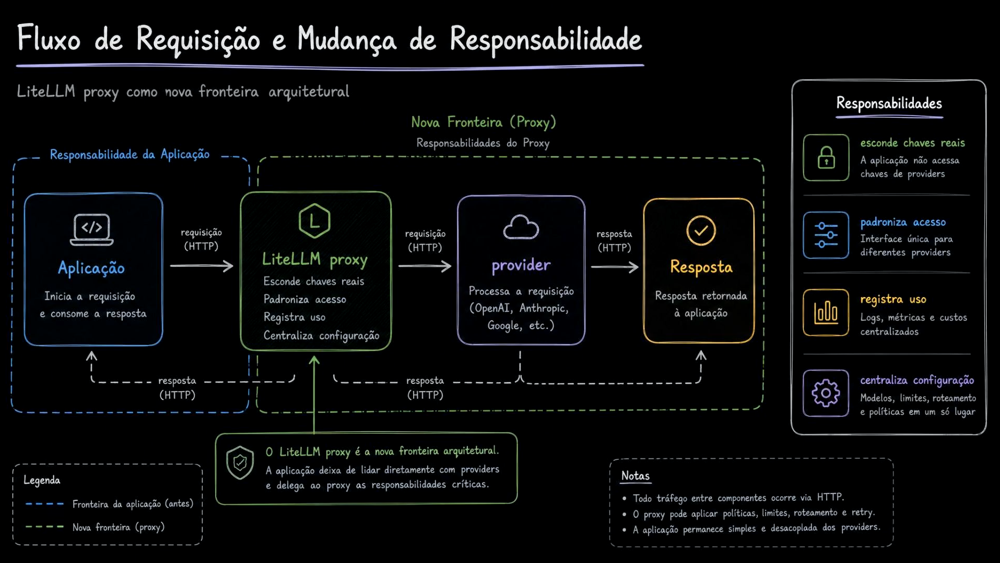
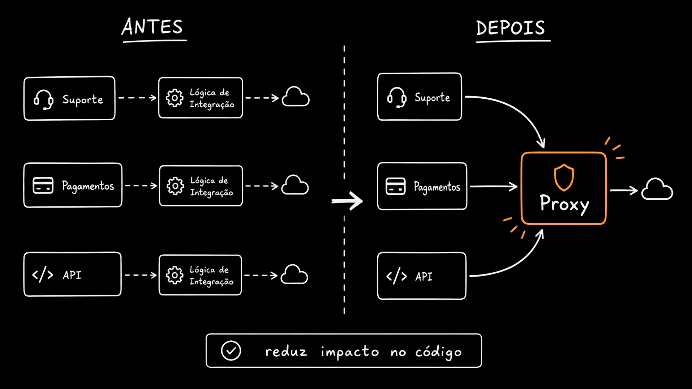
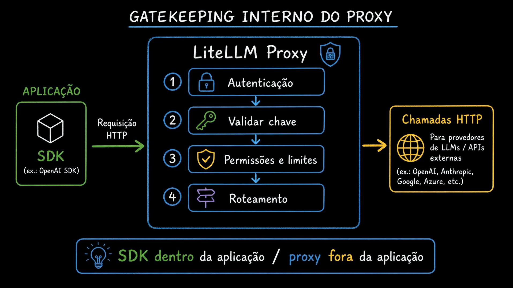

# Aula 08 — LiteLLM como Proxy

> Curso: **AI Gateways** · Duração: `03:08`

## Resumo

Nesta aula o LiteLLM deixa de ser apenas uma biblioteca dentro da aplicação e passa a aparecer como um **proxy HTTP separado**. Essa mudança é importante porque cria uma fronteira arquitetural: a aplicação não precisa mais conhecer diretamente a chave real do provider, nem concentrar regras de roteamento, limites, custo e observabilidade no próprio código.

O ponto central é: no modo SDK, cada aplicação carrega parte da integração. No modo proxy, as aplicações chamam um endpoint interno e o proxy concentra as decisões operacionais.

## 1. SDK vs proxy



A imagem compara dois modos de uso do LiteLLM:

- **Modo SDK**: a biblioteca LiteLLM roda dentro da própria aplicação.
- **Modo proxy**: o LiteLLM roda como serviço separado, acessado por HTTP.

No modo proxy, a aplicação troca uma dependência local por uma integração HTTP. Isso aumenta a capacidade de controle centralizado, porque várias aplicações podem chamar o mesmo gateway.

## 2. Nova fronteira arquitetural



O fluxo passa a ser:

```text
Aplicação -> LiteLLM Proxy -> Provider de IA
```

A aplicação inicia a requisição e consome a resposta. O proxy fica responsável por esconder chaves reais, padronizar acesso, registrar uso, centralizar configuração e aplicar políticas como limites, roteamento e retry.

A leitura arquitetural é que o proxy deixa de ser apenas um detalhe técnico: ele vira uma camada de controle entre produto e providers.

## 3. Redução de impacto nos serviços



Antes, cada serviço podia ter sua própria lógica de integração com IA: suporte, pagamentos, APIs internas etc. Depois, todos passam a chamar o mesmo proxy.

Isso reduz o impacto de mudanças como:

- trocar modelo físico;
- trocar provider;
- alterar chave;
- adicionar limite;
- mudar política de custo;
- registrar logs de uso.

O código dos serviços fica mais simples e o acoplamento com os providers diminui.

## 4. Gatekeeping interno



O proxy recebe a chamada HTTP e executa uma sequência de validações antes de repassar ao provider:

1. autenticação;
2. validação da chave;
3. permissões e limites;
4. roteamento para o destino correto.

Essa aula marca a transição mental de “biblioteca de compatibilidade” para “gateway operacional”.

## Ideia-chave

LiteLLM como SDK resolve compatibilidade dentro da aplicação. LiteLLM como proxy cria uma camada compartilhada de governança, segurança, roteamento e observabilidade.
