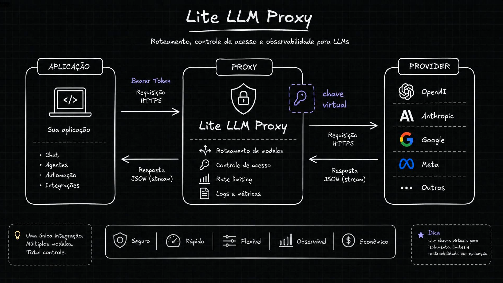
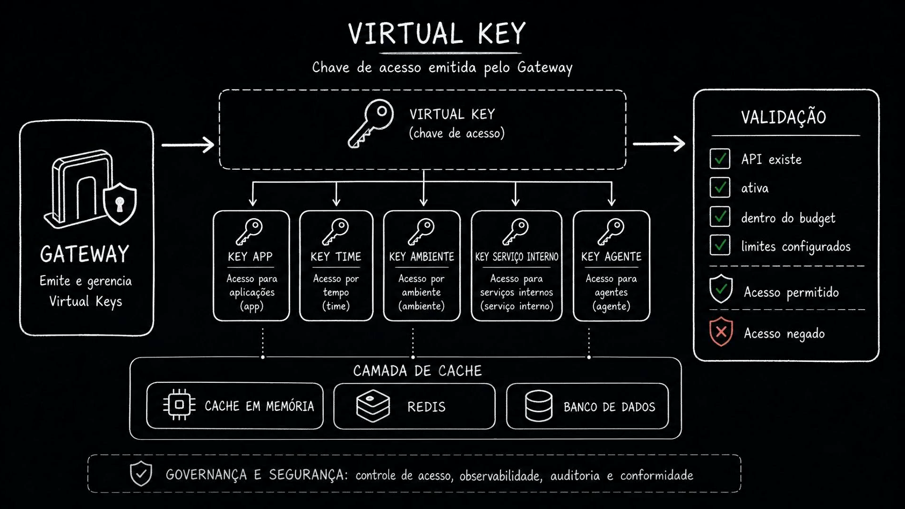
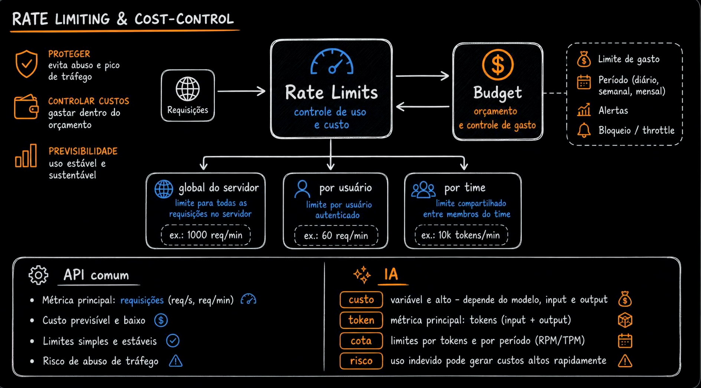
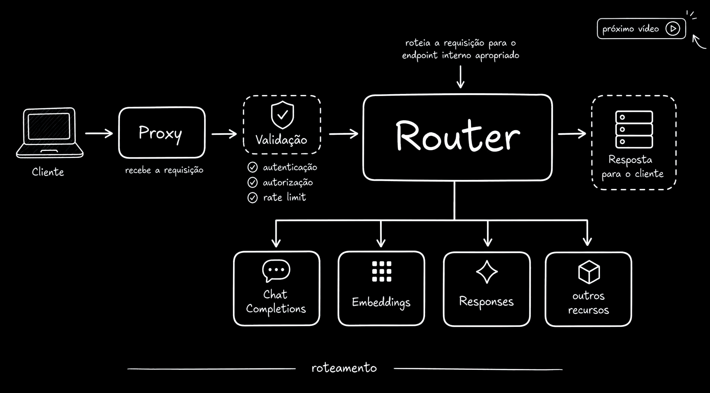

# Aula 09 — LiteLLM Proxy - Fluxo da requisição

> Curso: **AI Gateways** · Duração: `03:27`

## Resumo

A aula detalha o caminho de uma requisição passando pelo LiteLLM Proxy. O proxy não é só um repassador de HTTP: ele valida acesso, aplica rate limit, controla custo, registra métricas e decide para onde a chamada deve ir.

O fluxo fica mais parecido com uma API interna de IA do que com uma chamada direta para um provider.

## 1. Uma integração, vários providers



A aplicação chama o proxy usando um token interno. O proxy recebe a requisição, valida, registra e encaminha para o provider físico configurado.

Responsabilidades destacadas:

- roteamento de modelo;
- controle de acesso;
- rate limiting;
- logs e métricas;
- isolamento por chave virtual.

A aplicação passa a integrar com uma interface única, enquanto o proxy mantém a flexibilidade de falar com OpenAI, Anthropic, Google, Meta ou outros providers.

## 2. Virtual keys



As chaves virtuais representam identidades internas: aplicação, time, ambiente, serviço interno ou agente.

Antes de liberar uma chamada, o gateway pode verificar:

- se a chave existe;
- se está ativa;
- se ainda tem orçamento;
- se respeita os limites configurados;
- se possui permissão para aquela capacidade.

Essa camada permite isolar consumo, auditar uso e aplicar governança sem expor chaves reais dos providers.

## 3. Rate limit e controle de custo



Em APIs comuns, o custo por requisição tende a ser mais previsível. Em IA, o custo varia por modelo, tamanho de entrada, tamanho da resposta e frequência de uso.

Por isso, o gateway precisa lidar com métricas específicas:

- requisições por minuto;
- tokens por minuto;
- orçamento por chave, time ou aplicação;
- proteção contra picos e abuso.

O objetivo não é apenas proteger infraestrutura. É proteger orçamento.

## 4. Fluxo interno da requisição



O fluxo apresentado é:

```text
Client -> Proxy -> Validation -> Router -> Endpoint -> Provider -> Response
```

Primeiro a requisição é autenticada e validada. Depois passa por rate limit e autorização. Só então o router decide qual endpoint interno deve receber a chamada, como chat completions, embeddings, responses ou outro recurso.

## Ideia-chave

Um AI Gateway precisa tratar requisições de IA como tráfego governado: com identidade, limite, custo, permissão, observabilidade e roteamento.
