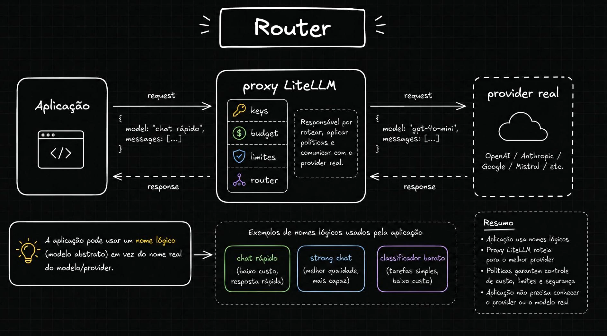
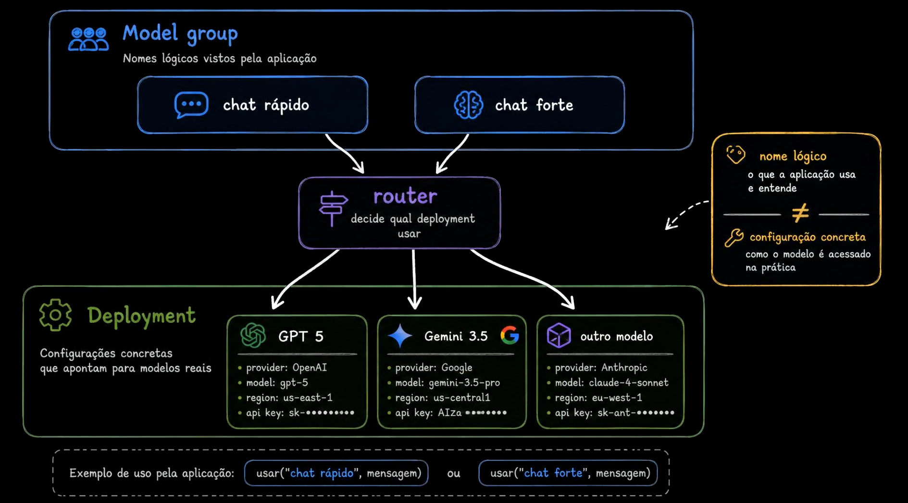
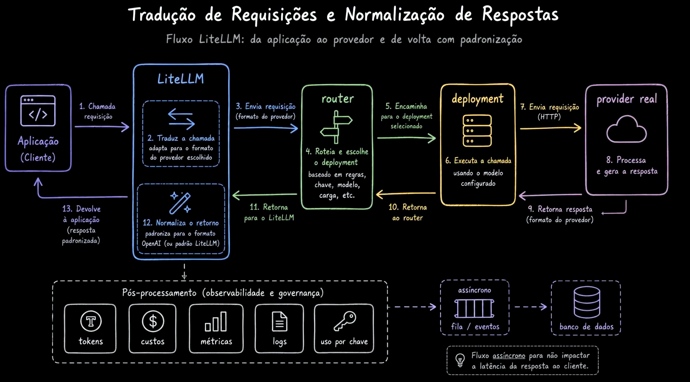
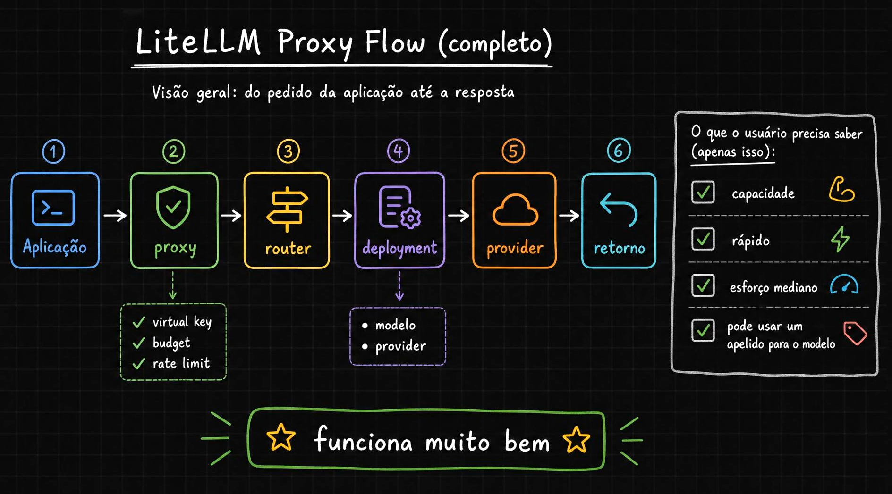

# Aula 10 — LiteLLM Proxy e Router

> Curso: **AI Gateways** · Duração: `03:44`

## Resumo

Esta aula separa dois conceitos que costumam se misturar: o nome que a aplicação usa e o modelo físico que realmente responde. O router permite que a aplicação peça uma **capacidade lógica**, enquanto o proxy decide qual deployment/modelo/provider deve atender.

Isso transforma `gpt-4o-mini`, `claude-*` ou `gemini-*` em detalhe de infraestrutura, não em contrato de aplicação.

## 1. Nomes lógicos



A aplicação chama algo como:

```json
{
  "model": "chat rapido",
  "messages": []
}
```

O proxy interpreta esse nome lógico e decide qual modelo físico usar. Exemplos de nomes lógicos:

- `chat rapido`: baixo custo e baixa latência;
- `strong chat`: maior qualidade e capacidade;
- `classificador barato`: tarefas simples com custo reduzido.

O contrato da aplicação passa a ser semântico: ela pede o tipo de capacidade que precisa.

## 2. Model group e deployments



O **model group** é o nome visível para a aplicação. Os **deployments** são as configurações concretas que apontam para providers e modelos reais.

Exemplo conceitual:

```text
chat rapido -> deployment OpenAI gpt-4o-mini
chat forte  -> deployment Anthropic/Google/OpenAI mais capaz
```

A aplicação não precisa saber região, provider, chave, endpoint ou modelo real. O router concentra essa decisão.

## 3. Tradução e normalização



O LiteLLM recebe uma chamada compatível, escolhe o deployment, adapta o formato para o provider escolhido e, ao receber a resposta, normaliza o retorno para a aplicação.

Além da chamada principal, o gateway pode registrar dados de observabilidade:

- tokens consumidos;
- custo estimado;
- modelo/deployment usado;
- chave virtual usada;
- métricas e logs.

Esse registro deve ser pensado para não virar gargalo de latência.

## 4. Fluxo completo



O fluxo completo fica:

```text
Aplicação -> Proxy -> Router -> Deployment -> Provider -> Resposta
```

Antes do roteamento, o proxy verifica chave virtual, orçamento e rate limit. Depois o router resolve o nome lógico para um deployment real.

## Ideia-chave

Router é o mecanismo que permite expor capacidades estáveis para a aplicação enquanto os modelos físicos podem mudar por custo, qualidade, disponibilidade ou política interna.
