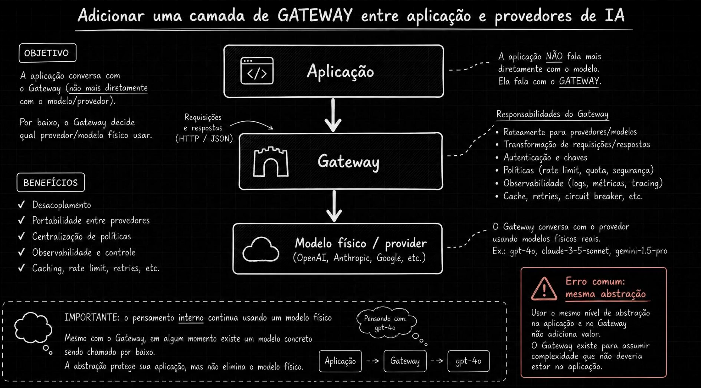
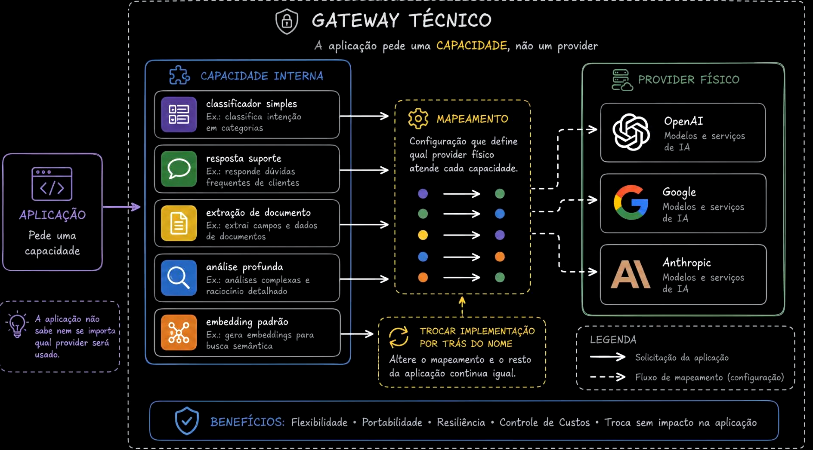
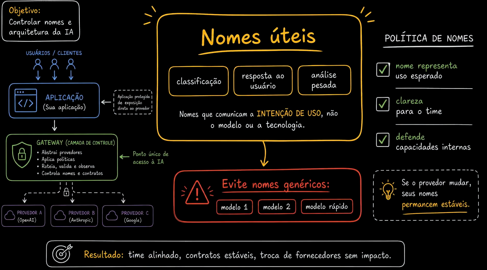
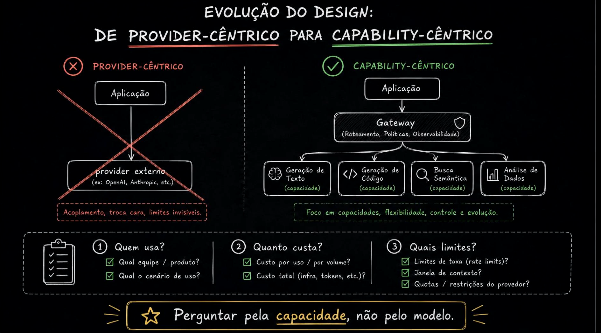

# Aula 11 — Expondo capacidades, não modelos físicos

> Curso: **AI Gateways** · Duração: `03:28`

## Resumo

A aula reforça a ideia de que a aplicação não deveria depender de modelos físicos. Em vez de pedir `gpt-*`, `claude-*` ou `gemini-*`, ela deveria pedir capacidades como classificação, resposta ao usuário, extração de documento ou análise profunda.

O gateway vira a camada que traduz intenção de uso em provider/modelo real.

## 1. Gateway como camada de abstração

O gateway fica entre a aplicação e os providers de IA. Ele não elimina a existência do modelo físico, mas impede que esse detalhe vaze para o contrato da aplicação.

Responsabilidades:

- roteamento;
- transformação de request/response;
- autenticação e chaves;
- políticas;
- observabilidade;
- cache, retry e circuit breaker.

Um erro comum é criar o gateway sem mudar o nível de abstração. Se a aplicação continua pedindo diretamente modelos físicos, o gateway agrega menos valor.

## 2. Aplicação pede capacidade

Exemplos de capacidades internas:

- `classificador simples`;
- `resposta suporte`;
- `extracao de documento`;
- `analise profunda`;
- `embedding padrao`.

O mapeamento interno decide se essa capacidade será atendida por OpenAI, Anthropic, Google ou outro provider.

## 3. Bons nomes

Nomes bons comunicam intenção de uso. Nomes ruins comunicam detalhe técnico ou ordem arbitrária.

Bons exemplos:

- `classificacao`;
- `resposta ao usuario`;
- `analise pesada`.

Evitar:

- `modelo 1`;
- `modelo 2`;
- `modelo rapido`.

O nome deveria permanecer estável mesmo quando o provider muda.

## 4. Evolução do desenho

No desenho orientado a provider, a aplicação acopla diretamente com a tecnologia externa. No desenho orientado a capacidade, a aplicação fala com o gateway e o gateway decide o provider físico.

Perguntas úteis para modelar capacidades:

- quem usa?
- qual time, produto ou cenário?
- qual custo esperado?
- quais limites de rate, contexto e quota?

## Ideia-chave

AI Gateway saudável expõe intenção de uso, não marca/modelo. Isso protege o produto contra mudanças de custo, provider, disponibilidade e estratégia técnica.
