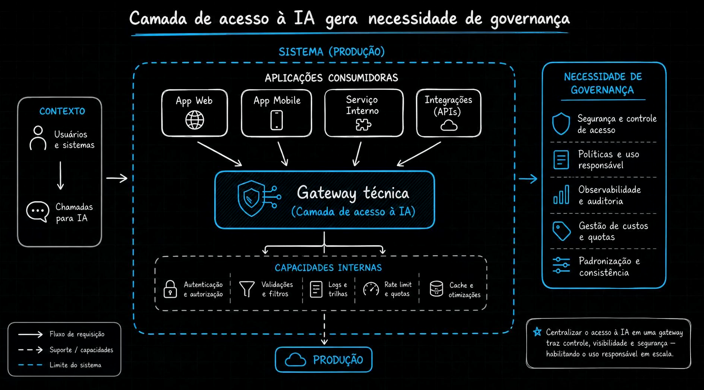
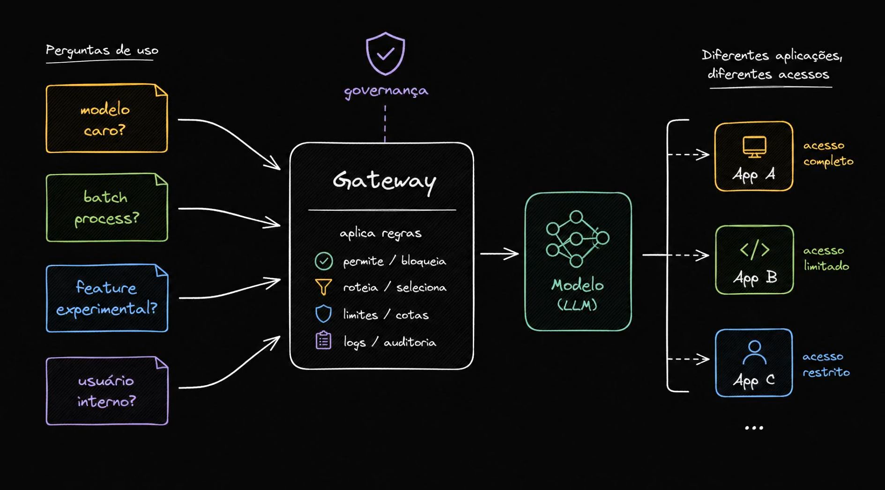
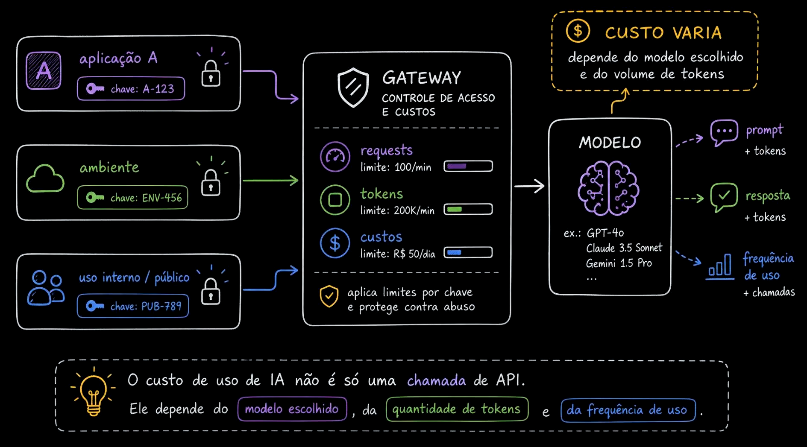
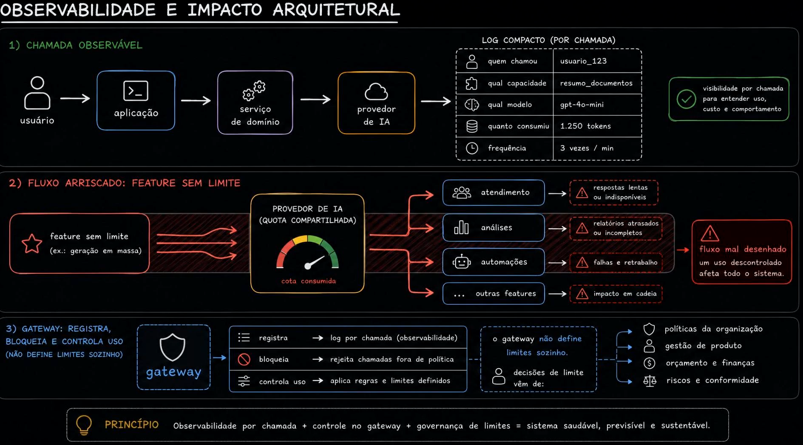
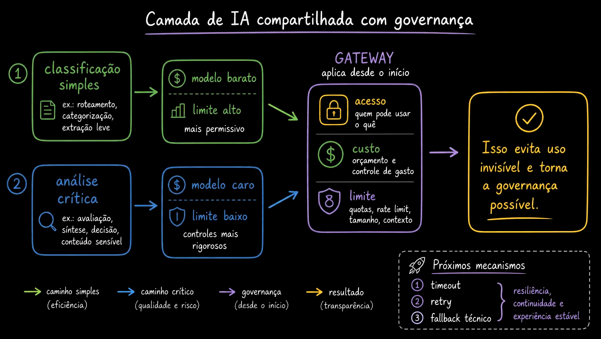

# Aula 12 — Governança mínima - acesso, custo e limites

> Curso: **AI Gateways** · Duração: `03:41`

## Resumo

Quando IA passa a ser usada por várias aplicações, a camada compartilhada precisa de governança mínima. Não basta “funcionar”: é preciso saber quem pode usar, quanto pode gastar, quais limites existem e como auditar o uso.

Nesta aula, governança aparece como parte da arquitetura, não como burocracia externa.

## 1. Camada compartilhada de acesso

Aplicações web, mobile, serviços internos e APIs passam por uma camada técnica comum. Nessa camada entram:

- autenticação e autorização;
- validações e filtros;
- logs e traces;
- rate limit e quotas;
- cache e otimizações.

Centralizar acesso permite controlar visibilidade, segurança e uso responsável em escala.

## 2. Perguntas de governança

O gateway pode tomar decisões diferentes dependendo do contexto:

- é um modelo caro?
- é um processo em batch?
- é uma feature experimental?
- é usuário interno?

Com essas respostas, ele pode permitir, bloquear, rotear, limitar ou registrar de forma diferente.

## 3. Controle por chave

Cada chave pode ter limites próprios:

- requisições por minuto;
- tokens por minuto;
- orçamento diário;
- permissões por capacidade.

Em IA, custo não é apenas “número de chamadas”. O custo depende de modelo, tokens de entrada, tokens de saída e frequência.

## 4. Observabilidade e impacto arquitetural

Para cada chamada, é útil registrar:

- quem chamou;
- qual capacidade usou;
- qual modelo/deployment respondeu;
- quantos tokens foram consumidos;
- com que frequência acontece.

Sem esse nível de observabilidade, uma feature pode consumir quota compartilhada e afetar relatórios, fluxos internos ou experiências críticas.

## 5. Governança desde o início

Nem toda capacidade merece o mesmo tratamento. Uma classificação simples pode usar modelo barato, limite alto e política mais permissiva. Uma análise crítica pode usar modelo caro, limite baixo e controles mais rígidos.

## Ideia-chave

Governança mínima em AI Gateway significa responder três perguntas desde cedo: quem pode acessar, quanto pode gastar e até onde pode ir.
