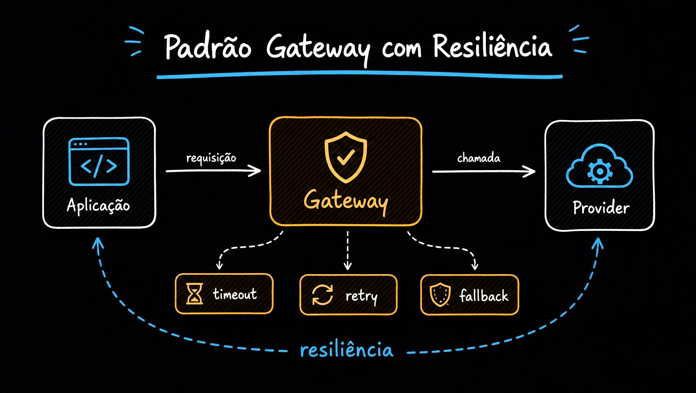
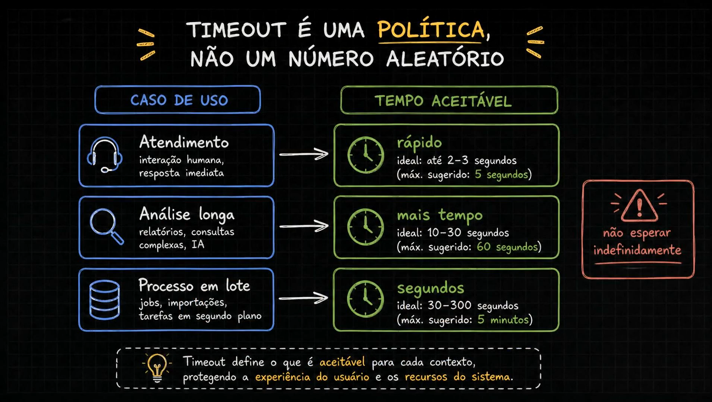
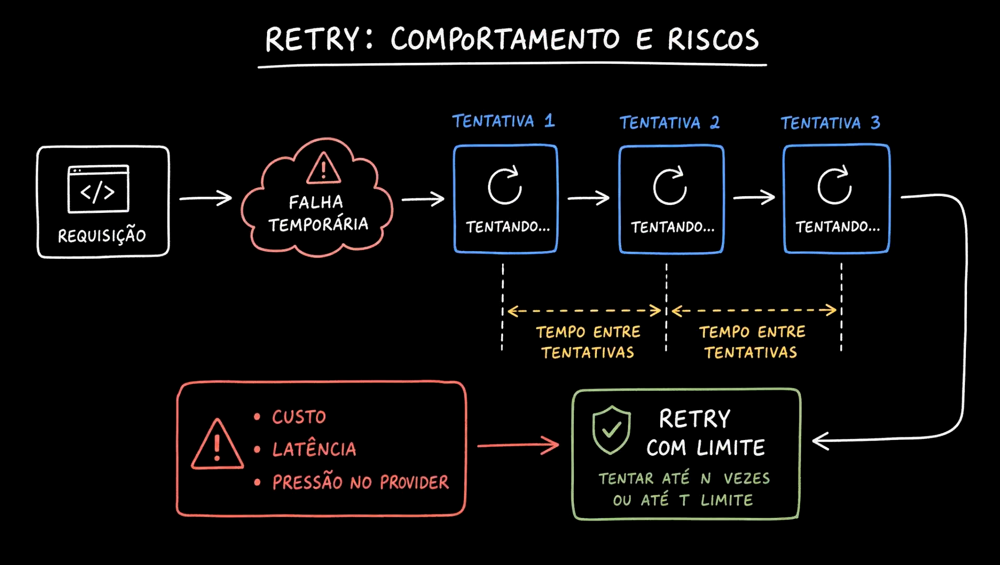
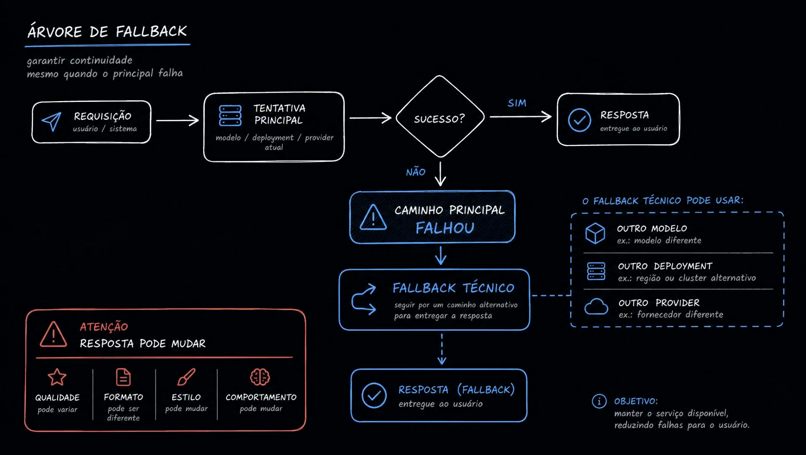
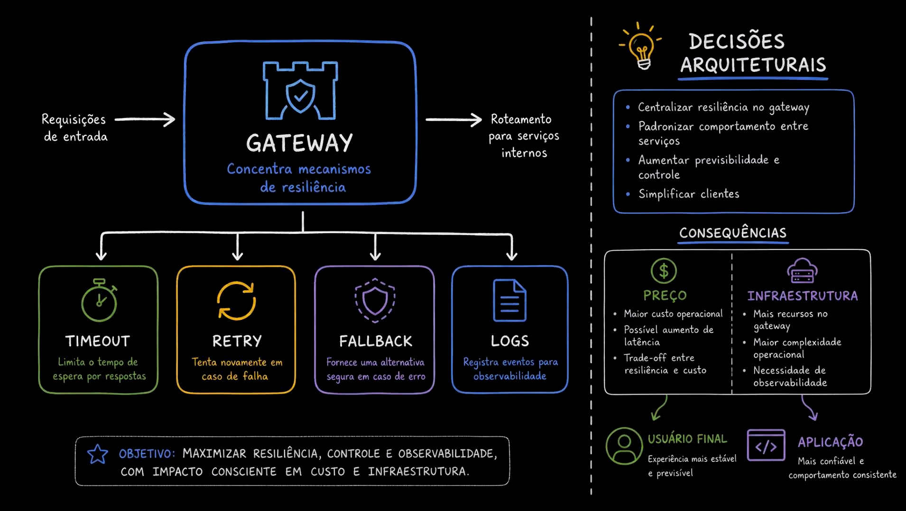
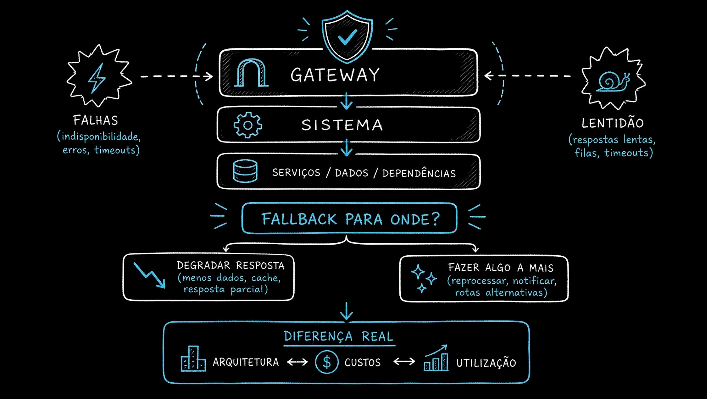

# Aula 13 — Resiliência - timeout, retry e fallback

> Curso: **AI Gateways** · Duração: `04:29`

## Resumo

Esta aula mostra o gateway como ponto natural para concentrar resiliência. Quando a chamada de IA fica lenta ou falha, a aplicação não deveria carregar sozinha toda a complexidade de timeout, retry e fallback.

Resiliência aqui não significa “sempre insistir”. Significa definir comportamento previsível por contexto.

## 1. Gateway resiliente



O padrão apresentado é:

```text
Aplicação -> Gateway -> Provider
```

O gateway concentra timeout, retry e fallback. A aplicação continua com um contrato simples e o comportamento operacional fica padronizado.

## 2. Timeout como política



Timeout não é número aleatório. Ele depende do caso de uso:

- interação humana: idealmente poucos segundos;
- análise longa ou relatório: dezenas de segundos podem fazer sentido;
- batch/background job: pode tolerar mais tempo.

Esperar indefinidamente prejudica UX e consome recursos do sistema.

## 3. Retry com limite



Retry ajuda em falhas temporárias, mas tem preço:

- aumenta custo;
- aumenta latência;
- aumenta pressão sobre provider;
- pode piorar um incidente se for agressivo demais.

Por isso, retry precisa de limite de tentativas e janela de tempo.

## 4. Fallback técnico



Quando o caminho principal falha, o gateway pode tentar uma alternativa:

- outro modelo;
- outro deployment;
- outra região;
- outro provider.

O cuidado é que o fallback pode mudar qualidade, formato, estilo ou comportamento da resposta. Nem todo fallback é equivalente.

## 5. Decisões concentradas no gateway



Centralizar resiliência simplifica clientes e torna o comportamento entre serviços mais consistente. Em troca, aumenta a responsabilidade operacional do gateway.

Custos possíveis:

- maior latência;
- mais chamadas;
- mais infraestrutura;
- mais necessidade de observabilidade.

## 6. Fallback para onde?



A pergunta importante não é apenas “tem fallback?”, mas “fallback para onde?”.

Algumas opções:

- degradar resposta;
- usar cache;
- responder parcialmente;
- reprocessar depois;
- notificar usuário;
- acionar rota alternativa.

## Ideia-chave

Timeout, retry e fallback são decisões de produto e arquitetura. O gateway ajuda a aplicar essas decisões de forma padronizada e observável.
