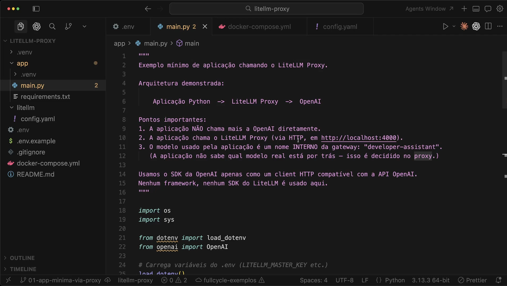
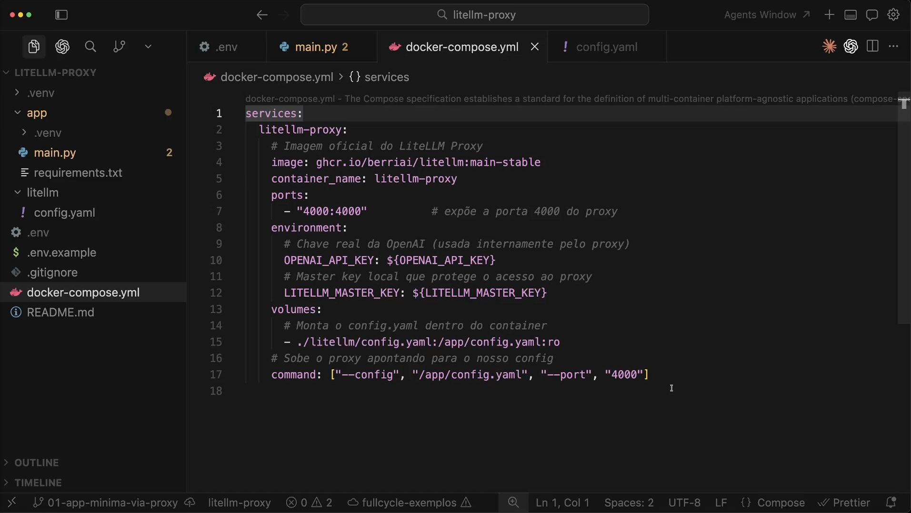
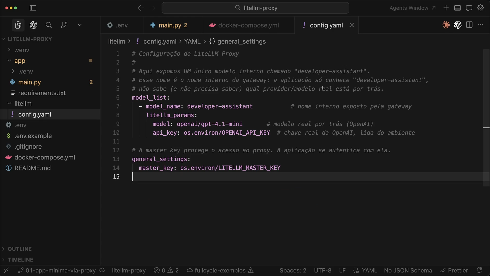
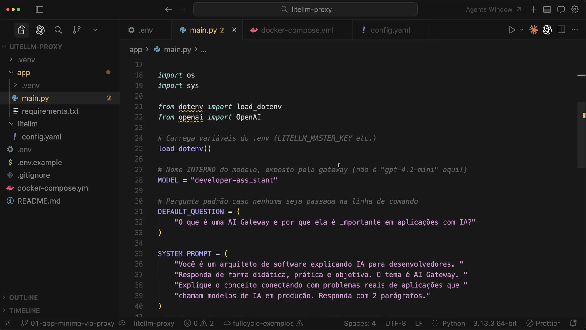

# Aula 14 — LiteLLM Proxy na prática

> Curso: **AI Gateways** · Duração: `07:16`

## Resumo

Esta aula inicia o projeto prático do LiteLLM Proxy. A ideia é montar uma aplicação Python mínima que não chama mais a OpenAI diretamente: ela chama o proxy local em `http://localhost:4000`.

O ponto arquitetural mais importante é que a aplicação usa um **nome interno** da gateway (`developer-assistant`) e não o nome físico do modelo real.

Projeto prático registrado em: [`minimal-proxy-client`](./minimal-proxy-client/README.md)

## 1. Estrutura do exemplo



A arquitetura demonstrada é:

```text
Aplicacao Python -> LiteLLM Proxy -> OpenAI
```

Pontos importantes da aula:

- a aplicação não chama mais a OpenAI diretamente;
- a aplicação chama o LiteLLM Proxy por HTTP;
- o modelo usado pela aplicação é um nome interno da gateway;
- a aplicação não sabe qual modelo real está por trás;
- o SDK da OpenAI é usado apenas como cliente HTTP compatível com a API OpenAI.

## 2. Docker Compose do proxy



O proxy é executado com Docker Compose, expondo a porta `4000`.

Configuração principal:

- imagem do LiteLLM Proxy;
- `OPENAI_API_KEY` real usada internamente pelo proxy;
- `LITELLM_MASTER_KEY` usada pela aplicação para autenticar no proxy;
- montagem do arquivo `litellm/config.yaml`;
- comando apontando para o config e porta `4000`.

## 3. Configuração do LiteLLM



O arquivo `config.yaml` expõe um único modelo lógico:

```yaml
model_name: developer-assistant
```

Por baixo, esse nome aponta para um modelo real da OpenAI. A aplicação só conhece `developer-assistant`, e a troca do modelo físico pode acontecer no proxy.

## 4. Código da aplicação



O código carrega variáveis do `.env`, define o modelo lógico e prepara um prompt didático sobre AI Gateway.

Prompt de sistema extraído da aula:

```text
Voce e um arquiteto de software explicando IA para desenvolvedores.
Responda de forma didatica, pratica e objetiva. O tema e AI Gateway.
Explique o conceito conectando com problemas reais de aplicacoes que chamam modelos de IA em producao. Responda com 2 paragrafos.
```

Pergunta padrão extraída da aula:

```text
O que e uma AI Gateway e por que ela e importante em aplicacoes com IA?
```

## Ideia-chave

Nesta prática, o ganho não está em chamar um modelo. O ganho está em provar que a aplicação conversa com uma capacidade interna e deixa o modelo físico sob controle do proxy.
