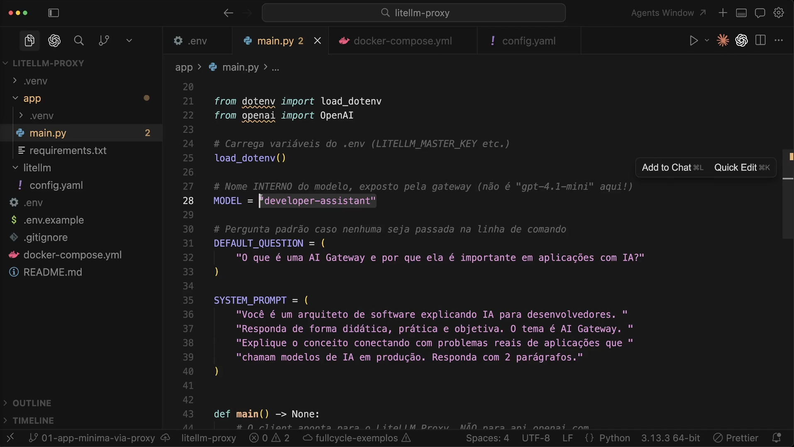
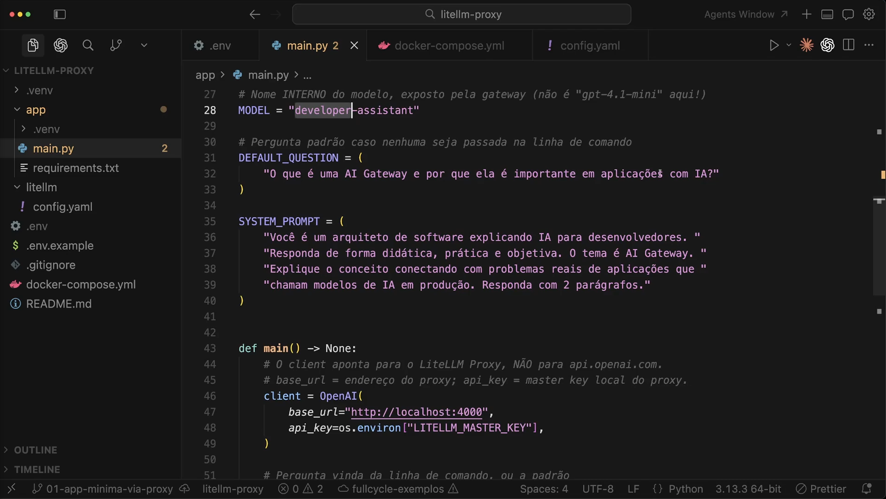
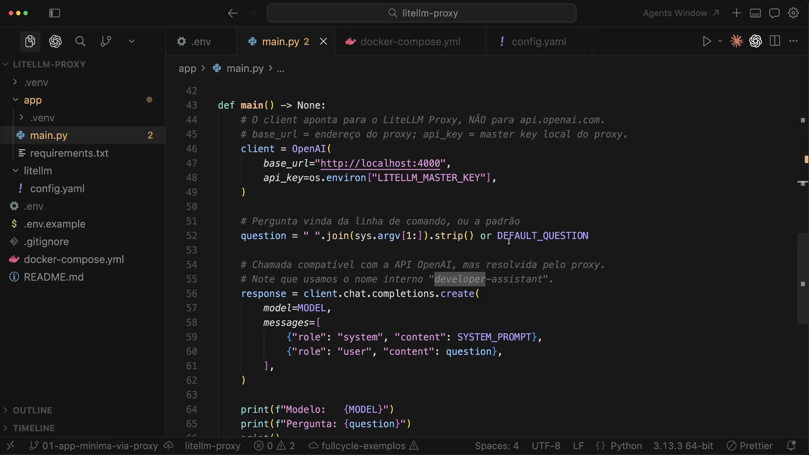
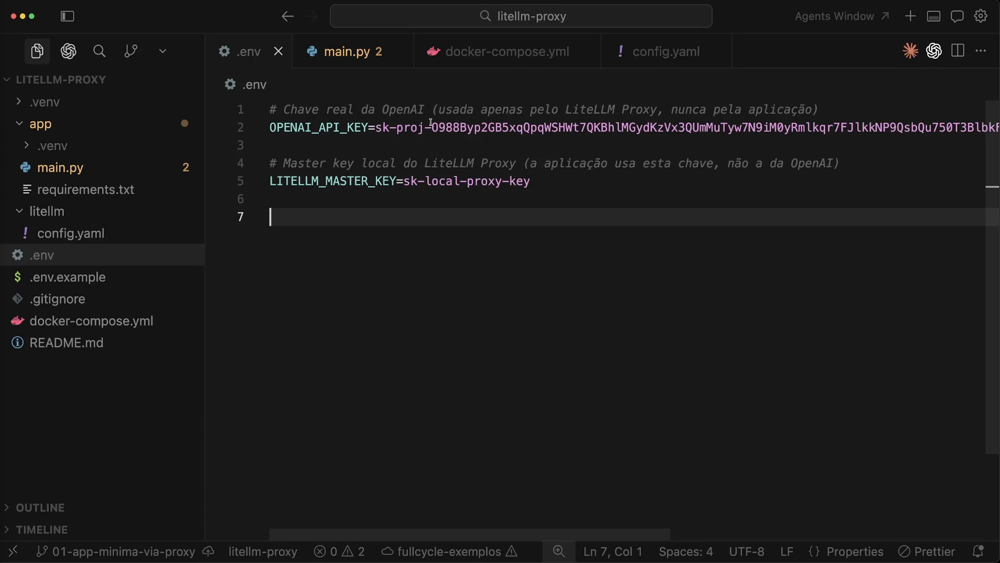
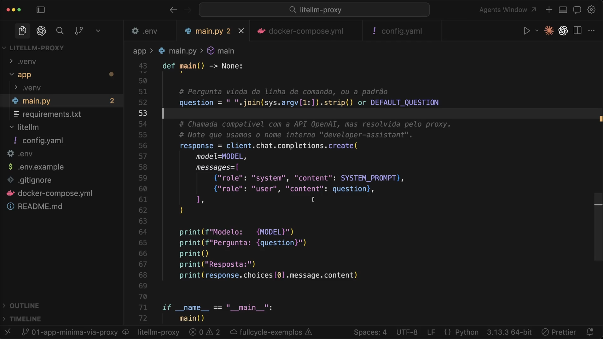
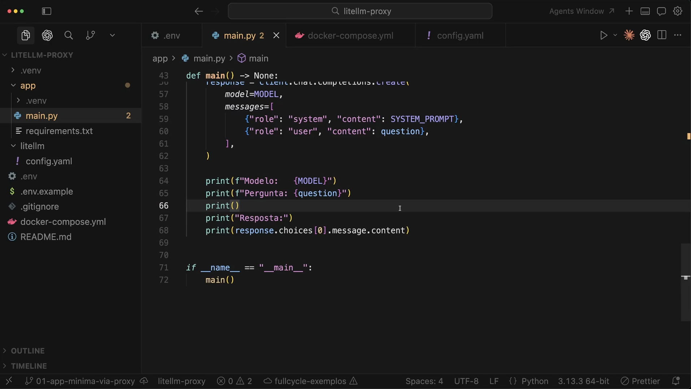
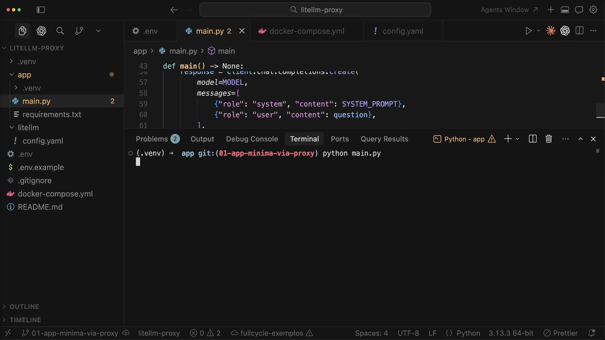
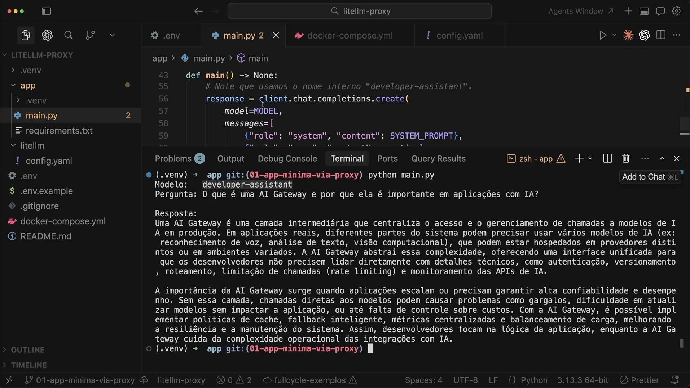

# Aula 15 — LiteLLM Proxy na prática - parte 2

> Curso: **AI Gateways** · Duração: `03:11`

## Resumo

Esta aula conclui a prática iniciada na aula 14. O foco é terminar o `main.py`, autenticar a aplicação no proxy usando a `LITELLM_MASTER_KEY` e executar a chamada usando o modelo lógico `developer-assistant`.

Projeto prático registrado em: [`minimal-proxy-client`](./minimal-proxy-client/README.md)

## 1. Modelo interno



A aplicação define:

```python
MODEL = "developer-assistant"
```

Esse é o nome exposto pela gateway. O código deixa explícito que a aplicação não deve usar `gpt-*` diretamente.

## 2. Client apontando para o proxy



O client da OpenAI é inicializado com:

```python
base_url = "http://localhost:4000"
api_key = os.environ["LITELLM_MASTER_KEY"]
```

O SDK é compatível com a API OpenAI, mas a requisição não vai para `api.openai.com`. Ela vai para o LiteLLM Proxy local.

## 3. Pergunta por argumento de linha de comando



O código permite passar uma pergunta via terminal:

```python
question = " ".join(sys.argv[1:]).strip() or DEFAULT_QUESTION
```

Se nenhum argumento for enviado, usa a pergunta padrão da aula.

## 4. Variáveis de ambiente



O `.env` separa duas chaves:

- `OPENAI_API_KEY`: chave real usada apenas pelo proxy;
- `LITELLM_MASTER_KEY`: chave local usada pela aplicação para acessar o proxy.

Importante: não registrar chaves reais no repositório. O projeto prático usa apenas placeholders em `.env.example`.

## 5. Chamada compatível com OpenAI



A aplicação chama:

```python
client.chat.completions.create(...)
```

O formato continua familiar para quem usa o SDK da OpenAI, mas a resolução do modelo acontece no proxy.

## 6. Saída da resposta



O exemplo imprime:

- modelo lógico usado;
- pergunta;
- resposta do assistente.

Isso ajuda a visualizar que a aplicação não conhece o modelo físico.

## 7. Execução



A aula executa:

```bash
python main.py
```

O terminal usa a pergunta padrão quando nenhum argumento é informado.

## 8. Resultado



O resultado mostra uma explicação em dois parágrafos sobre AI Gateway. A resposta conecta gateway com centralização de acesso, roteamento, controle de custo, limites, monitoramento, resiliência e manutenção.

## Ideia-chave

O código da aplicação fica estável enquanto a decisão de provider/modelo fica no proxy. Esse é o primeiro passo prático para tratar IA como uma capacidade interna governada.
