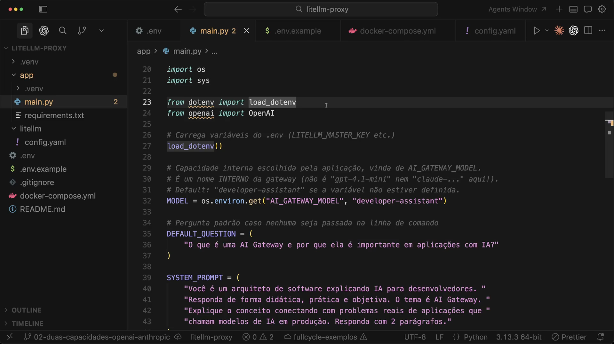
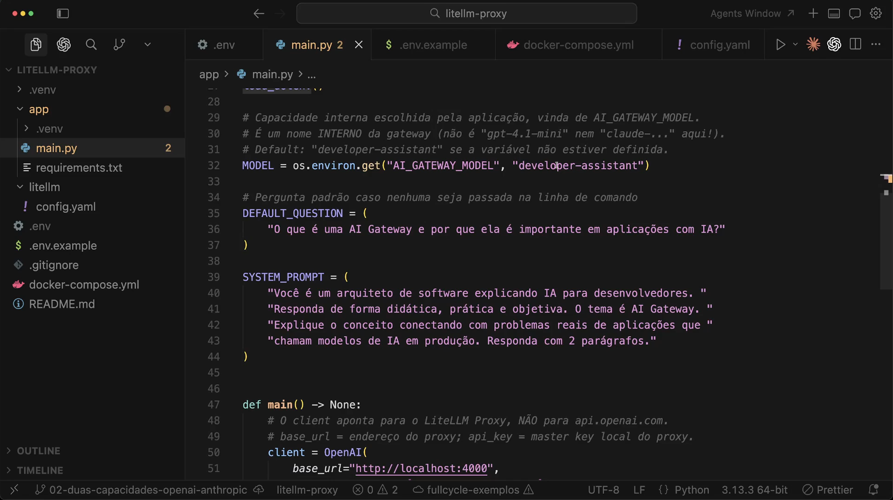
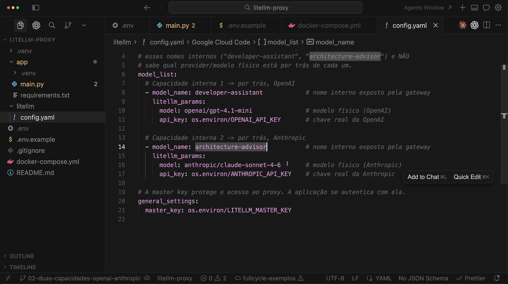
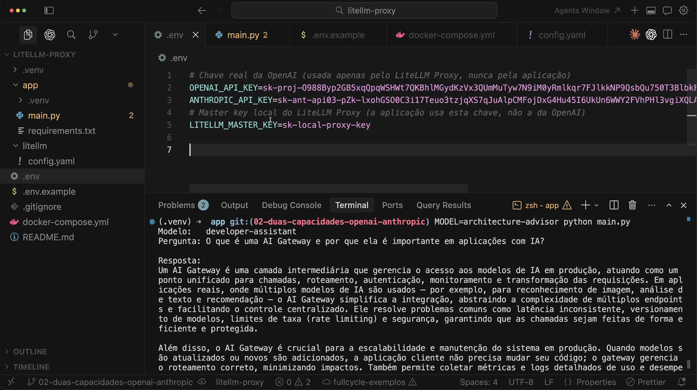
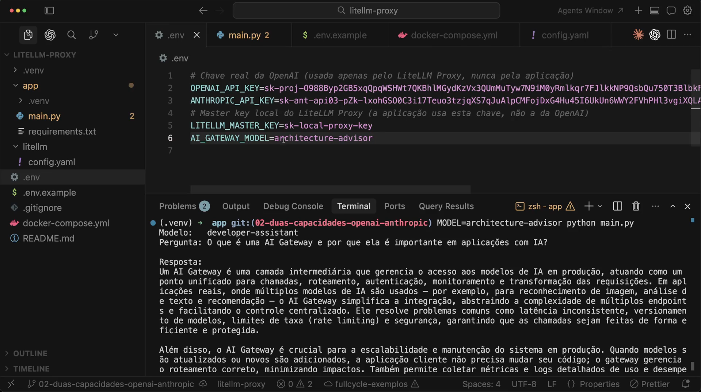
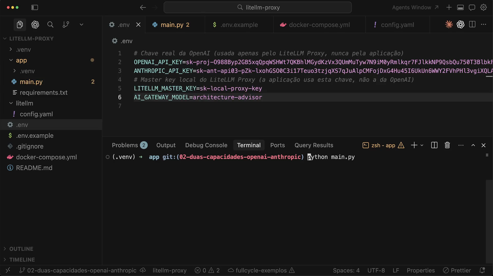
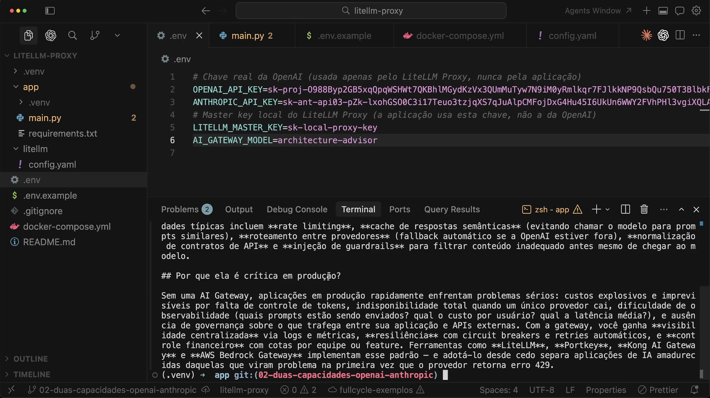
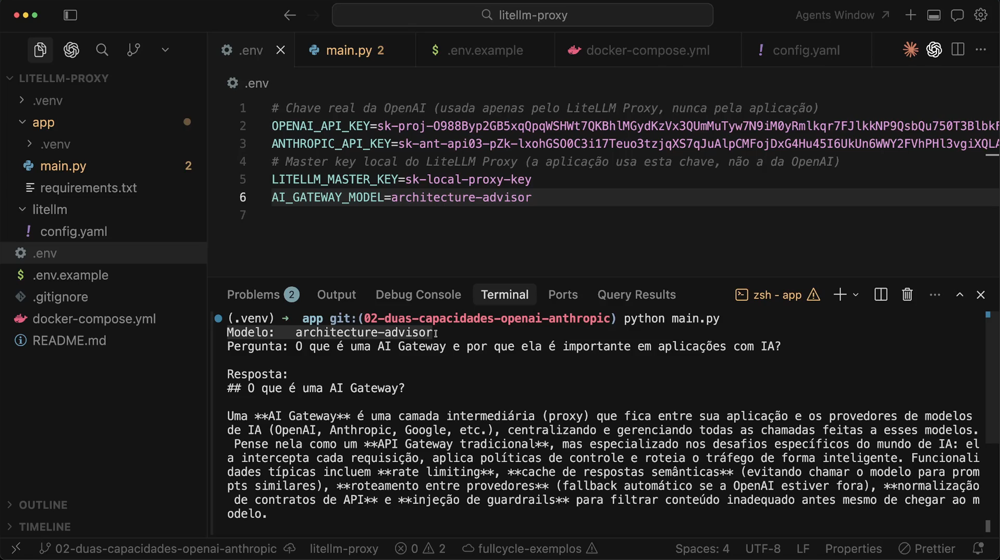
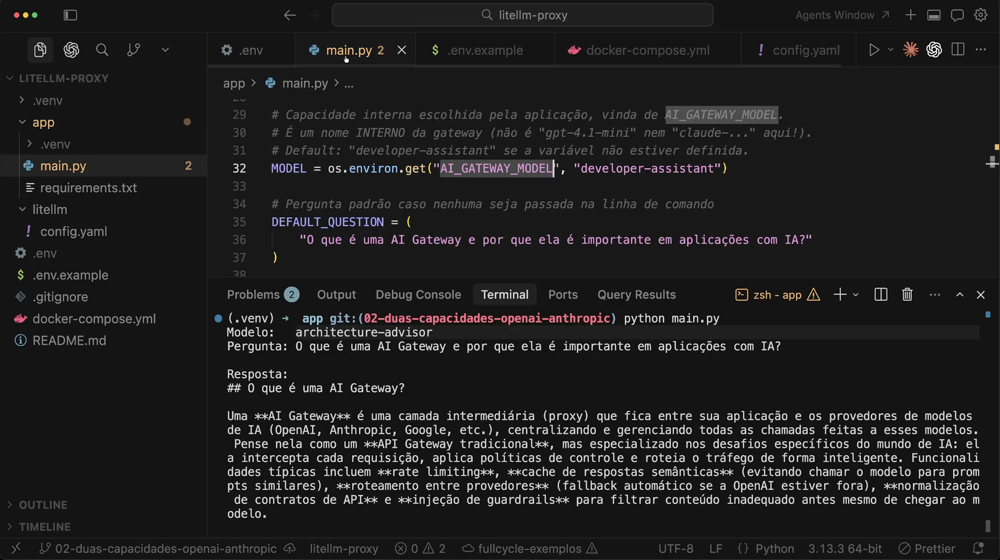

# Aula 16 — Adicionando e alternando modelos no Proxy

> Curso: **AI Gateways** · Duração: `06:12`

## Resumo

Esta aula continua o projeto prático do LiteLLM Proxy e mostra como adicionar mais de uma capacidade interna na gateway. A aplicação deixa de usar um modelo fixo e passa a ler `AI_GATEWAY_MODEL`, mantendo o contrato em nomes internos como `developer-assistant` e `architecture-advisor`.

O ponto principal é que alternar entre OpenAI e Anthropic passa a ser uma decisão de configuração da gateway, não uma mudança no código de integração da aplicação.

Projeto prático registrado em: [`multi-capability-proxy`](./multi-capability-proxy/README.md)

## 1. Modelo vindo da configuração



O `main.py` passa a ler a capacidade interna por variável de ambiente:

```python
MODEL = os.environ.get("AI_GATEWAY_MODEL", "developer-assistant")
```

A aplicação continua sem conhecer `gpt-*` ou `claude-*`. Ela conhece apenas o nome publicado pelo gateway.

## 2. Default seguro para a aplicação



Se `AI_GATEWAY_MODEL` não estiver definida, o código usa `developer-assistant`.

Isso mantém o exemplo executável com uma capacidade padrão, mas permite alternar o comportamento sem editar o código.

## 3. Duas capacidades no proxy



O `config.yaml` passa a expor duas capacidades:

- `developer-assistant`: mapeada para `openai/gpt-4.1-mini`;
- `architecture-advisor`: mapeada para `anthropic/claude-sonnet-4-6`.

O proxy sabe qual provider físico está por trás de cada nome. A aplicação não sabe e não precisa saber.

## 4. Variáveis de ambiente



O `.env` passa a ter:

- `OPENAI_API_KEY`;
- `ANTHROPIC_API_KEY`;
- `LITELLM_MASTER_KEY`;
- `AI_GATEWAY_MODEL`.

Os prints mostram chaves reais no editor. No projeto prático desta pasta, elas foram substituídas por placeholders em `.env.example`.

## 5. Alternando a capacidade



Ao definir:

```env
AI_GATEWAY_MODEL=architecture-advisor
```

a mesma aplicação passa a chamar a capacidade exposta pelo proxy para o Anthropic.

## 6. Execução sem mudar o código



A execução continua sendo:

```bash
python main.py
```

A diferença está no ambiente e na configuração do proxy.

## 7. Resposta com outro comportamento



A resposta muda porque o modelo físico por trás da capacidade mudou. Isso é esperado: alternar providers/modelos pode mudar estilo, profundidade, formato e vocabulário.

## 8. Resultado usando `architecture-advisor`



O terminal mostra `Modelo: architecture-advisor`, mas a aplicação ainda está chamando a mesma interface HTTP do LiteLLM Proxy.

## 9. Contrato da aplicação



O contrato importante para a aplicação é:

```text
AI_GATEWAY_MODEL -> nome interno da gateway
```

Não é provider. Não é modelo físico. É uma capacidade.

## Ideia-chave

Adicionar e alternar modelos no proxy permite trocar implementação sem trocar integração. A aplicação escolhe uma capacidade interna; o gateway decide o provider/modelo real.
