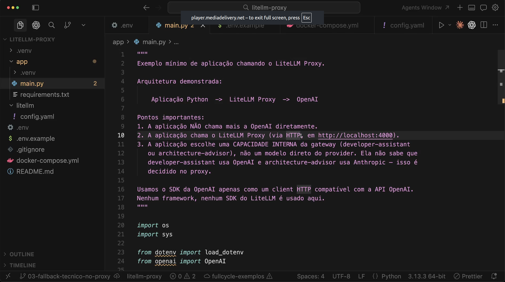
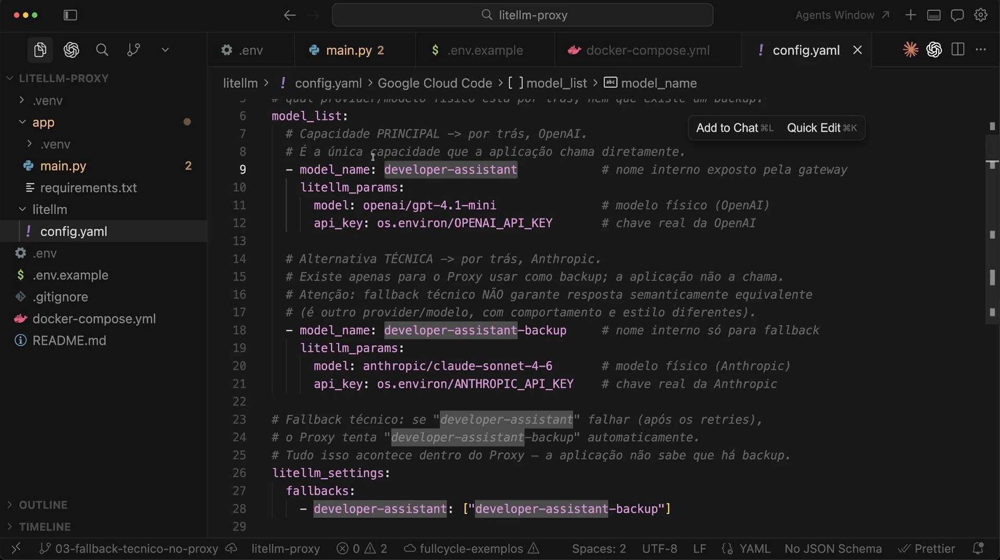
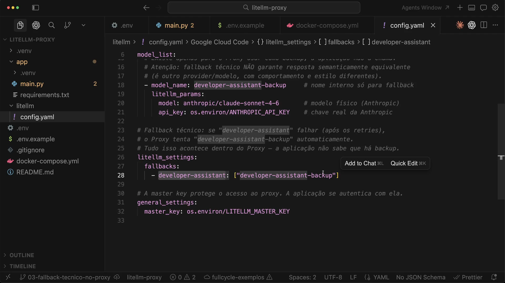
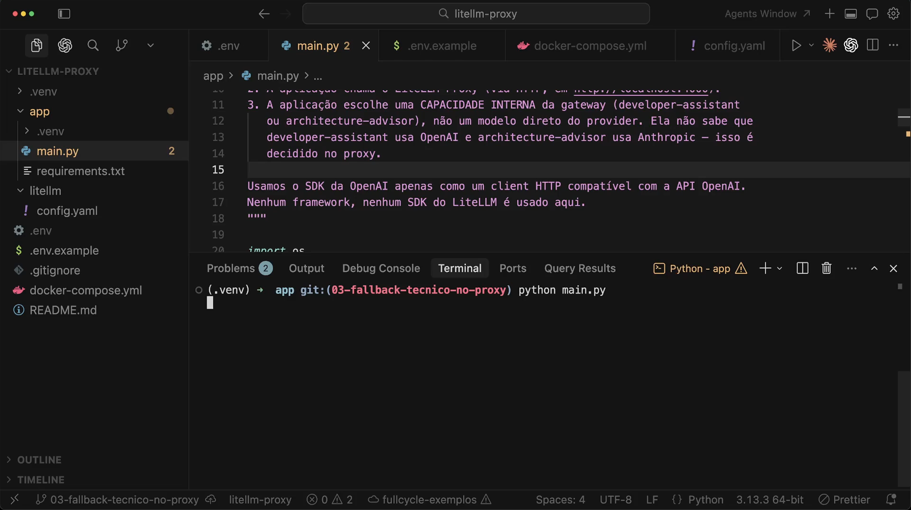
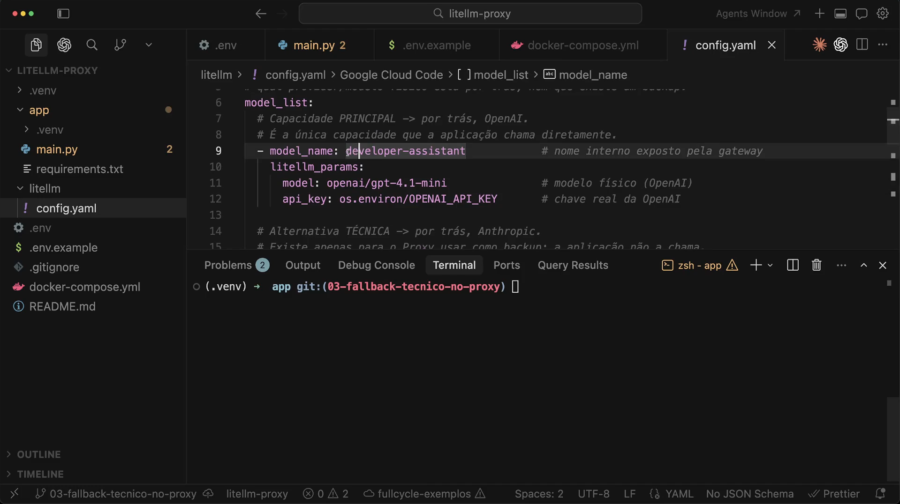
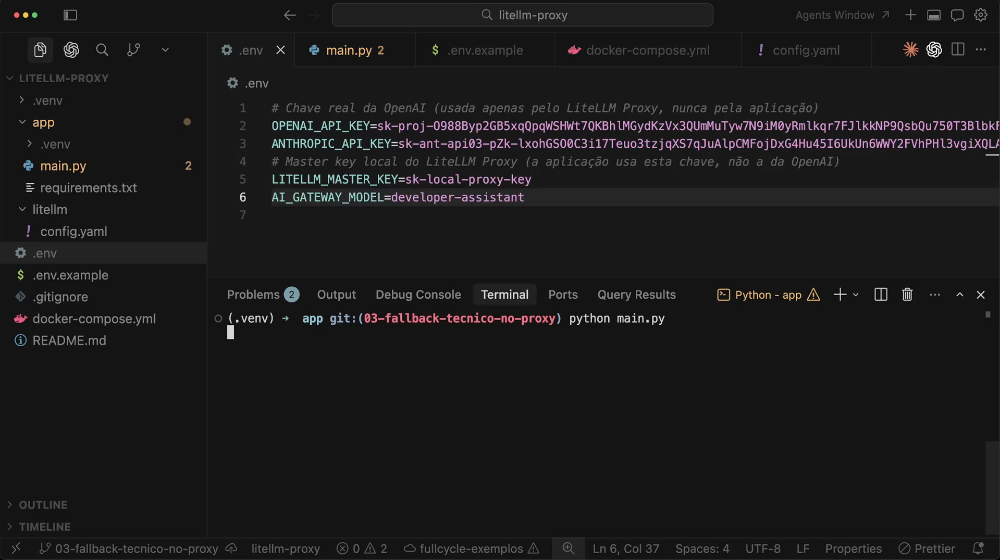
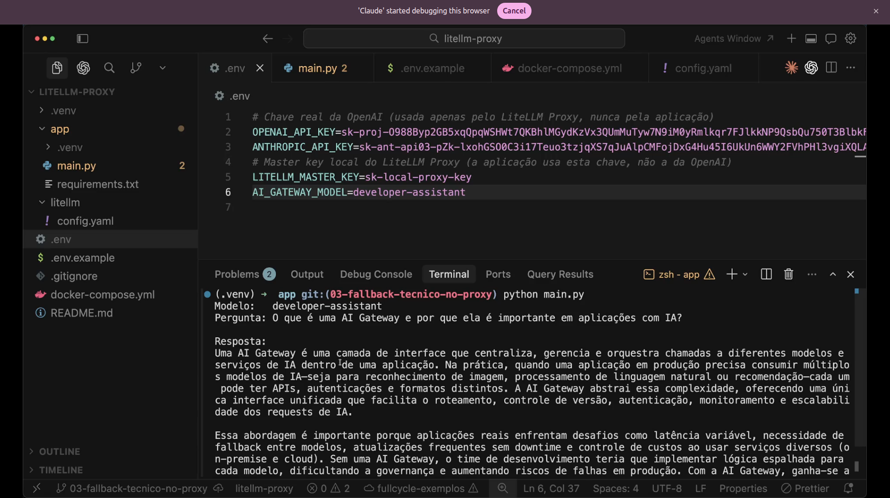

# Aula 17 — Fallback técnico

> Curso: **AI Gateways** · Duração: `06:32`

## Resumo

Esta aula adiciona fallback técnico dentro do LiteLLM Proxy. A aplicação continua chamando apenas a capacidade principal, `developer-assistant`, mas o proxy ganha uma alternativa interna, `developer-assistant-backup`, usada automaticamente se a principal falhar.

O ponto arquitetural é que o fallback acontece no proxy. A aplicação não chama o backup diretamente e não precisa importar outro SDK.

Projeto prático registrado em: [`proxy-technical-fallback`](./proxy-technical-fallback/README.md)

## 1. Aplicação chama uma capacidade



A arquitetura segue:

```text
Aplicacao Python -> LiteLLM Proxy -> OpenAI
```

Mas agora existe uma regra importante: a aplicação escolhe uma capacidade interna da gateway, não um modelo direto do provider.

Exemplos citados:

- `developer-assistant`;
- `architecture-advisor`.

## 2. Capacidade principal e backup



O `config.yaml` define:

- `developer-assistant`: capacidade principal por trás da OpenAI;
- `developer-assistant-backup`: alternativa técnica por trás da Anthropic.

O comentário da aula é essencial: fallback técnico não garante resposta semanticamente equivalente. É outro provider/modelo, com comportamento e estilo diferentes.

## 3. Regra de fallback



A regra aparece em `litellm_settings.fallbacks`:

```yaml
litellm_settings:
  fallbacks:
    - developer-assistant: ["developer-assistant-backup"]
```

Se `developer-assistant` falhar, depois das tentativas configuradas, o proxy tenta `developer-assistant-backup`.

## 4. Execução pela aplicação



A aplicação executa o mesmo comando:

```bash
python main.py
```

Ela não recebe um novo endpoint, não escolhe backup e não muda de SDK.

## 5. Nome principal no proxy



A capacidade principal continua publicada como `developer-assistant`. O backup existe apenas para o proxy.

Essa separação evita que o código cliente comece a depender de detalhes de contingência.

## 6. Ambiente apontando para a principal



O `.env` mantém:

```env
AI_GATEWAY_MODEL=developer-assistant
```

Ou seja: mesmo com fallback configurado, o contrato da aplicação continua sendo a capacidade principal.

## 7. Resultado com fallback transparente



O terminal mostra a aplicação usando `developer-assistant`. Se o caminho principal falhar, o proxy pode resolver por outro modelo sem expor essa decisão para a aplicação.

## Ideia-chave

Fallback técnico é mecanismo de resiliência, não garantia de equivalência. Ele aumenta disponibilidade, mas precisa ser observado porque pode mudar qualidade, formato e comportamento da resposta.
