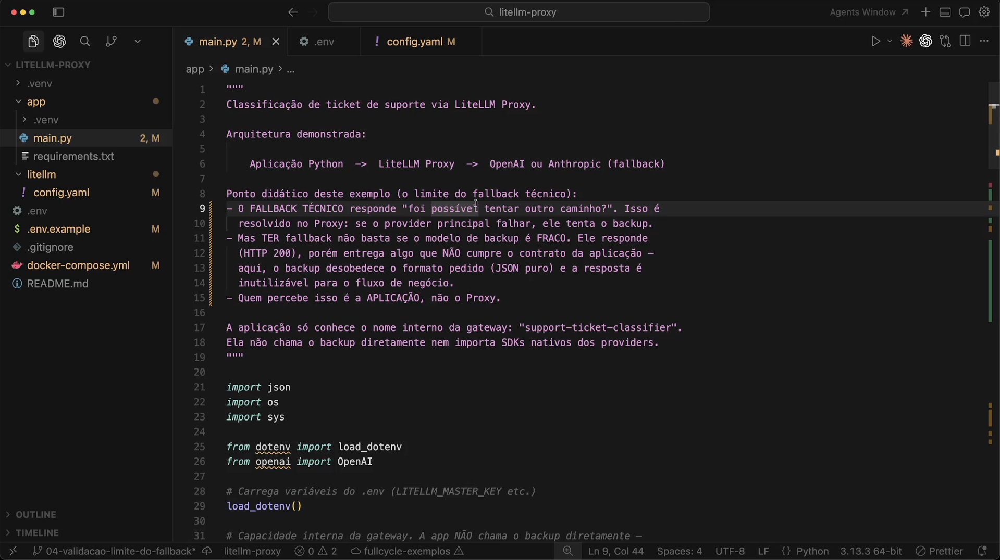
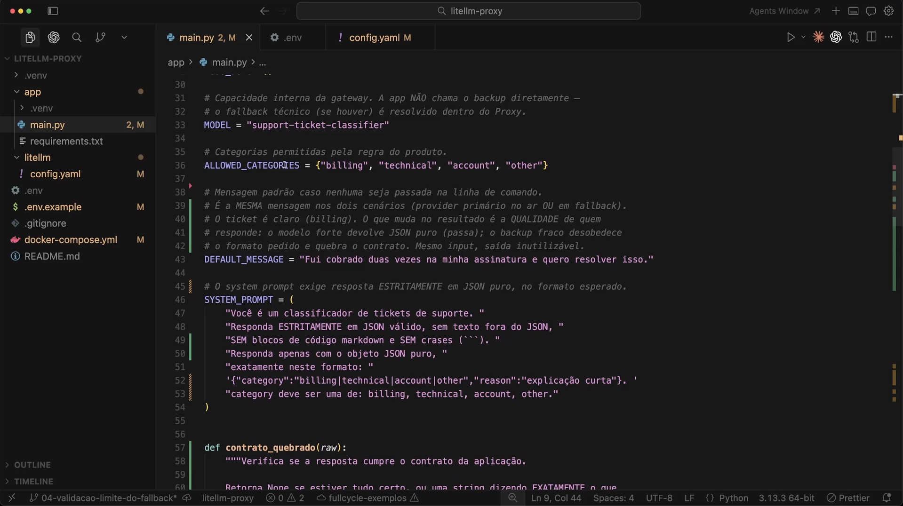
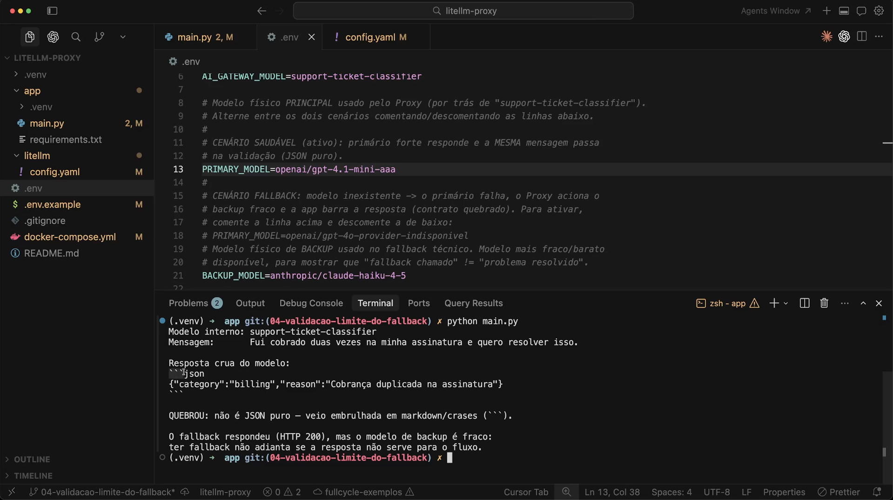
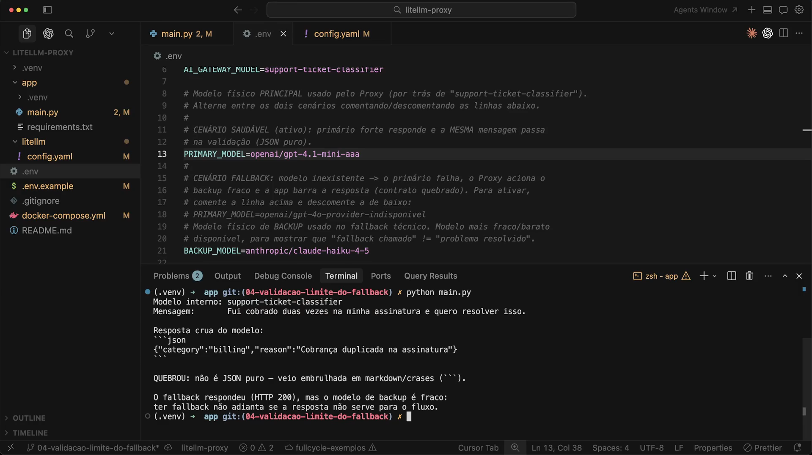
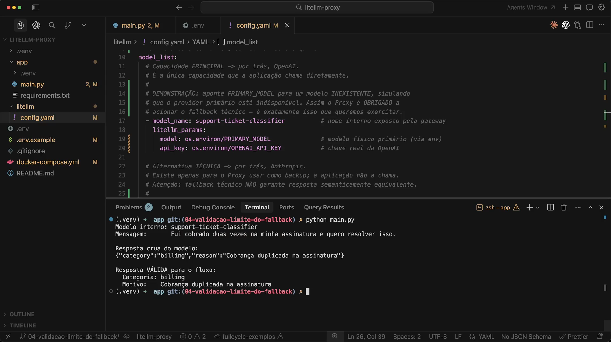
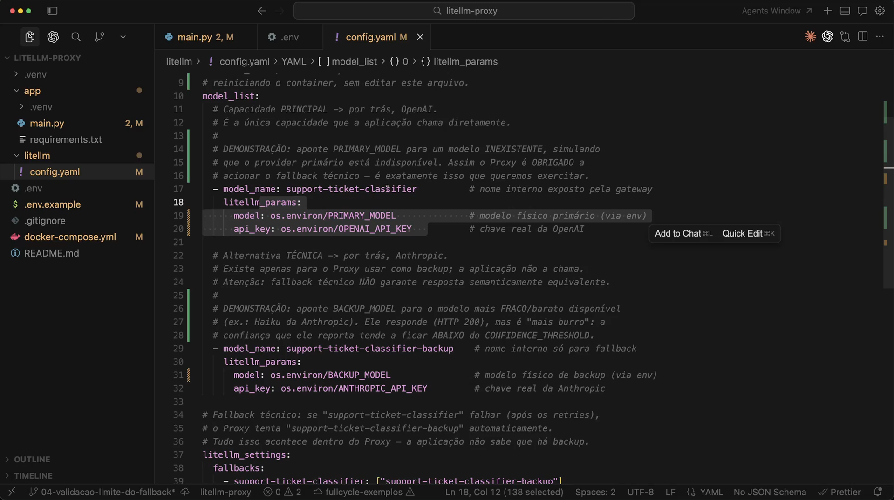
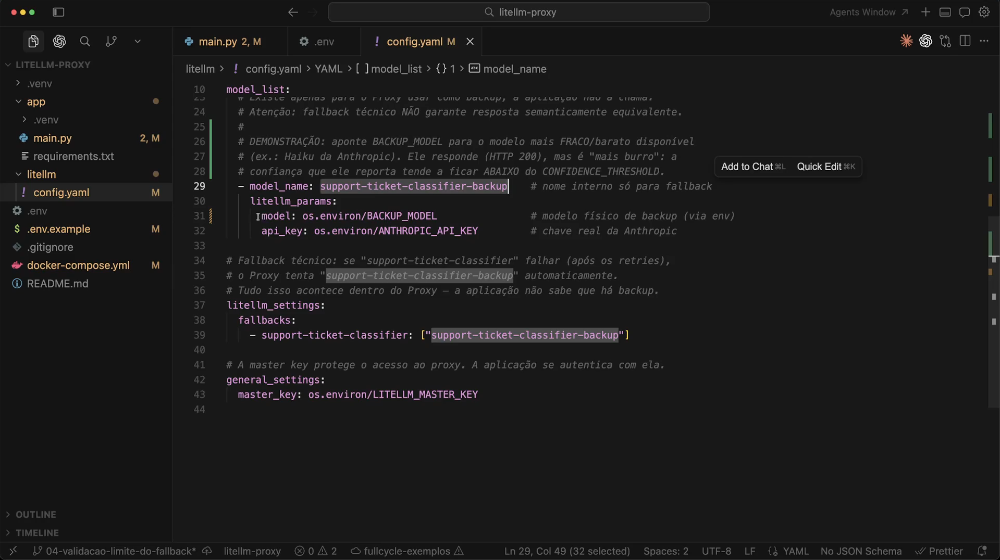
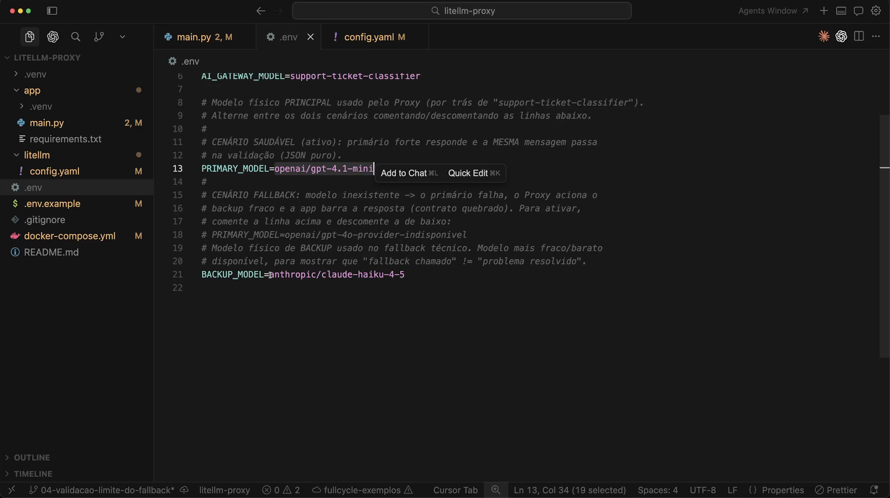
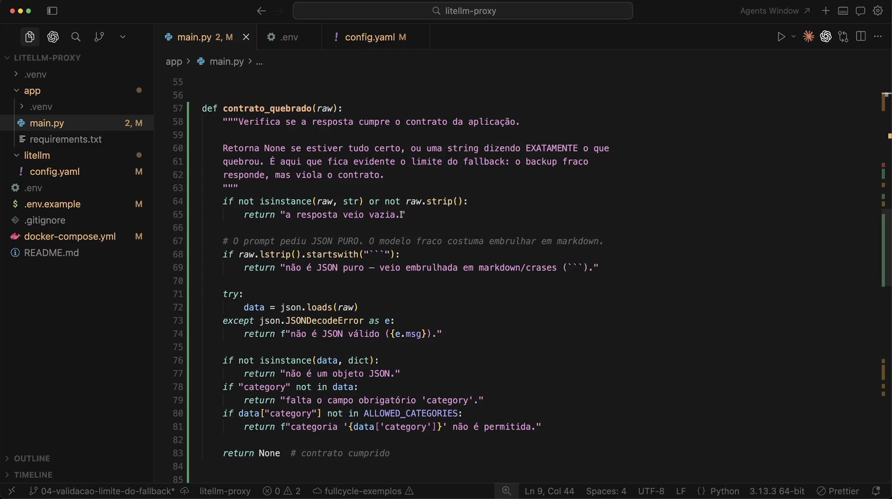

# Aula 18 — Fallback com modelo fraco

> Curso: **AI Gateways** · Duração: `05:38`

## Resumo

Esta aula mostra o limite do fallback técnico. O exemplo muda para classificação de ticket de suporte, onde a aplicação exige JSON puro. Quando o fallback usa um modelo mais fraco, ele pode responder com HTTP 200 e ainda assim quebrar o contrato da aplicação.

O ponto principal é: fallback chamado não significa problema resolvido. A aplicação precisa validar se a resposta ainda serve para o fluxo de negócio.

Projeto prático registrado em: [`weak-model-fallback-validation`](./weak-model-fallback-validation/README.md)

## 1. Novo caso de uso: classificação de ticket



A arquitetura segue com proxy:

```text
Aplicacao Python -> LiteLLM Proxy -> OpenAI ou Anthropic (fallback)
```

Mas o contrato agora é mais rígido. A aplicação espera um objeto JSON puro para classificar tickets de suporte.

## 2. Contrato esperado pela aplicação



O código define:

```python
MODEL = "support-ticket-classifier"
ALLOWED_CATEGORIES = {"billing", "technical", "account", "other"}
DEFAULT_MESSAGE = "Fui cobrado duas vezes na minha assinatura e quero resolver isso."
```

O prompt exige resposta estritamente em JSON válido, sem markdown e sem crases.

Formato esperado:

```json
{"category":"billing|technical|account|other","reason":"explicacao curta"}
```

## 3. Cenário de fallback quebrando contrato



O `.env` mostra dois cenários:

- cenário saudável: modelo primário forte responde JSON puro;
- cenário de fallback: modelo primário inexistente força o proxy a acionar o backup fraco.

No resultado exibido, o fallback responde com markdown/crases. A chamada retorna, mas a resposta não é JSON puro.

## 4. Mesmo problema, mesma entrada



A mensagem de entrada continua sendo a mesma:

```text
Fui cobrado duas vezes na minha assinatura e quero resolver isso.
```

O que muda é a qualidade/aderência do modelo que responde.

## 5. Cenário saudável



Quando o modelo primário está disponível, a resposta vem como JSON puro e passa na validação.

Resultado conceitual:

```json
{"category":"billing","reason":"Cobranca duplicada na assinatura"}
```

## 6. Modelos via env



O `config.yaml` usa:

- `PRIMARY_MODEL` para o modelo principal;
- `BACKUP_MODEL` para o fallback;
- `OPENAI_API_KEY` para o principal;
- `ANTHROPIC_API_KEY` para o backup.

Isso permite alternar cenário sem reiniciar o desenho da aplicação.

## 7. Backup fraco



O backup é publicado como `support-ticket-classifier-backup` e existe só para o proxy.

O comentário da aula destaca que esse modelo mais fraco pode responder com HTTP 200, mas com confiança/aderência abaixo do necessário.

## 8. Alternando cenário



Ao apontar `PRIMARY_MODEL` para um modelo válido, o fluxo passa. Ao apontar para um modelo inexistente, o proxy aciona fallback.

Esse artifício simula indisponibilidade do provider principal.

## 9. Validação do contrato



A função `contrato_quebrado(raw)` verifica se a resposta:

- veio vazia;
- veio embrulhada em markdown/crases;
- não é JSON válido;
- não é um objeto JSON;
- não tem `category`;
- tem categoria fora das permitidas.

Essa validação deixa claro que a aplicação ainda precisa defender o contrato de negócio.

## Ideia-chave

Fallback com modelo fraco pode preservar disponibilidade técnica e quebrar utilidade de negócio. Em fluxos estruturados, a aplicação precisa validar contrato, não apenas sucesso HTTP.
